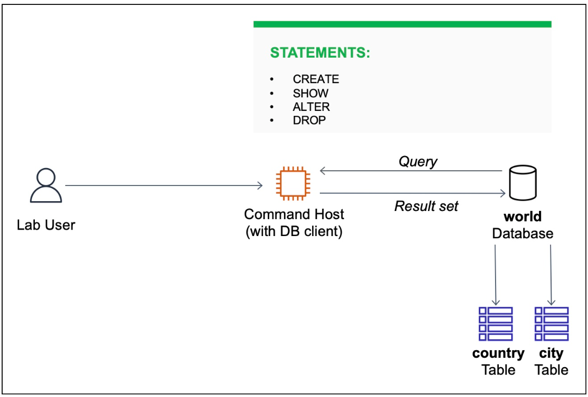
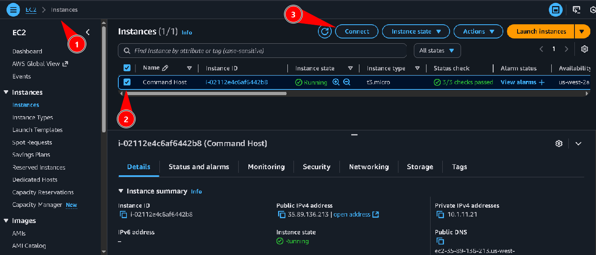
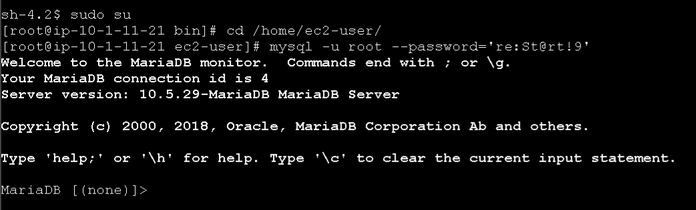
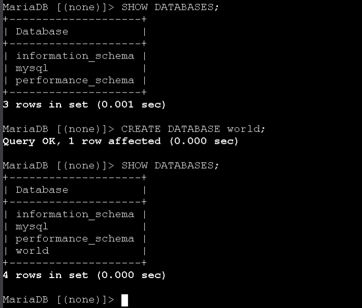
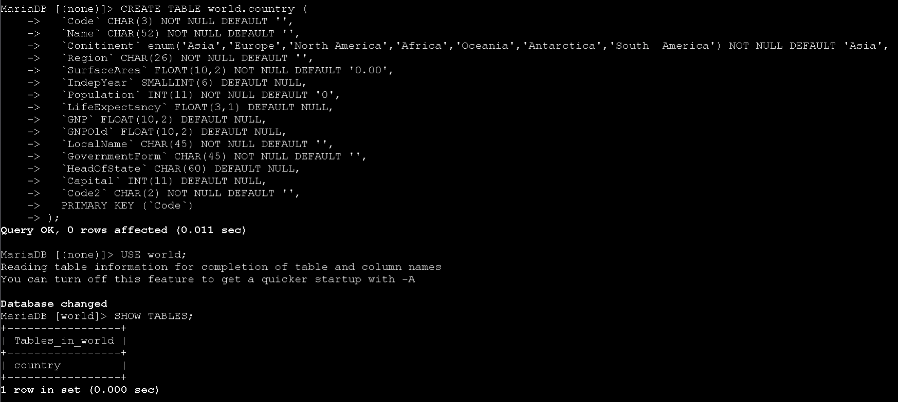
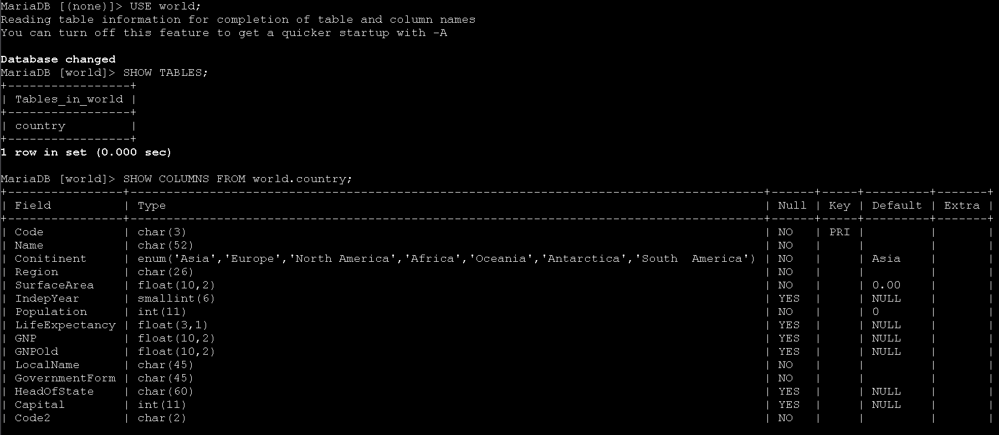
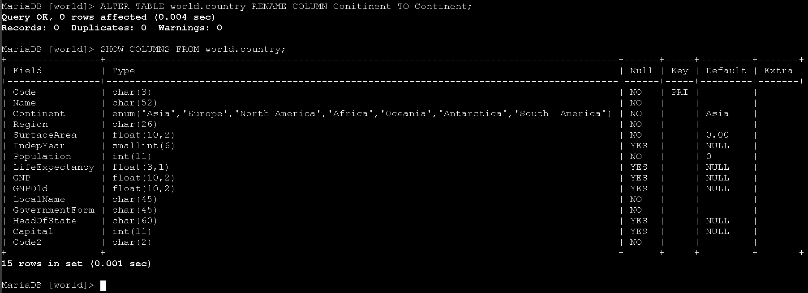
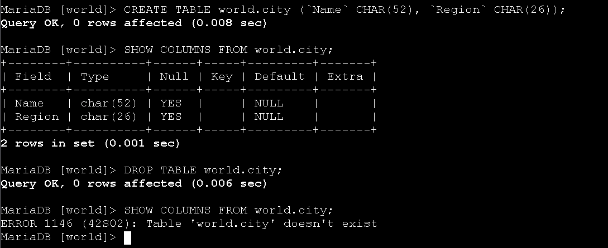
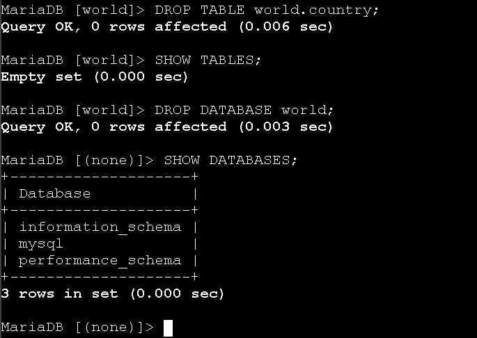

# Laboratório de operações de tabela em banco de dados - Bancos de Dados 🗄️


## Visão geral
Neste lab pratiquei operações comuns de banco de dados e tabelas em um servidor MariaDB/MySQL a partir de um Command Host (EC2) usando um cliente SQL. As operações cobriram os comandos: CREATE, SHOW, ALTER e DROP.



## Objetivos
- Usar CREATE para criar banco e tabelas
- Usar SHOW para listar bancos, tabelas e colunas
- Usar ALTER para alterar a estrutura de uma tabela
- Usar DROP para excluir tabelas e bancos

---

## Task 1: Conectar ao Command Host
1. No Console AWS, acesse EC2 > Instances, selecione a instância Command Host e clique em Connect (Session Manager).



2. No terminal do Session Manager, elevo para root e conecto no servidor MariaDB com o cliente `mysql`.

```bash path=null start=null
sudo su
cd /home/ec2-user/
mysql -u root --password='re:St@rt!9'
```



---

## Task 2: Criar o banco de dados e tabelas
1. Listo os bancos existentes e crio o banco `world`, validando em seguida com SHOW DATABASES.

```sql path=null start=null
SHOW DATABASES;
CREATE DATABASE world;
SHOW DATABASES;
```



2. Crio a tabela `world.country` com o esquema fornecido e verifico as tabelas do banco.

```sql path=null start=null
CREATE TABLE world.country (
  `Code` CHAR(3) NOT NULL DEFAULT '',
  `Name` CHAR(52) NOT NULL DEFAULT '',
  `Conitinent` enum('Asia','Europe','North America','Africa','Oceania','Antarctica','South America') NOT NULL DEFAULT 'Asia',
  `Region` CHAR(26) NOT NULL DEFAULT '',
  `SurfaceArea` FLOAT(10,2) NOT NULL DEFAULT '0.00',
  `IndepYear` SMALLINT(6) DEFAULT NULL,
  `Population` INT(11) NOT NULL DEFAULT '0',
  `LifeExpectancy` FLOAT(3,1) DEFAULT NULL,
  `GNP` FLOAT(10,2) DEFAULT NULL,
  `GNPOld` FLOAT(10,2) DEFAULT NULL,
  `LocalName` CHAR(45) NOT NULL DEFAULT '',
  `GovernmentForm` CHAR(45) NOT NULL DEFAULT '',
  `HeadOfState` CHAR(60) DEFAULT NULL,
  `Capital` INT(11) DEFAULT NULL,
  `Code2` CHAR(2) NOT NULL DEFAULT '',
  PRIMARY KEY (`Code`)
);

USE world;
SHOW TABLES;
```



3. Inspeciono o esquema da tabela `country` e identifico o campo escrito incorretamente (`Conitinent`).

```sql path=null start=null
SHOW COLUMNS FROM world.country;
```



4. Corrijo o nome da coluna com ALTER TABLE e valido novamente.

```sql path=null start=null
ALTER TABLE world.country RENAME COLUMN Conitinent TO Continent;
SHOW COLUMNS FROM world.country;
```



5. (Desafio) Crio a tabela `world.city` com duas colunas e, em seguida, confirmo o esquema.

```sql path=null start=null
CREATE TABLE world.city (`Name` CHAR(52), `Region` CHAR(26));
SHOW COLUMNS FROM world.city;
```



---

## Task 3: Excluir tabelas e banco de dados
1. Excluo a tabela `world.city` e valido que não existe mais.

```sql path=null start=null
DROP TABLE world.city;
SHOW COLUMNS FROM world.city; -- retorna erro: tabela não existe
```


2. Excluo a tabela `world.country` e verifico que o banco não possui mais tabelas.

```sql path=null start=null
DROP TABLE world.country;
SHOW TABLES;
```



3. Excluo o banco `world` e confirmo com SHOW DATABASES.

```sql path=null start=null
DROP DATABASE world;
SHOW DATABASES;
```


---

## Conclusão
Neste laboratório pratiquei operações fundamentais de administração de bancos relacionais: criação de banco e tabelas (CREATE), inspeção de objetos (SHOW), alteração de esquema (ALTER) e exclusão de objetos (DROP). Essas ações foram executadas a partir de um Command Host conectado ao servidor MariaDB.

