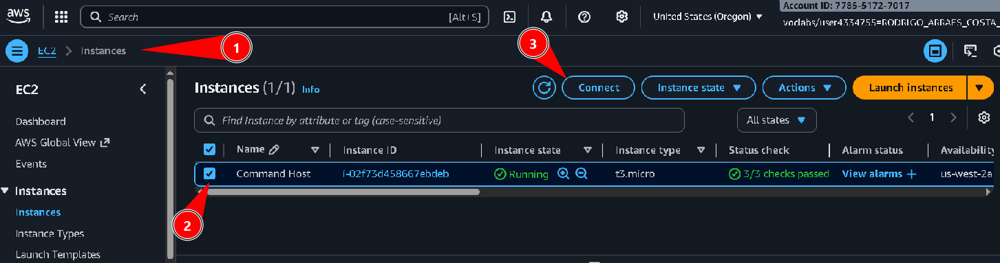
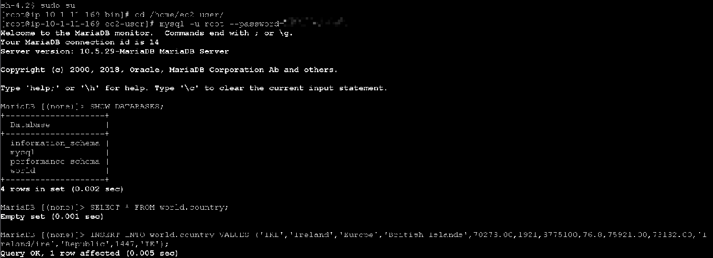
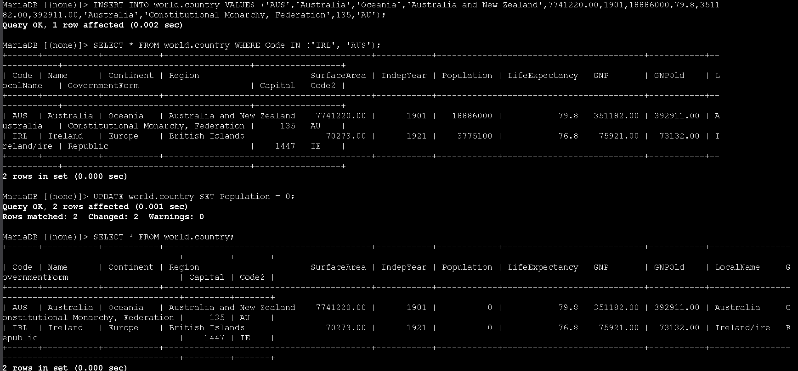
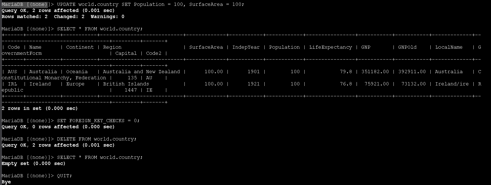
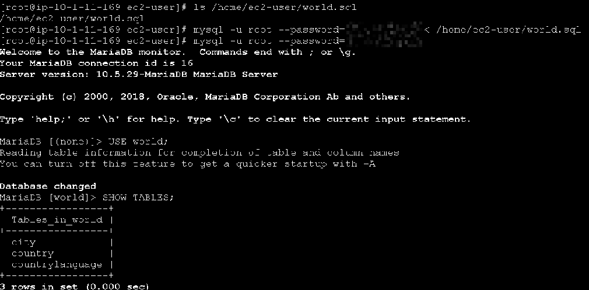
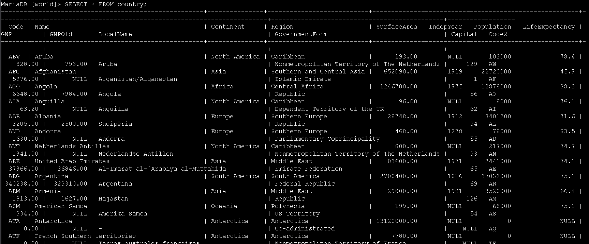
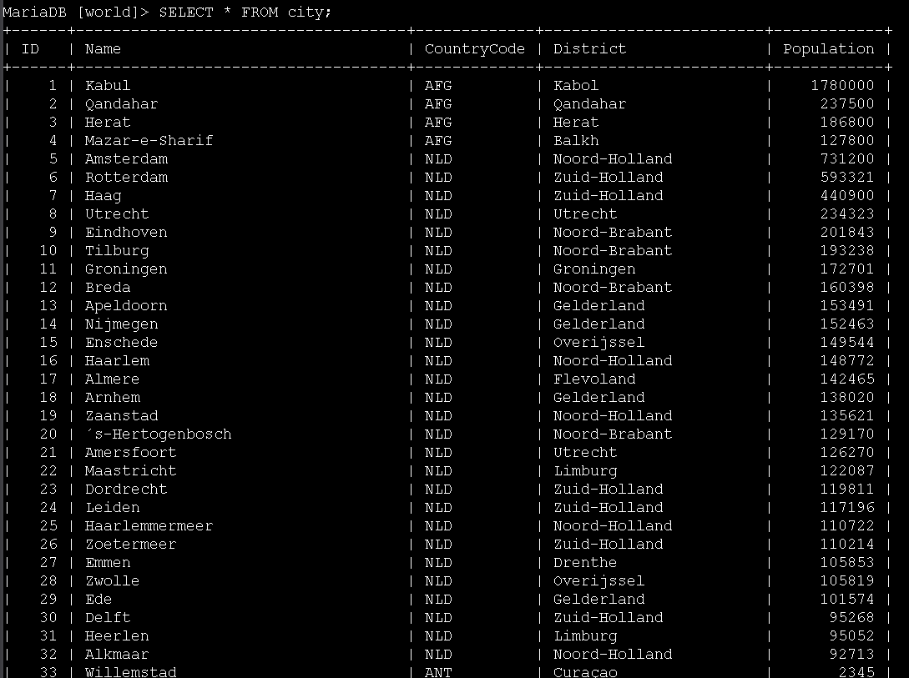
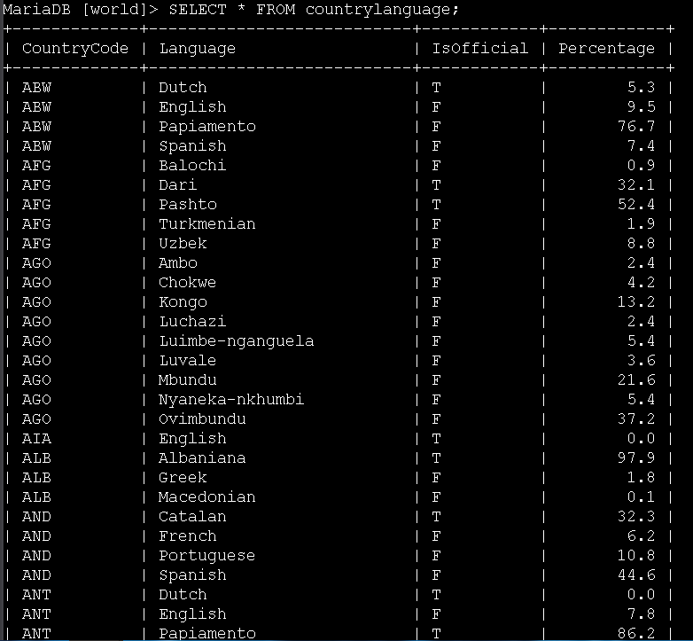

# Laboratório de inserção, atualização e exclusão de dados - Bancos de Dados 🗄️✏️


## Visão geral
Neste lab validei a configuração de um banco de dados relacional chamado `world`, que contém as tabelas `city`, `country` e `countrylanguage`. Para isso, realizei operações de **INSERT**, **UPDATE**, **DELETE** e importei dados a partir de um arquivo SQL usando o cliente MariaDB/MySQL em um Command Host (instância EC2).


## Objetivos
- Inserir linhas em uma tabela usando `INSERT`
- Atualizar linhas em uma tabela usando `UPDATE`
- Excluir linhas de uma tabela usando `DELETE`
- Importar dados de um arquivo de backup (`world.sql`) para popular múltiplas tabelas

---

## Task 1: Conectar ao banco de dados
1. No Console AWS, acesse **EC2** pelo menu de serviços e, na barra lateral esquerda, selecione **Instances**.
2. Marque a instância chamada **Command Host** e clique em **Connect**.



3. Na tela de conexão, selecione a aba **Session Manager** e clique em **Connect** para abrir um terminal na instância.
4. No terminal, elevei o usuário para `root`, naveguei até o diretório do usuário `ec2-user` e acessei o cliente MariaDB/MySQL com o usuário `root`:

```bash path=null start=null
sudo su
cd /home/ec2-user/
mysql -u root --password='re:St@rt!9'
```

5. Para listar os bancos de dados existentes, utilizei o comando:

```sql path=null start=null
SHOW DATABASES;
```



O comando retorna, entre outros, o banco de dados `world`, que será usado neste laboratório.

---

## Task 2: Inserir dados na tabela `country`
Nesta tarefa, inseri duas linhas de exemplo na tabela `world.country`.

1. Primeiro, verifiquei o conteúdo atual da tabela `country`:

```sql path=null start=null
SELECT * FROM world.country;
```

A tabela estava vazia.

2. Em seguida, inseri os registros da **Irlanda** e da **Austrália** usando comandos `INSERT INTO ... VALUES`:

```sql path=null start=null
INSERT INTO world.country VALUES ('IRL','Ireland','Europe','British Islands',70273.00,1921,3775100,76.8,75921.00,73132.00,'Ireland/Éire','Republic',1447,'IE');

INSERT INTO world.country VALUES ('AUS','Australia','Oceania','Australia and New Zealand',7741220.00,1901,18886000,79.8,351182.00,392911.00,'Australia','Constitutional Monarchy, Federation',135,'AU');
```

3. Para confirmar que as duas linhas foram inseridas corretamente, rodei um `SELECT` filtrando pelos códigos dos países:

```sql path=null start=null
SELECT * FROM world.country WHERE Code IN ('IRL', 'AUS');
```



O resultado mostra as duas linhas com todos os campos preenchidos conforme o esquema da tabela.

---

## Task 3: Atualizar linhas na tabela
Nesta etapa, pratiquei a atualização de valores em todas as linhas da tabela `country`.

1. Para zerar a coluna `Population` de todas as linhas da tabela, utilizei o comando:

```sql path=null start=null
UPDATE world.country SET Population = 0;
```

Como não há cláusula `WHERE`, **todas** as linhas da tabela são afetadas.

2. Validei a alteração verificando novamente o conteúdo da tabela:

```sql path=null start=null
SELECT * FROM world.country;
```

3. Em seguida, atualizei as colunas `Population` e `SurfaceArea` para `100` em todas as linhas:

```sql path=null start=null
UPDATE world.country SET Population = 100, SurfaceArea = 100;
```

4. Novamente, usei um `SELECT` para conferir o resultado:

```sql path=null start=null
SELECT * FROM world.country;
```



Esse passo demonstra como um `UPDATE` sem `WHERE` impacta todas as linhas da tabela.

---

## Task 4: Excluir linhas da tabela `country`
Aqui, pratiquei a remoção de dados de uma tabela usando `DELETE`.

1. Antes de executar a exclusão, desabilitei temporariamente a verificação de chaves estrangeiras (boa prática em alguns cenários de limpeza de dados):

```sql path=null start=null
SET FOREIGN_KEY_CHECKS = 0;
```

2. Para excluir **todas** as linhas da tabela `country`, utilizei:

```sql path=null start=null
DELETE FROM world.country;
```

3. Confirmei que a tabela estava vazia com o comando:

```sql path=null start=null
SELECT * FROM world.country;
```



Como o comando `DELETE` não possui cláusula `WHERE`, todas as linhas foram removidas.

---

## Task 5: Importar dados usando um arquivo SQL
Nesta última tarefa, carreguei um arquivo de backup (`world.sql`) que popula completamente o banco `world` com dados de exemplo.

1. Saí do cliente MySQL com o comando:

```sql path=null start=null
QUIT;
```

2. No shell Linux, listei o arquivo `world.sql` para confirmar que ele estava disponível no diretório `/home/ec2-user/`:

```bash path=null start=null
ls /home/ec2-user/world.sql
```

3. Para importar o conteúdo do arquivo para o servidor MariaDB, utilizei o redirecionamento de entrada do MySQL:

```bash path=null start=null
mysql -u root --password='re:St@rt!9' < /home/ec2-user/world.sql
```

4. Após a importação, conectei novamente ao banco:

```bash path=null start=null
mysql -u root --password='re:St@rt!9'
```

5. Selecionei o banco `world` e listei as tabelas criadas pelo script:

```sql path=null start=null
USE world;
SHOW TABLES;
```

6. Para verificar que as linhas foram carregadas com sucesso na tabela `country`, executei:

```sql path=null start=null
SELECT * FROM country;
```



Observa-se agora um grande número de registros, representando países do mundo.

7. Em seguida, consultei também as tabelas `city` e `countrylanguage` para validar o carregamento completo do arquivo de backup:

```sql path=null start=null
SELECT * FROM city;
```



```sql path=null start=null
SELECT * FROM countrylanguage;
```



---

## Conclusão
Neste laboratório, pratiquei operações essenciais de manipulação de dados em bancos relacionais. Utilizando o cliente MySQL em um Command Host, inseri registros na tabela `country` com `INSERT`, atualizei colunas para todas as linhas com `UPDATE`, removi todos os registros usando `DELETE` e, por fim, importei um arquivo SQL completo (`world.sql`) que recria as tabelas `city`, `country` e `countrylanguage` com dados reais de exemplo. Essas operações são a base do dia a dia de administração e manutenção de bancos de dados relacionais.
