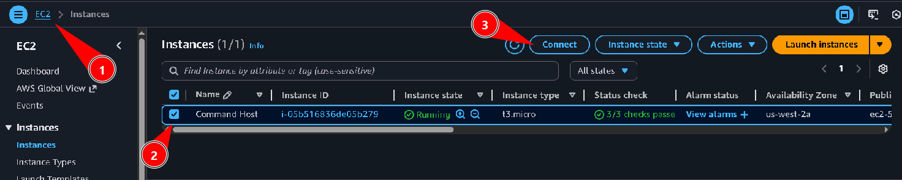
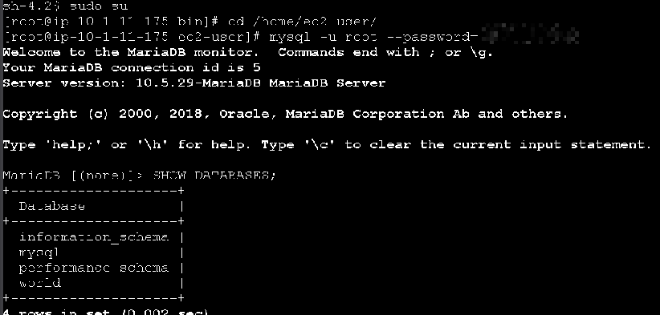
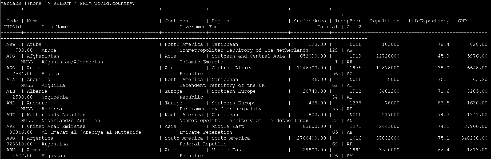
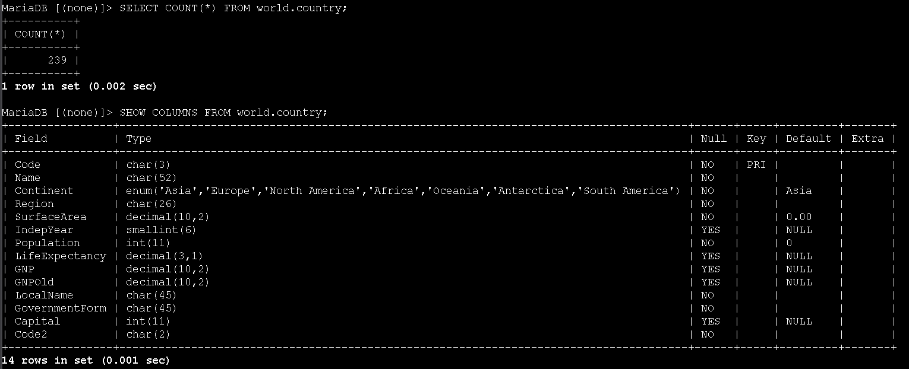
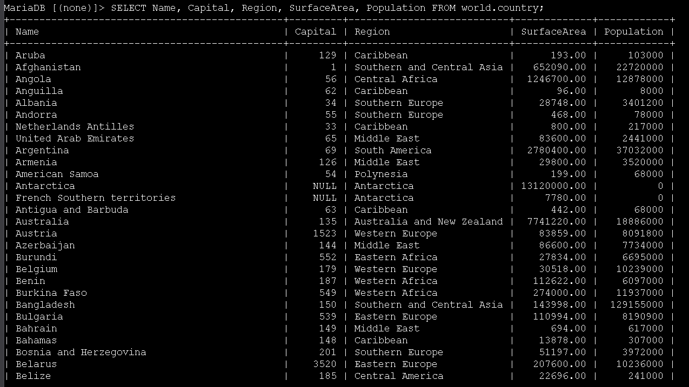
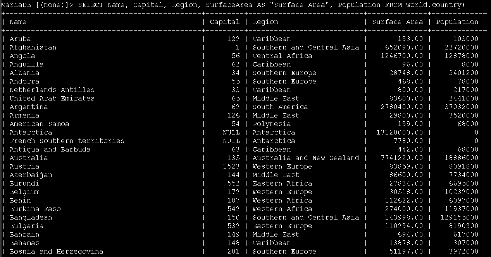
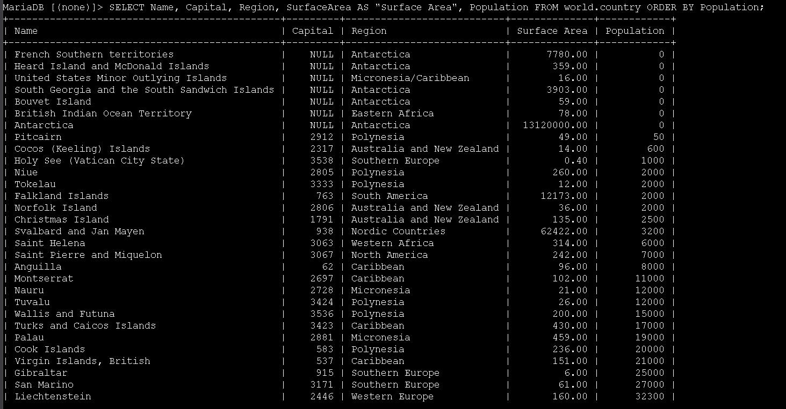
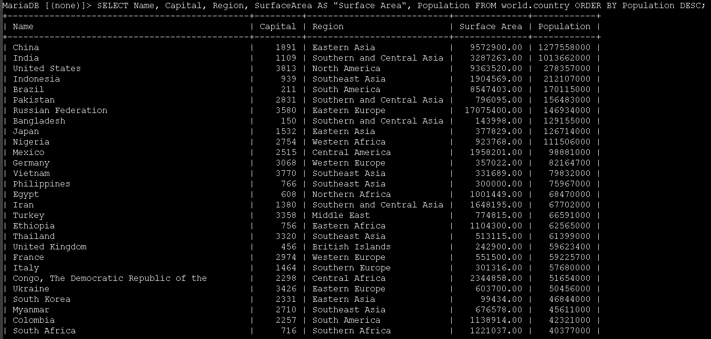
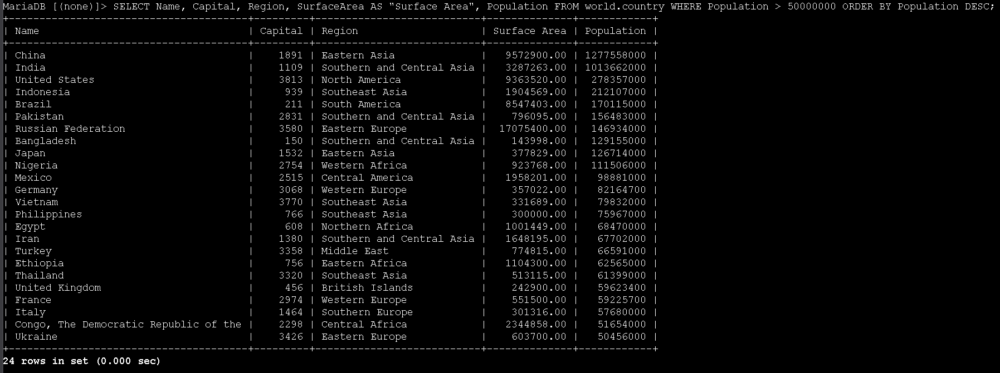

# Laboratório de seleção de dados em banco de dados - Bancos de Dados 🗄️🔍


## Visão geral
Neste lab trabalhei com consultas SQL no banco de dados `world`, que contém as tabelas `city`, `country` e `countrylanguage`. O foco foi usar o comando **SELECT** em conjunto com funções e operadores comuns para filtrar, ordenar e contar registros.


## Objetivos
- Usar o comando `SELECT` para consultar tabelas de um banco de dados
- Utilizar a função de agregação `COUNT()`
- Aplicar operadores de comparação (`<`, `>`, `=`)
- Usar as cláusulas `WHERE` e `ORDER BY`
- Combinar condições com o operador lógico `AND`

---

## Task 1: Conectar ao Command Host e ao banco de dados
1. No Console AWS, acessei **EC2** pelo menu de serviços e, na barra lateral, escolhi **Instances**.
2. Selecionei a instância **Command Host** e cliquei em **Connect** para abrir a tela de conexão.



3. Na aba **Session Manager**, cliquei em **Connect** para abrir um terminal na instância.
4. No terminal, executei os comandos abaixo para virar usuário `root`, ir até o diretório do usuário padrão e abrir o cliente MariaDB/MySQL:

```bash path=null start=null
sudo su
cd /home/ec2-user/
mysql -u root --password='re:St@rt!9'
```

5. Para listar os bancos de dados disponíveis, usei:

```sql path=null start=null
SHOW DATABASES;
```



Entre os bancos listados, está o banco `world`, que será usado em todas as consultas deste laboratório.

---

## Task 2: Consultar a tabela `country` com SELECT
Nesta tarefa, comecei explorando a tabela principal `world.country`.

1. Para listar todas as colunas e linhas da tabela `country`, utilizei:

```sql path=null start=null
SELECT * FROM world.country;
```



O resultado mostra todos os países cadastrados com suas colunas, como `Name`, `Continent`, `Region`, `SurfaceArea`, `Population` e outras.

2. Em seguida, utilizei a função `COUNT()` para contar o número total de linhas da tabela:

```sql path=null start=null
SELECT COUNT(*) FROM world.country;
```

3. Para entender melhor o esquema da tabela, listei suas colunas com:

```sql path=null start=null
SHOW COLUMNS FROM world.country;
```



Esse comando exibe o nome de cada campo, tipo de dado, se aceita `NULL`, chave primária, valor padrão e outras informações de metadados.

---

## Task 3: Selecionar colunas específicas e usar alias
Depois de conhecer o esquema, passei a selecionar apenas as colunas relevantes para as análises.

1. Para retornar somente algumas colunas da tabela, utilizei o comando:

```sql path=null start=null
SELECT Name, Capital, Region, SurfaceArea, Population FROM world.country;
```



2. Para deixar o nome da coluna `SurfaceArea` mais amigável no resultado, usei um **alias** com `AS`:

```sql path=null start=null
SELECT Name, Capital, Region, SurfaceArea AS "Surface Area", Population
FROM world.country;
```



Na saída, a coluna passa a ser exibida com o rótulo **Surface Area**, sem alterar a estrutura real da tabela.

---

## Task 4: Ordenar resultados com ORDER BY
Nessa etapa, pratiquei a ordenação de resultados com base na coluna de população.

1. Para ordenar os países por população em ordem crescente (padrão), utilizei:

```sql path=null start=null
SELECT Name, Capital, Region, SurfaceArea AS "Surface Area", Population
FROM world.country
ORDER BY Population;
```



2. Em seguida, ordenei em ordem decrescente usando a opção `DESC`:

```sql path=null start=null
SELECT Name, Capital, Region, SurfaceArea AS "Surface Area", Population
FROM world.country
ORDER BY Population DESC;
```



Assim, os países mais populosos (como China, Índia, Estados Unidos, entre outros) aparecem no topo do resultado.

---

## Task 5: Filtrar resultados com WHERE e operadores de comparação
Por fim, utilizei a cláusula `WHERE` em conjunto com operadores lógicos e de comparação para filtrar os dados.

1. Para retornar apenas os países com população **maior que 50.000.000** de habitantes, rodei:

```sql path=null start=null
SELECT Name, Capital, Region, SurfaceArea AS "Surface Area", Population
FROM world.country
WHERE Population > 50000000
ORDER BY Population DESC;
```

2. Em seguida, filtrei para países com população **maior que 50.000.000 e menor que 100.000.000**, usando o operador lógico `AND`:

```sql path=null start=null
SELECT Name, Capital, Region, SurfaceArea AS "Surface Area", Population
FROM world.country
WHERE Population > 50000000 AND Population < 100000000
ORDER BY Population DESC;
```

3. Como desafio proposto no lab, respondi à pergunta:

> **Qual país da região Southern Europe possui população maior que 50.000.000?**

Para isso, executei a consulta abaixo, combinando `AND` com a condição de região:

```sql path=null start=null
SELECT Name, Capital, Region, SurfaceArea AS "Surface Area", Population
FROM world.country
WHERE Population > 50000000 AND Region = 'Southern Europe';
```



O resultado retorna **Italy**, atendendo a todos os critérios definidos.

---

## Conclusão
Neste laboratório, pratiquei a consulta de dados em um banco relacional usando o comando `SELECT` e recursos fundamentais do SQL. Aprendi a listar todos os registros de uma tabela, contar linhas com `COUNT()`, visualizar o esquema com `SHOW COLUMNS`, selecionar colunas específicas, renomear cabeçalhos com `AS`, ordenar resultados com `ORDER BY` e filtrar dados com `WHERE` combinando operadores de comparação e o operador lógico `AND`. Essas técnicas são a base para construir consultas mais complexas e relatórios sobre dados armazenados em bancos relacionais.
