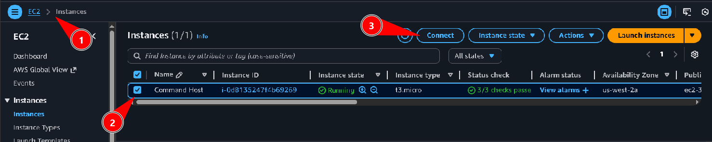
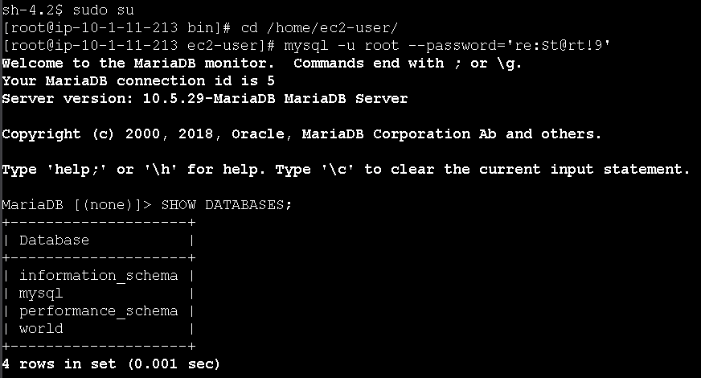
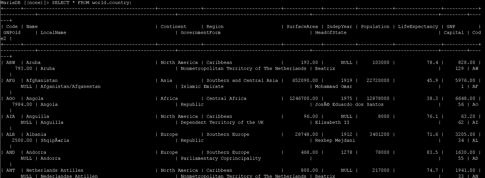
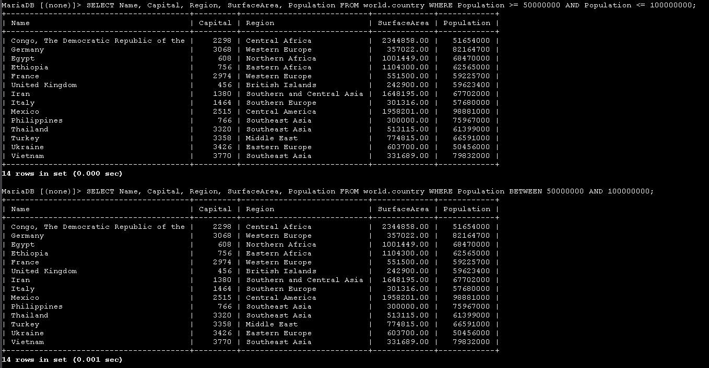
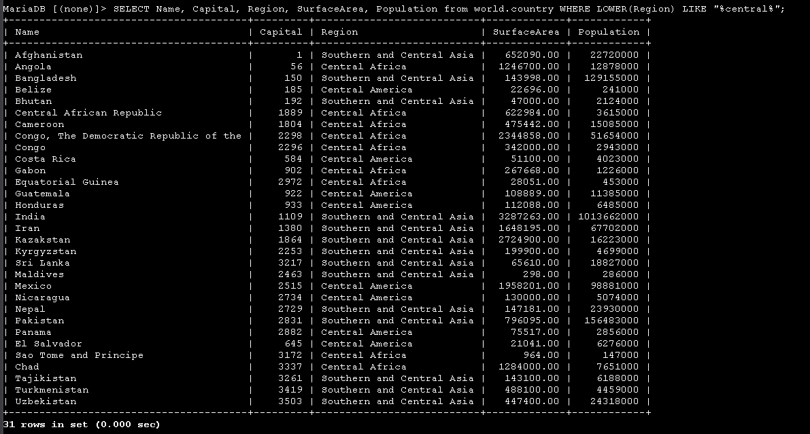
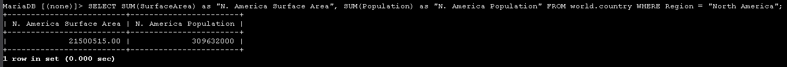

# Laboratório de pesquisa condicional em banco de dados - Bancos de Dados 🗄️🔎


## Visão geral
Neste lab pratiquei pesquisas condicionais na tabela `country` do banco de dados `world`, utilizando o comando **SELECT** combinado com cláusula **WHERE**, operadores (`BETWEEN`, `LIKE`) e funções (`SUM`, `LOWER`). O objetivo foi filtrar registros com base em condições e agregar dados de forma flexível.


## Objetivos
- Escrever condições de busca usando a cláusula `WHERE`
- Utilizar o operador `BETWEEN` para trabalhar com faixas de valores
- Usar o operador `LIKE` com curingas (`%`) para buscar padrões em strings
- Criar aliases de coluna com o comando `AS`
- Usar funções em instruções `SELECT` e na cláusula `WHERE`

---

## Task 1: Conectar ao Command Host e ao banco de dados
1. No Console AWS, acessei **EC2** pelo menu de serviços e, na barra lateral, selecionei **Instances**.
2. Marquei a instância **Command Host** e cliquei em **Connect** para abrir a tela de conexão.



3. Na aba **Session Manager**, cliquei em **Connect** para abrir um terminal na instância.
4. No terminal, executei os comandos abaixo para virar usuário `root`, acessar o diretório do usuário padrão e abrir o cliente MariaDB/MySQL:

```bash path=null start=null
sudo su
cd /home/ec2-user/
mysql -u root --password='re:St@rt!9'
```

5. Para listar os bancos de dados disponíveis, usei:

```sql path=null start=null
SHOW DATABASES;
```



Entre os bancos listados aparece o banco `world`, que contém as tabelas `city`, `country` e `countrylanguage` usadas neste laboratório.

---

## Task 2: Revisar a tabela `country`
Nesta etapa, revisei o esquema, os dados e a quantidade de linhas da tabela `country`.

1. Para visualizar todos os registros e colunas, executei:

```sql path=null start=null
SELECT * FROM world.country;
```



O resultado mostra os países com colunas como `Name`, `Region`, `SurfaceArea`, `Population`, entre outras. A partir desse conjunto completo, as próximas etapas passam a aplicar filtros para reduzir e focar a pesquisa.

---

## Task 3: Filtrar por faixa de valores usando WHERE e BETWEEN
Aqui, filtrei países com base em uma faixa de população, primeiro usando operadores relacionais e depois o operador `BETWEEN`.

1. Para listar apenas os países cuja população está **entre 50.000.000 e 100.000.000**, usei a cláusula `WHERE` com o operador lógico `AND`:

```sql path=null start=null
SELECT Name, Capital, Region, SurfaceArea, Population
FROM world.country
WHERE Population >= 50000000 AND Population <= 100000000;
```



2. Em seguida, escrevi a mesma consulta utilizando o operador `BETWEEN`, que torna o critério de faixa mais legível. O operador é **inclusivo**, ou seja, inclui os valores inicial e final:

```sql path=null start=null
SELECT Name, Capital, Region, SurfaceArea, Population
FROM world.country
WHERE Population BETWEEN 50000000 AND 100000000;
```


Em ambos os casos, o conjunto de países retornado é o mesmo, demonstrando duas formas equivalentes de aplicar o filtro.

---

## Task 4: Usar LIKE e funções de agregação
Nesta task, utilizei o operador `LIKE` com curinga e a função `SUM()` para agregar dados.

1. Para calcular a população total de todos os países cuja região contém a palavra **Europe**, executei:

```sql path=null start=null
SELECT SUM(Population)
FROM world.country
WHERE Region LIKE "%Europe%";
```

2. Depois repeti a consulta adicionando um **alias** para a coluna calculada, deixando a saída mais amigável:

```sql path=null start=null
SELECT SUM(population) AS "Europe Population Total"
FROM world.country
WHERE region LIKE "%Europe%";
```



Assim, o resultado mostra uma única linha com a coluna nomeada como **Europe Population Total**, representando a soma das populações de todos os países europeus.

---

## Task 5: Realizar pesquisa condicional com LOWER e LIKE
Por fim, explorei como lidar com pesquisas sensíveis a maiúsculas/minúsculas usando a função `LOWER()`.

1. Para recuperar todos os países cuja região contém a palavra **central** (independentemente de estar em maiúsculas ou minúsculas), utilizei:

```sql path=null start=null
SELECT Name, Capital, Region, SurfaceArea, Population
FROM world.country
WHERE LOWER(Region) LIKE "%central%";
```



A função `LOWER(Region)` converte o valor da coluna para minúsculas antes da comparação, garantindo que expressões como "Central America" ou "SOUTHERN AND CENTRAL ASIA" sejam encontradas corretamente ao usar o padrão `%central%`.

---

## Desafio: Somar área e população da América do Norte
Como desafio final, escrevi uma consulta para retornar a **soma da área** e a **soma da população** dos países da região *North America*, usando aliases descritivos:

```sql path=null start=null
SELECT SUM(SurfaceArea) AS "N. America Surface Area",
       SUM(Population) AS "N. America Population"
FROM world.country
WHERE Region = "North America";
```

O resultado traz uma única linha com os totais de área e população da América do Norte, demonstrando o uso combinado de `WHERE`, `SUM()` e `AS`.

---

## Conclusão
Neste laboratório, aprofundei o uso de pesquisas condicionais em SQL. Trabalhei com filtros por faixa de valores (`WHERE` com operadores relacionais e `BETWEEN`), pesquisas por padrão de texto (`LIKE` com `%`), agregações com `SUM()`, criação de aliases com `AS` e uso de funções em cláusulas `SELECT` e `WHERE` (`LOWER`). Essas técnicas permitem construir consultas mais expressivas e poderosas para análise de dados em bancos relacionais.

