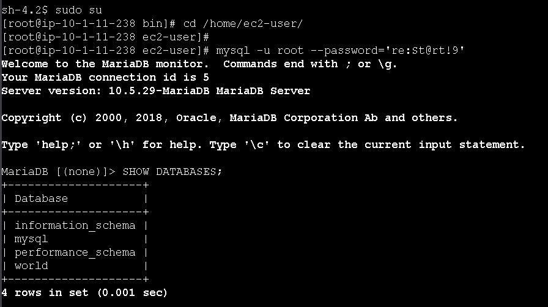
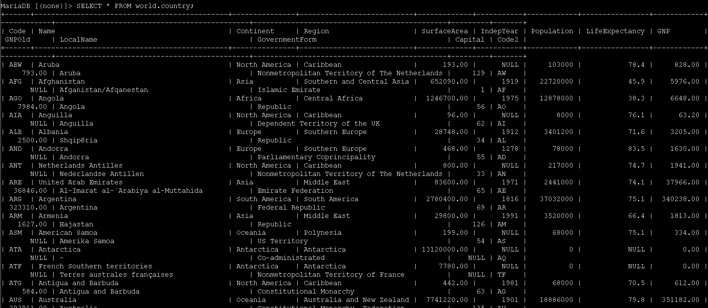
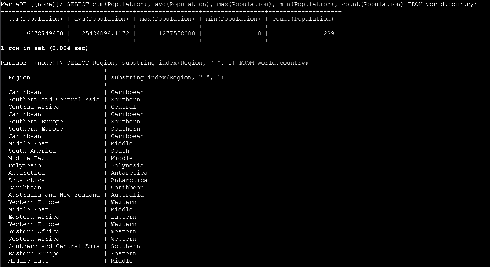
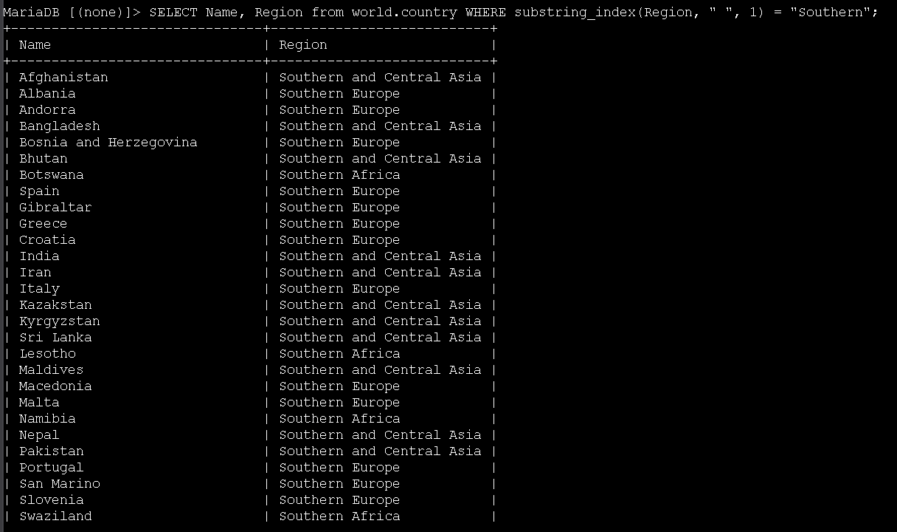
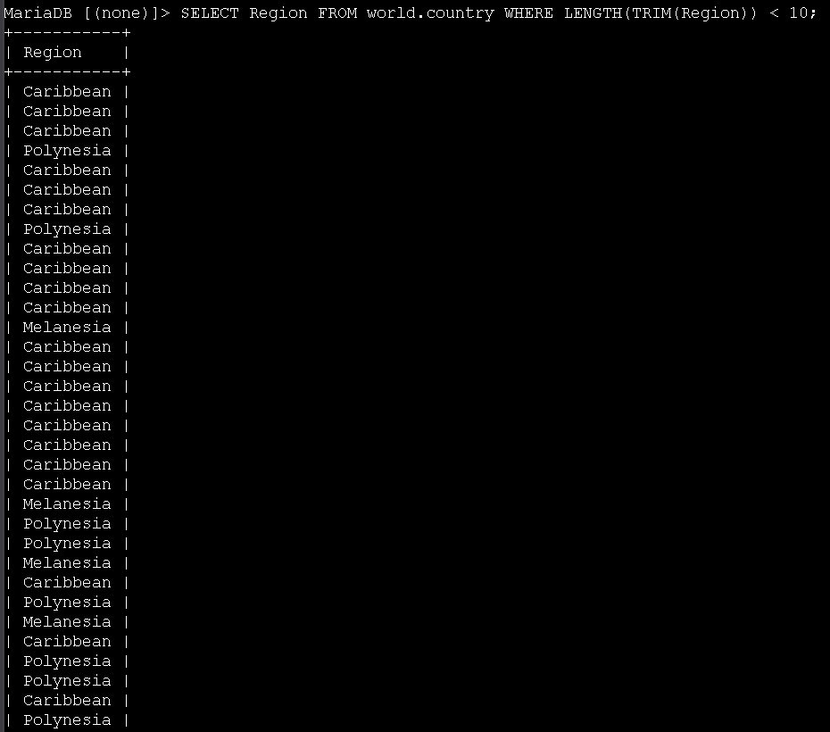
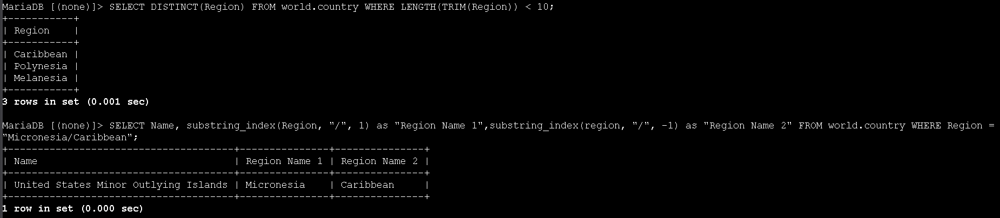

# Laboratório trabalhando com funções SQL - Bancos de Dados 🗄️🧮


## Visão geral
Neste lab trabalhei com várias funções SQL aplicadas à tabela `country` do banco `world`. O objetivo foi praticar funções de agregação, funções de manipulação de strings e funções para medir/comparar comprimentos de textos, sempre em conjunto com o comando **SELECT** e, em alguns casos, com a cláusula **WHERE**.


## Objetivos
- Utilizar funções de agregação `SUM()`, `MIN()`, `MAX()` e `AVG()` para resumir dados
- Usar `SUBSTRING_INDEX()` para dividir strings em partes
- Aplicar `LENGTH()` e `TRIM()` para medir o tamanho de textos
- Empregar `DISTINCT()` para eliminar valores duplicados
- Combinar funções em instruções `SELECT` e em cláusulas `WHERE`

---

## Task 1: Conectar ao Command Host
1. No Console AWS, acessei **EC2** pelo menu de serviços e, na navegação lateral, escolhi **Instances**.
2. Selecionei a instância **Command Host** e cliquei em **Connect** para abrir a tela de conexão.
3. Na aba **Session Manager**, cliquei em **Connect** para abrir um terminal na instância.
4. No terminal, executei os seguintes comandos para tornar‑me `root`, ir até o diretório do usuário padrão e abrir o cliente MariaDB/MySQL:

```bash path=null start=null
sudo su
cd /home/ec2-user/
mysql -u root --password='re:St@rt!9'
```

5. Para listar os bancos de dados existentes, utilizei:

```sql path=null start=null
SHOW DATABASES;
```



Entre os bancos listados está o `world`, que será usado em todas as consultas deste laboratório.

---

## Task 2: Explorar a tabela `country` e usar funções de agregação
1. Para revisar o esquema, os dados e a quantidade de linhas da tabela principal, executei:

```sql path=null start=null
SELECT * FROM world.country;
```



2. Em seguida, utilizei funções de agregação para resumir os dados da coluna `Population` da tabela `country`:

```sql path=null start=null
SELECT SUM(Population),
       AVG(Population),
       MAX(Population),
       MIN(Population),
       COUNT(Population)
FROM world.country;
```



Essas funções fazem o seguinte:
- `SUM(Population)`: soma todas as populações dos países
- `AVG(Population)`: calcula a média de população
- `MAX(Population)`: retorna o maior valor de população
- `MIN(Population)`: retorna o menor valor de população
- `COUNT(Population)`: conta quantas linhas possuem valor na coluna `Population`

---

## Task 3: Dividir strings com SUBSTRING_INDEX()
Nesta task trabalhei com a coluna `Region`, dividindo o texto em partes.

1. Primeiro, usei `SUBSTRING_INDEX()` para obter apenas a primeira palavra de cada região (tudo antes do primeiro espaço):

```sql path=null start=null
SELECT Region,
       SUBSTRING_INDEX(Region, " ", 1)
FROM world.country;
```

O resultado mostra a região completa e, na segunda coluna, apenas o primeiro termo (por exemplo, *Southern*, *Central*, *Middle*, *Western*).

2. Em seguida, usei `SUBSTRING_INDEX()` dentro da cláusula `WHERE` para filtrar apenas países cuja região começa com **Southern**:

```sql path=null start=null
SELECT Name, Region
FROM world.country
WHERE SUBSTRING_INDEX(Region, " ", 1) = "Southern";
```



Assim, recuperei uma lista de países em regiões como *Southern Europe*, *Southern and Central Asia* e *Southern Africa*.

---

## Task 4: Medir o tamanho de textos com LENGTH() e TRIM()
Aqui pratiquei funções para medir o comprimento de strings e filtrar resultados com base nisso.

1. Para retornar apenas regiões cujo nome tem **menos de 10 caracteres**, utilizei `TRIM()` (para remover espaços extras nas pontas) e `LENGTH()` (para contar os caracteres restantes):

```sql path=null start=null
SELECT Region
FROM world.country
WHERE LENGTH(TRIM(Region)) < 10;
```



O resultado mostra várias ocorrências de regiões curtas, como *Caribbean*, *Polynesia* e *Melanesia*.

2. Para remover as duplicidades e ver cada região curta apenas uma vez, repeti a consulta usando `DISTINCT()`:

```sql path=null start=null
SELECT DISTINCT(Region)
FROM world.country
WHERE LENGTH(TRIM(Region)) < 10;
```



Dessa forma, obtive uma lista única das regiões que atendem ao critério de tamanho.

---

## Desafio: Dividir a região "Micronesia/Caribbean" em duas colunas
Como desafio extra do lab, escrevi uma consulta para retornar os países cuja região é **Micronesia/Caribbean**, dividindo esse texto em duas colunas separadas:

```sql path=null start=null
SELECT Name,
       SUBSTRING_INDEX(Region, "/", 1) AS "Region Name 1",
       SUBSTRING_INDEX(Region, "/", -1) AS "Region Name 2"
FROM world.country
WHERE Region = "Micronesia/Caribbean";
```

O resultado mostra o país correspondente e as colunas **Region Name 1** = *Micronesia* e **Region Name 2** = *Caribbean*, demonstrando como `SUBSTRING_INDEX()` pode ser usada para quebrar strings com base em um delimitador específico.

---

## Conclusão
Neste laboratório, aprofundei o uso de funções SQL para análise e transformação de dados. Usei funções de agregação (`SUM`, `AVG`, `MIN`, `MAX`, `COUNT`) para resumir informações, `SUBSTRING_INDEX()` para extrair partes de textos, `LENGTH()` e `TRIM()` para filtrar por tamanho de strings e `DISTINCT()` para remover duplicidades. Combinar essas funções em `SELECT` e `WHERE` torna as consultas bem mais poderosas e flexíveis para trabalhar com dados relacionais.

