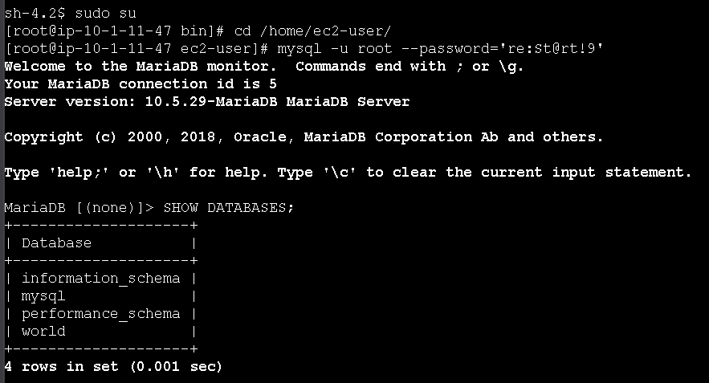
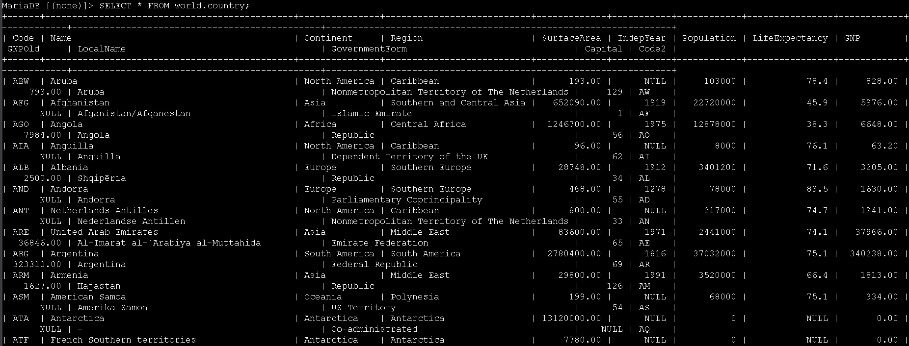
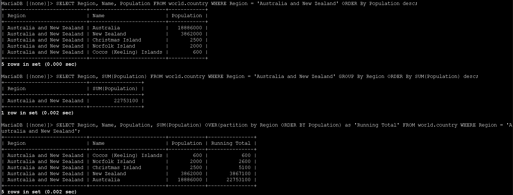
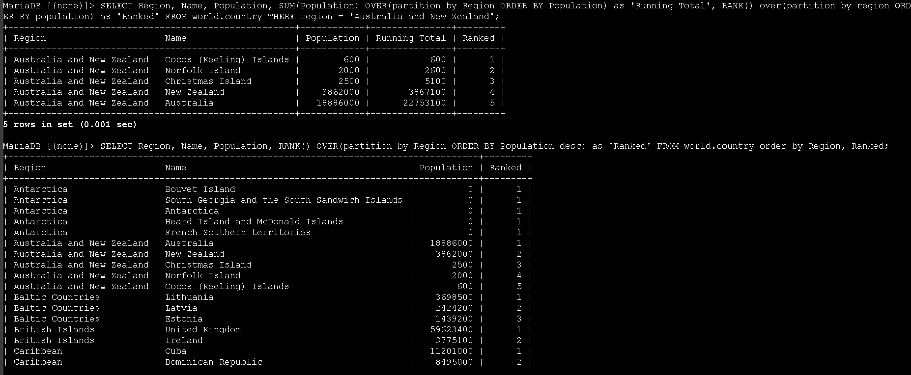

# Laboratório de organização de dados - Bancos de Dados 🗄️📊


## Visão geral
Neste lab pratiquei a organização e análise de dados na tabela `country` do banco `world`, utilizando as cláusulas **GROUP BY** e **OVER** em conjunto com funções de agregação e de janela. O foco foi agrupar registros por região, calcular totais e criar rankings de países com base na população.


## Objetivos
- Usar a cláusula `GROUP BY` com a função de agregação `SUM()`
- Utilizar a cláusula `OVER` com a função de janela `RANK()`
- Combinar `OVER` com `SUM()` e `RANK()` para criar totais cumulativos e rankings por região

---

## Task 1: Conectar ao Command Host e ao banco de dados
1. No Console AWS, acessei **EC2** pelo menu de serviços e, na navegação lateral, escolhi **Instances**.
2. Selecionei a instância **Command Host** e cliquei em **Connect** para abrir a tela de conexão.
3. Na aba **Session Manager**, cliquei em **Connect** para abrir um terminal.
4. No terminal, executei os comandos abaixo para virar `root`, ir até o diretório do usuário padrão e abrir o cliente MariaDB/MySQL:

```bash path=null start=null
sudo su
cd /home/ec2-user/
mysql -u root --password='re:St@rt!9'
```

5. Para listar os bancos de dados disponíveis, usei:

```sql path=null start=null
SHOW DATABASES;
```



Entre eles está o banco `world`, que contém as tabelas `city`, `country` e `countrylanguage` utilizadas no laboratório.

---

## Task 2: Explorar a tabela `country`
Antes de aplicar `GROUP BY` e `OVER`, revisei a estrutura e os dados da tabela principal.

1. Para visualizar todas as colunas e linhas da tabela `country`, executei:

```sql path=null start=null
SELECT * FROM world.country;
```



Essa consulta mostra informações como `Name`, `Region`, `SurfaceArea`, `Population` e outros campos que serão utilizados nas consultas de agregação e ranking.

---

## Task 3: Agrupar dados com GROUP BY e SUM()
Nesta etapa agrupei os registros por região para calcular totais de população.

1. Primeiro, filtrei os países da região **Australia and New Zealand** e ordenei por população de forma decrescente:

```sql path=null start=null
SELECT Region, Name, Population
FROM world.country
WHERE Region = 'Australia and New Zealand'
ORDER BY Population DESC;
```

2. Em seguida, usei `GROUP BY` junto com `SUM()` para calcular a **população total da região Australia and New Zealand**:

```sql path=null start=null
SELECT Region, SUM(Population)
FROM world.country
WHERE Region = 'Australia and New Zealand'
GROUP BY Region
ORDER BY SUM(Population) DESC;
```



Essa consulta retorna uma única linha com a região e a soma das populações de todos os países que pertencem a ela.

---

## Task 4: Criar totais cumulativos com SUM() OVER()
Agora utilizei funções de janela para produzir um **total acumulado** dentro da região.

1. Para calcular um *running total* da população na região **Australia and New Zealand**, usei `SUM(Population) OVER(...)`:

```sql path=null start=null
SELECT Region,
       Name,
       Population,
       SUM(Population) OVER(
         PARTITION BY Region
         ORDER BY Population
       ) AS 'Running Total'
FROM world.country
WHERE Region = 'Australia and New Zealand';
```

O resultado mostra, para cada país, sua população e uma coluna **Running Total** que acumula os valores linha a linha dentro da mesma região.

---

## Task 5: Rankear países com RANK() OVER()
Por fim, combinei a função de janela `RANK()` com `OVER` para criar rankings por região.

1. Para calcular o total acumulado **e** atribuir um ranking de população dentro da região *Australia and New Zealand*, utilizei:

```sql path=null start=null
SELECT Region,
       Name,
       Population,
       SUM(Population) OVER(
         PARTITION BY Region
         ORDER BY Population
       ) AS 'Running Total',
       RANK() OVER(
         PARTITION BY Region
         ORDER BY Population
       ) AS 'Ranked'
FROM world.country
WHERE Region = 'Australia and New Zealand';
```

2. Em seguida, para resolver o desafio do laboratório, escrevi uma consulta que **ranqueia os países dentro de cada região** pela população (do maior para o menor):

```sql path=null start=null
SELECT Region,
       Name,
       Population,
       RANK() OVER(
         PARTITION BY Region
         ORDER BY Population DESC
       ) AS 'Ranked'
FROM world.country
ORDER BY Region, Ranked;
```



Assim é possível ver, para cada região, qual país ocupa a primeira posição em população, a segunda, e assim por diante.

---

## Conclusão
Neste laboratório pratiquei como organizar e analisar dados usando `GROUP BY` e funções de janela com `OVER`. Agrupei registros por região para calcular totais de população com `SUM()`, gerei totais acumulados com `SUM() OVER(PARTITION BY ...)` e criei rankings por região com `RANK() OVER`. Esses recursos são fundamentais para construir relatórios e análises avançadas diretamente via SQL, sem precisar exportar os dados para outras ferramentas.
