# Laboratório de introdução ao Amazon Aurora - Bancos de Dados ☁️🗄️


## Visão geral
Neste lab tive o primeiro contato com o **Amazon Aurora**, criando um cluster Aurora MySQL, configurando a conectividade a partir de uma instância **EC2 (Command Host)** e executando consultas SQL básicas. O objetivo é entender o fluxo completo de provisionar o banco, conectar via cliente MariaDB e criar/consultar tabelas dentro do banco `world`.


## Objetivos
- Criar uma instância Aurora MySQL através do Amazon RDS
- Conectar a uma instância Amazon EC2 pré-criada (Command Host)
- Configurar a instância EC2 para se conectar ao Aurora usando o cliente MariaDB
- Criar a tabela `country`, inserir registros e consultar dados no banco `world`

---

## Task 1: Criar uma instância Aurora
1. No topo do Console AWS, pesquisei por **RDS** e acessei o serviço.
2. No menu lateral, fui em **Databases** e cliquei em **Create database**.

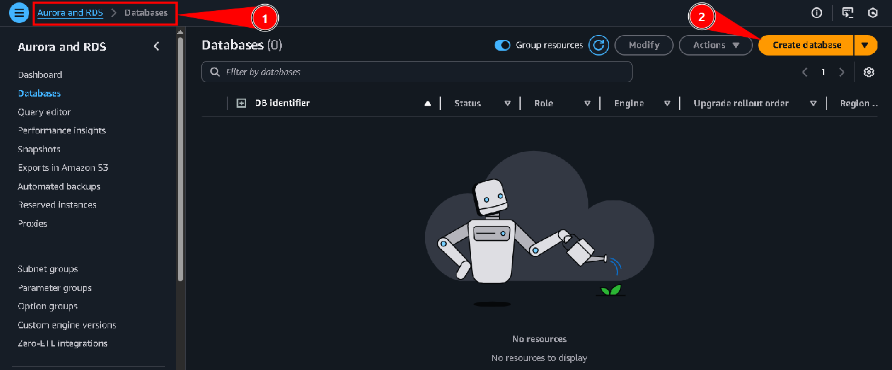

3. Em **Choose a database creation method**, selecionei **Standard create**.
4. Em **Engine type**, escolhi **Aurora (MySQL Compatible)** e mantive a **engine version** padrão da major version 8.0.
5. Em **Templates**, selecionei **Dev/Test**.

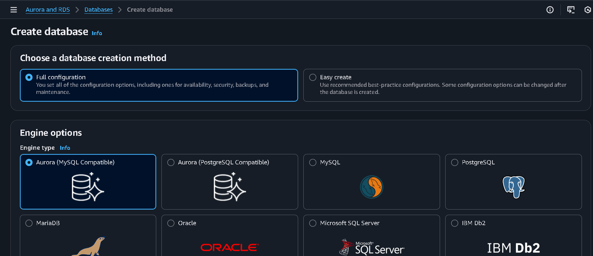

6. Na seção **Settings**, configurei:
   - **DB cluster identifier**: `aurora`
   - **Master username**: `admin`
   - **Master password**: `admin123`
   - **Confirm password**: `admin123`

7. Em **Instance configuration**, escolhi **Burstable classes (includes t classes)** e o tipo **db.t3.medium**.

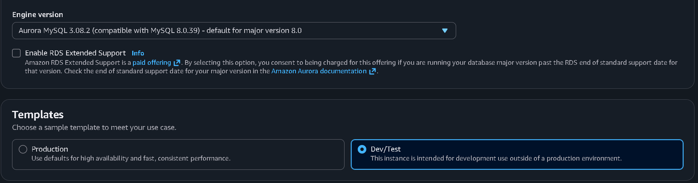

8. Em **Availability & durability**, para **Multi-AZ deployment**, selecionei **Don't create an Aurora Replica**, já que se trata apenas de um ambiente de laboratório.

9. Na seção **Connectivity**, deixei as opções não mencionadas com o valor padrão e configurei:
   - **Virtual private cloud (VPC)**: `LabVPC`
   - **Subnet group**: `dbsubnetgroup`
   - **Public access**: **No**
   - **VPC security group**: **Choose existing**
   - Removi o security group **default**
   - Em **Existing VPC security groups**, selecionei **DBSecurityGroup**

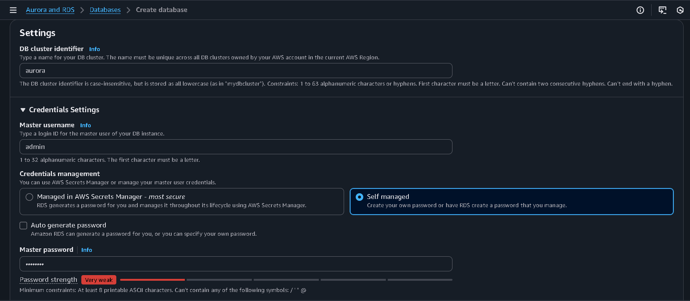

10. Na seção **Monitoring**, desmarquei **Enable Enhanced monitoring**.
11. Em **Additional configuration**, defini **Initial database name** como `world`.
12. Em **Encryption**, desmarquei **Enable encryption**.
13. Em **Maintenance**, desmarquei **Enable auto minor version upgrade**.
14. Rolei até o final da página e cliquei em **Create database** para criar o cluster Aurora.

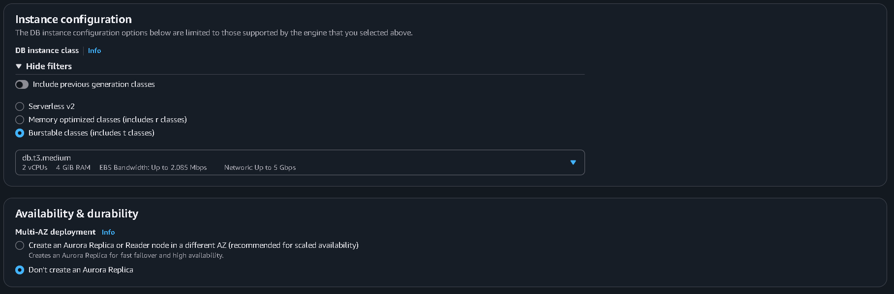

Após alguns minutos, o status da base passou para **Available** e recebi a mensagem de que o database `aurora` foi criado com sucesso.

---

## Task 2: Conectar à instância Amazon EC2 (Command Host)
1. No Console AWS, pesquisei por **EC2** e abri o serviço.
2. No menu lateral, selecionei **Instances**.
3. Marquei a instância chamada **Command Host** e cliquei em **Connect**.


4. Na tela de conexão, escolhi a aba **Session Manager** e cliquei em **Connect** para abrir um terminal na instância.

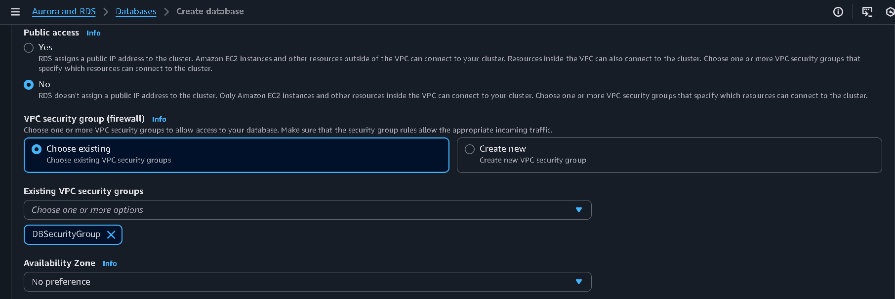

Com isso, estabeleci uma sessão de terminal Linux na instância **Command Host**.

---

## Task 3: Configurar a instância EC2 para conectar ao Aurora
### 3.1 Instalar o cliente MariaDB
No terminal do Command Host, instalei o cliente MariaDB usando o `yum`:

```bash path=null start=null
sudo yum install mariadb -y
```

O comando baixa e instala o cliente, que será usado para conectar ao endpoint do Aurora.

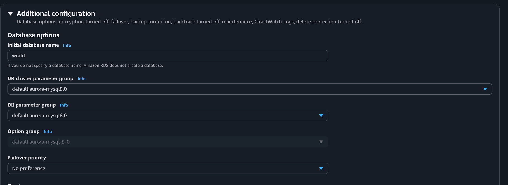

### 3.2 Obter o endpoint do cluster Aurora
1. Em outra aba do navegador, voltei para o serviço **RDS**.
2. No menu lateral, acessei **Databases** e aguardei até que o cluster `aurora` estivesse com status **Available**.
3. Selecionei o banco `aurora` e abri a aba **Connectivity & security**.
4. Na seção **Endpoints**, copiei o **Endpoint** do *Writer* (cluster endpoint) para um editor de texto. Ele tem formato semelhante a:

```text path=null start=null
aurora.cluster-abcdefghijklm.us-west-2.rds.amazonaws.com
```

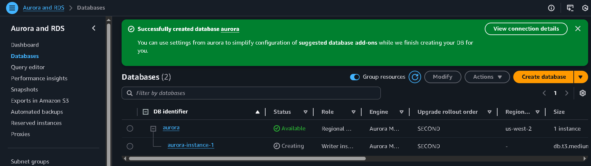

### 3.3 Conectar ao Aurora via cliente MariaDB
De volta ao terminal do Command Host, usei o cliente `mysql` (MariaDB) para conectar ao endpoint do cluster Aurora, substituindo `<endpoint_goes_here>` pelo endpoint copiado:

```bash path=null start=null
mysql -u admin --password='admin123' -h <endpoint_goes_here>
```

Após executar o comando, o cliente exibiu o banner do MariaDB/MySQL, indicando conexão bem-sucedida ao servidor Aurora.


---

## Task 4: Criar tabela, inserir dados e consultar o Aurora
Com a conexão estabelecida, passei a trabalhar no banco `world` criado na Task 1.

### 4.1 Listar bancos de dados e acessar o `world`
1. Para listar os bancos disponíveis no Aurora, executei:

```sql path=null start=null
SHOW DATABASES;
```

2. Em seguida, selecionei o banco `world`:

```sql path=null start=null
USE world;
```

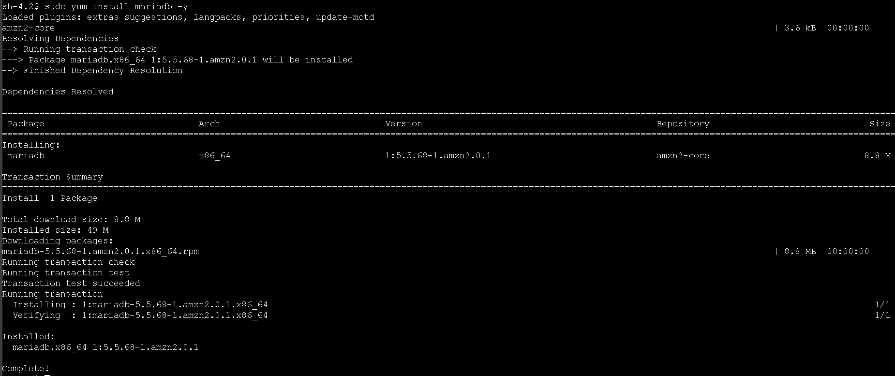

### 4.2 Criar a tabela `country`
Criei a tabela `country` com o esquema fornecido no lab:

```sql path=null start=null
CREATE TABLE `country` (
  `Code` CHAR(3) NOT NULL DEFAULT '',
  `Name` CHAR(52) NOT NULL DEFAULT '',
  `Continent` ENUM('Asia','Europe','North America','Africa','Oceania','Antarctica','South America') NOT NULL DEFAULT 'Asia',
  `Region` CHAR(26) NOT NULL DEFAULT '',
  `SurfaceArea` FLOAT(10,2) NOT NULL DEFAULT '0.00',
  `IndepYear` SMALLINT(6) DEFAULT NULL,
  `Population` INT(11) NOT NULL DEFAULT '0',
  `LifeExpectancy` FLOAT(3,1) DEFAULT NULL,
  `GNP` FLOAT(10,2) DEFAULT NULL,
  `GNPOld` FLOAT(10,2) DEFAULT NULL,
  `LocalName` CHAR(45) NOT NULL DEFAULT '',
  `GovernmentForm` CHAR(45) NOT NULL DEFAULT '',
  `Capital` INT(11) DEFAULT NULL,
  `Code2` CHAR(2) NOT NULL DEFAULT '',
  PRIMARY KEY (`Code`)
);
```

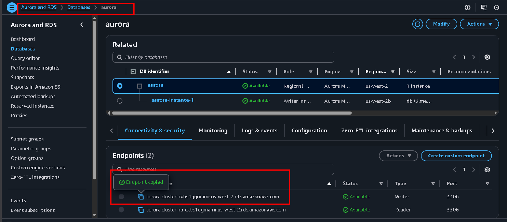

### 4.3 Inserir registros na tabela
Inseri cinco países de exemplo na tabela `country`:

```sql path=null start=null
INSERT INTO `country` VALUES
('GAB','Gabon','Africa','Central Africa',267668.00,1960,1226000,50.1,5493.00,5279.00,'Le Gabon','Republic',902,'GA');

INSERT INTO `country` VALUES
('IRL','Ireland','Europe','British Islands',70273.00,1921,3775100,76.8,75921.00,73132.00,'Ireland/Éire','Republic',1447,'IE');

INSERT INTO `country` VALUES
('THA','Thailand','Asia','Southeast Asia',513115.00,1350,61399000,68.6,116416.00,153907.00,'Prathet Thai','Constitutional Monarchy',3320,'TH');

INSERT INTO `country` VALUES
('CRI','Costa Rica','North America','Central America',51100.00,1821,4023000,75.8,10226.00,9757.00,'Costa Rica','Republic',584,'CR');

INSERT INTO `country` VALUES
('AUS','Australia','Oceania','Australia and New Zealand',7741220.00,1901,18886000,79.8,351182.00,392911.00,'Australia','Constitutional Monarchy, Federation',135,'AU');
```


### 4.4 Consultar os dados inseridos
Por fim, executei uma consulta para retornar apenas os países com **GNP > 35000** e **Population > 10000000**:

```sql path=null start=null
SELECT *
FROM country
WHERE GNP > 35000
  AND Population > 10000000;
```

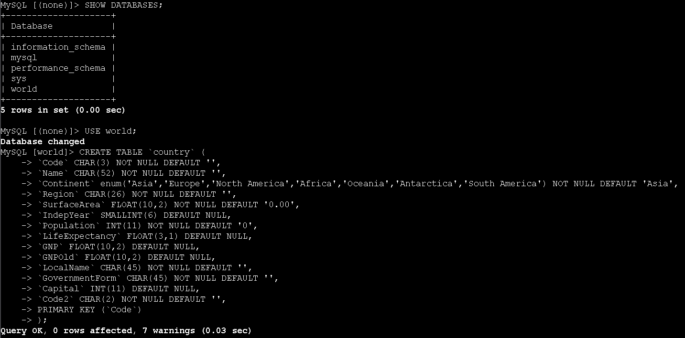

O resultado retorna duas linhas, correspondentes a **Australia** e **Thailand**, confirmando que a tabela foi criada corretamente e que os dados foram inseridos e consultados com sucesso.

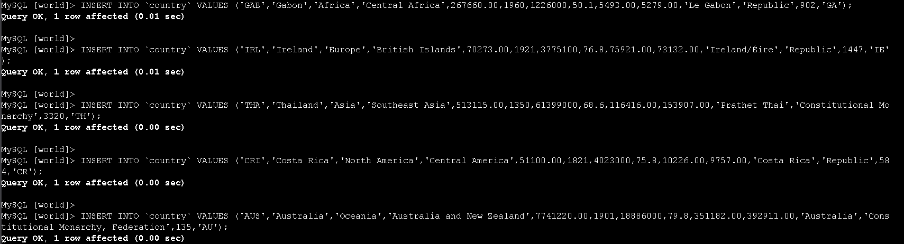

---

## Conclusão
Neste laboratório, criei um cluster **Amazon Aurora MySQL**, defini o banco inicial `world` e configurei a conectividade a partir de uma instância **EC2 Command Host** utilizando o cliente MariaDB. Em seguida, dentro do Aurora, criei a tabela `country`, inseri registros de exemplo e executei consultas filtrando por `GNP` e `Population`. Esse fluxo mostrou na prática como provisionar, acessar e operar um banco Aurora em um cenário simples de leitura e escrita de dados.

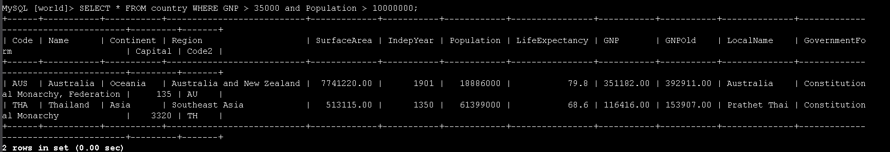
