# Laboratório de introdução ao Amazon DynamoDB - Bancos de Dados 🎵📚

## Visão geral
Neste lab criei e manipulei uma tabela **NoSQL** no **Amazon DynamoDB** para armazenar informações de uma biblioteca de músicas. Trabalhei com criação de tabela, inserção de itens com atributos flexíveis, atualização de dados, consultas via *Query* e *Scan* e, por fim, exclusão da tabela.

## Objetivos
- Criar uma tabela no Amazon DynamoDB
- Inserir itens com diferentes conjuntos de atributos
- Atualizar atributos de um item existente
- Consultar dados usando **Query** (por chave primária) e **Scan** com filtros
- Excluir a tabela DynamoDB ao final do laboratório

---

## Task 1: Criar a tabela `Music`
1. No Console AWS, acessei **DynamoDB** pelo menu de serviços em **Database > DynamoDB**.
2. Na página inicial do serviço, cliquei em **Create table**.

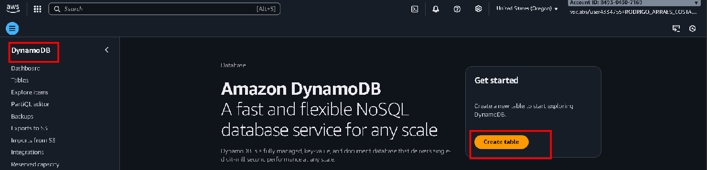

3. Em **Table name**, defini o nome da tabela como `Music`.
4. Em **Partition key**, informei `Artist` e mantive o tipo **String**.
5. Em **Sort key (optional)**, informei `Song` também como **String**.

6. Mantive as configurações padrão de capacidade e índices e cliquei em **Create table**.

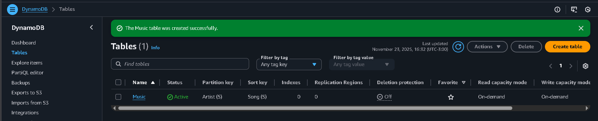

Após alguns instantes, a tabela `Music` ficou com status **Active** e apareceu a mensagem de sucesso.

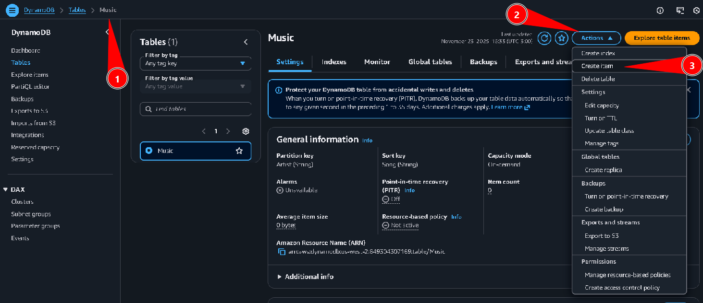

---

## Task 2: Adicionar itens na tabela
Nesta tarefa, inseri manualmente três músicas na tabela `Music`, demonstrando a flexibilidade de atributos do DynamoDB.

1. No menu lateral do DynamoDB, selecionei **Tables**, cliquei na tabela `Music` e depois em **Actions > Create item**.

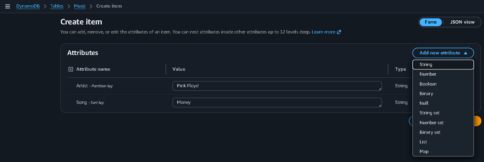

2. No formulário de criação do item, preenchi os atributos obrigatórios:
   - **Artist**: `Pink Floyd`
   - **Song**: `Money`

3. Em seguida, adicionei atributos extras usando **Add new attribute**:
   - Atributo `Album` do tipo **String** com valor `The Dark Side of the Moon`
   - Atributo `Year` do tipo **Number** com valor `1973`

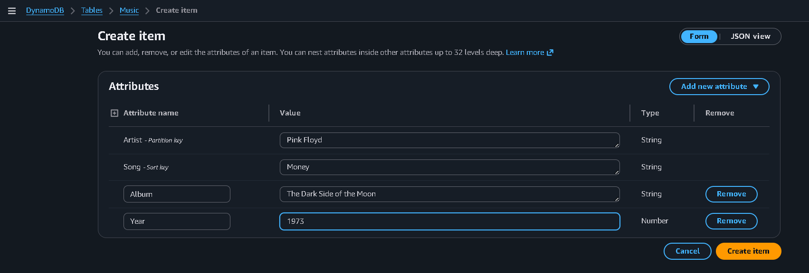

4. Cliquei em **Create item** para salvar o registro de `Pink Floyd - Money`.

5. Repita o processo para criar o segundo item com os seguintes atributos:
   - **Artist**: `John Lennon`
   - **Song**: `Imagine`
   - **Album** (String): `Imagine`
   - **Year** (Number): `1971`
   - **Genre** (String): `Soft rock`

6. Criei o terceiro item com os atributos abaixo:
   - **Artist**: `Psy`
   - **Song**: `Gangnam Style`
   - **Album** (String): `Psy 6 (Six Rules), Part 1`
   - **Year** (Number): `2011`
   - **LengthSeconds** (Number): `219`

Após inserir todos os registros, ao executar um *Scan* simples, a tabela exibe os três itens da biblioteca musical.

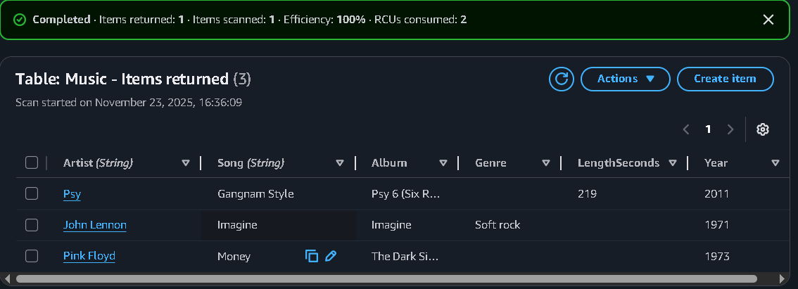

---

## Task 3: Modificar um item existente
Percebi que o ano da música **Gangnam Style** estava incorreto (2011). Nesta task corrigi esse valor.

1. No menu lateral, acessei **Explore items** e garanti que a tabela selecionada era `Music`.
2. Na lista de itens retornados por um *Scan*, cliquei sobre o artista **Psy** para editar o item.

3. Na tela de edição, alterei o valor do atributo **Year** de `2011` para `2012`.

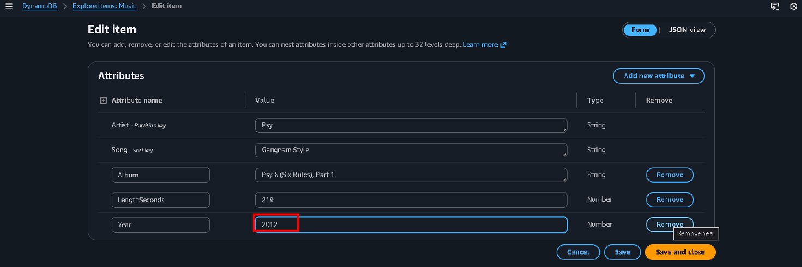

4. Cliquei em **Save and close** para salvar a atualização. O item agora está com o ano correto.

---

## Task 4: Consultar a tabela
### 4.1 Consultar via Query (por chave primária)
1. Em **Explore items**, selecionei a tabela `Music` e marquei a opção **Query** na seção *Scan or query items*.
2. Em **Partition key (Artist)**, preenchi com `Psy`.
3. Em **Sort key (Song)**, preenchi com `Gangnam Style`.
4. Cliquei em **Run** para executar a consulta.

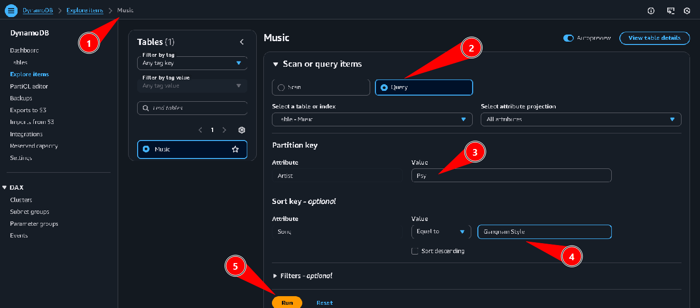

A consulta retornou rapidamente apenas o item correspondente à combinação `Artist = Psy` e `Song = Gangnam Style`.

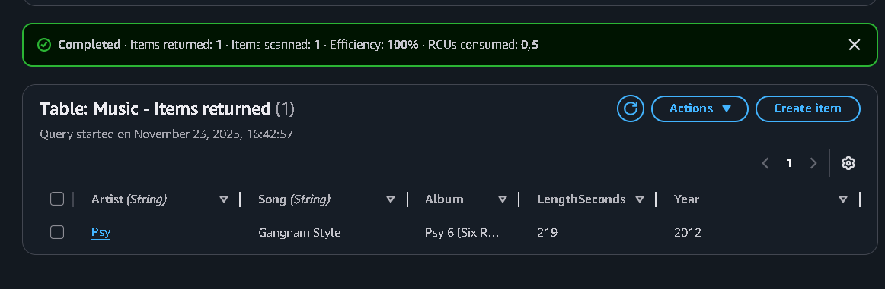

### 4.2 Consultar via Scan com filtro
1. Ainda em **Explore items**, alterei o modo de consulta para **Scan**.
2. Em **Filters (optional)**, adicionei um filtro com:
   - **Attribute name**: `Year`
   - **Condition**: `= (Equal to)`
   - **Type**: **Number**
   - **Value**: `1971`
3. Cliquei em **Run**.

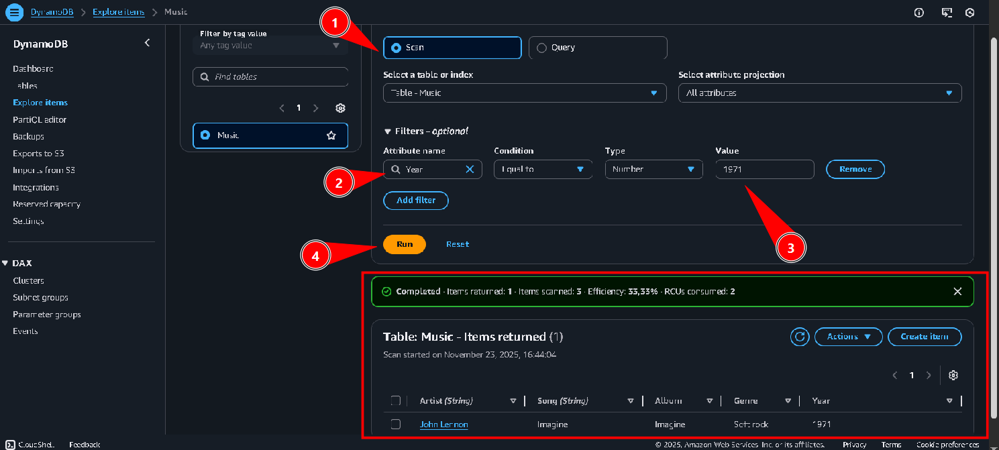

O resultado retornou somente a música **Imagine** de John Lennon, lançada em 1971.

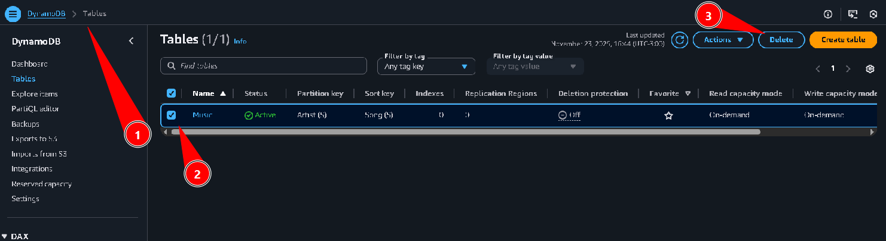

---

## Task 5: Excluir a tabela `Music`
1. No menu lateral, voltei para **Tables**.
2. Marquei a tabela `Music` e cliquei em **Actions > Delete table**.
3. Na janela de confirmação, digitei `delete` e confirmei em **Delete table**.

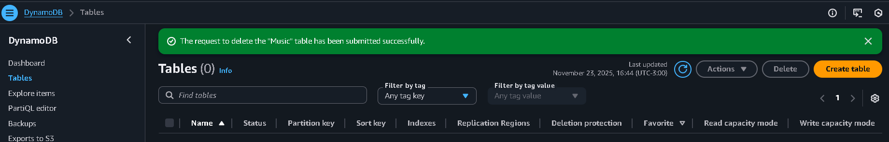

Após alguns instantes, a tabela foi removida e a lista de tabelas do DynamoDB ficou vazia.

---

## Conclusão
Neste laboratório, pratiquei conceitos básicos de **Amazon DynamoDB**, criando a tabela `Music` com chave composta (`Artist` + `Song`), inserindo itens com diferentes atributos, atualizando um registro existente, consultando dados com *Query* e *Scan* (incluindo filtros) e, por fim, excluindo a tabela. Isso mostrou na prática a flexibilidade do modelo NoSQL do DynamoDB e como ele pode ser usado para aplicações que exigem baixa latência e escalabilidade.
