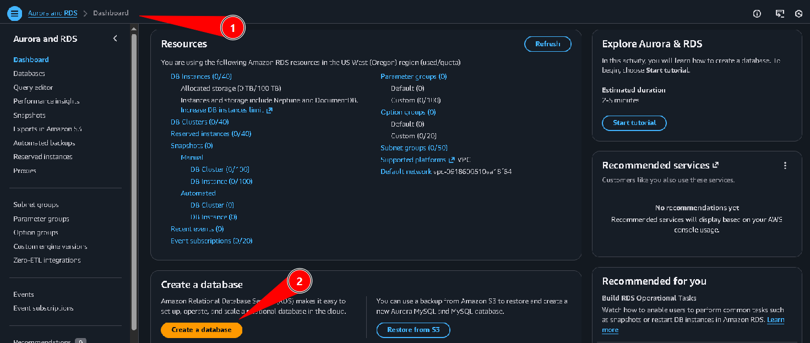
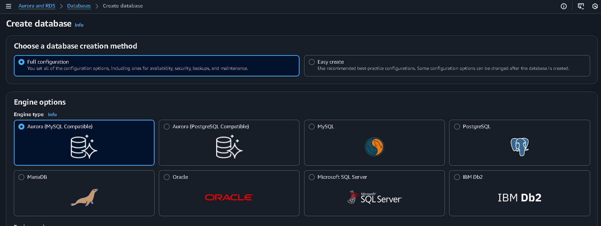
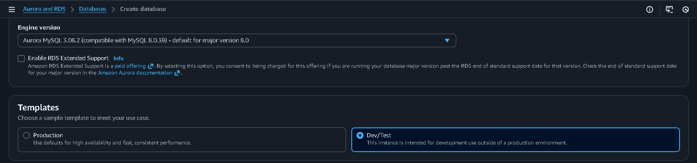
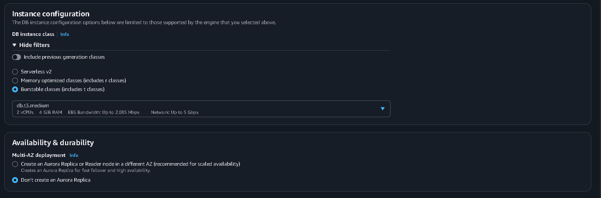
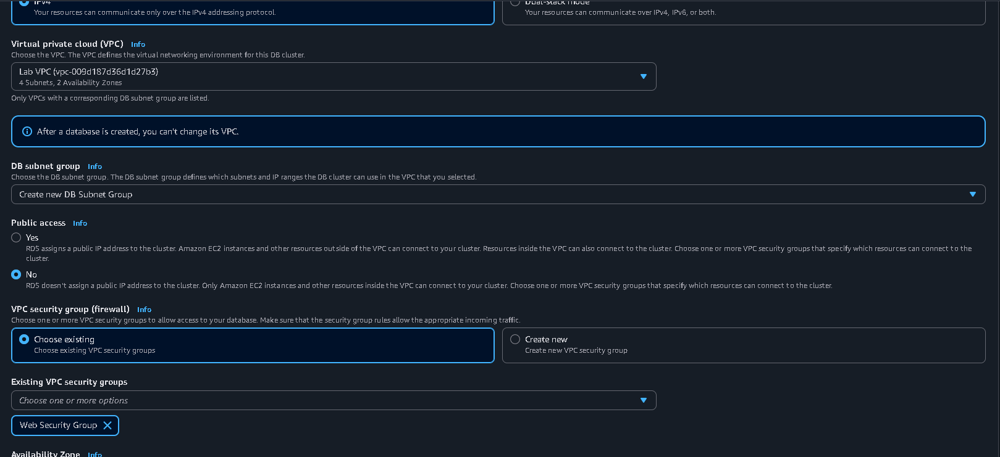
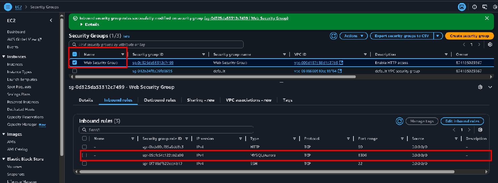
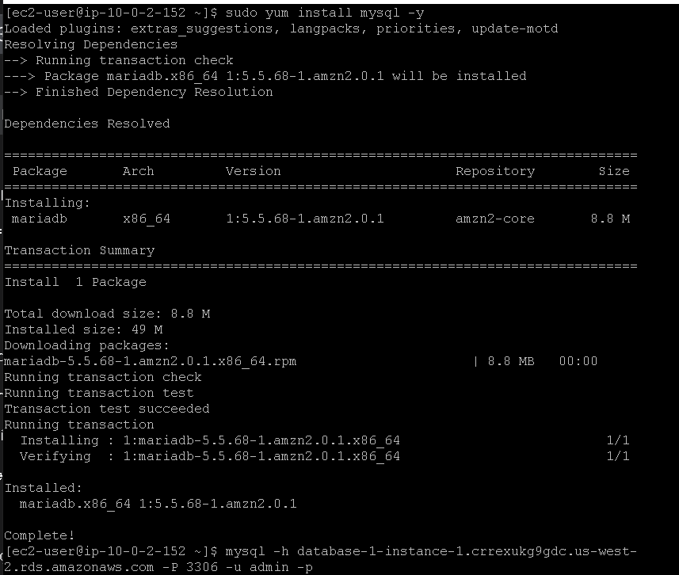
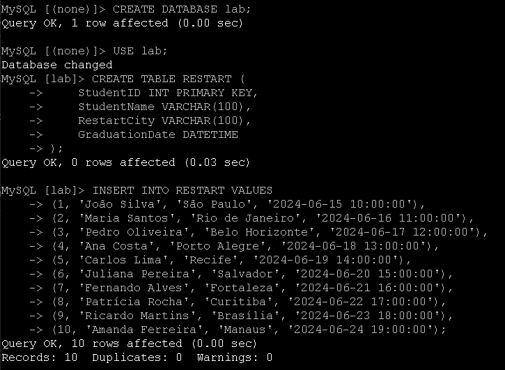
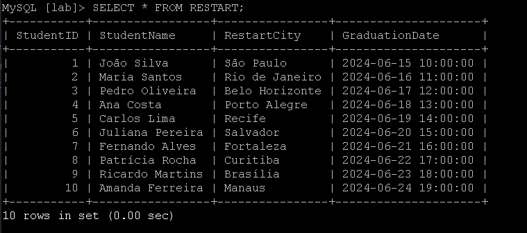

# Lab 37 - Criar e acessar um servidor RDS - Bancos de Dados 🗄️☁️

## Visão geral
Neste laboratório de **desafio**, construí do zero um servidor de banco de dados gerenciado no **Amazon RDS** e interagi com ele a partir de um servidor Linux (LinuxServer). O objetivo foi praticar o provisionamento de uma instância de banco relacional gerenciada pela AWS, configurar a conectividade de rede e trabalhar com tabelas e consultas SQL usando o cliente **MySQL**.

Ao final, eu tinha um banco de dados `lab` com duas tabelas relacionadas (`RESTART` e `CLOUD_PRACTITIONER`) e realizei *SELECTs* e um **INNER JOIN** entre elas.

## Objetivos
- Criar uma instância de banco de dados no **Amazon RDS** (Aurora MySQL compatível)
- Configurar VPC e *security groups* para permitir o acesso a partir do LinuxServer
- Conectar ao banco usando o cliente **mysql** em uma instância EC2
- Criar as tabelas `RESTART` e `CLOUD_PRACTITIONER`
- Inserir linhas de teste e consultar os dados com **INNER JOIN**

---

## Task 1: Criar a instância de banco de dados no Amazon RDS

1. No Console AWS, pesquisei por **RDS** e abri o serviço **Aurora and RDS**.
2. No painel **Dashboard**, conferi que não havia bancos criados e, na seção **Create a database**, cliquei em **Create a database**.



3. Na tela **Create database**, escolhi o método **Full configuration**, que permite configurar todos os detalhes da instância.
4. Em **Engine options**, selecionei **Aurora (MySQL Compatible)** como tipo de mecanismo.



5. Mantive a **Engine version** padrão para Aurora MySQL 8.x e escolhi o *template* **Dev/Test**, adequado para ambiente de laboratório.



6. Em **Instance configuration**, selecionei **Burstable classes (includes t classes)** e usei uma instância do tipo **db.t3.medium**, que está dentro das restrições do lab.
7. Em **Availability & durability**, marquei **Don't create an Aurora Replica**, evitando Multi‑AZ/standby conforme orientado no desafio.



---

## Task 2: Configurar rede e *security groups*

1. Na seção **Connectivity**, escolhi a **Virtual private cloud (VPC)** chamada **Lab VPC**, fornecida pelo ambiente do laboratório.
2. Mantive o **DB subnet group** padrão sugerido pelo ambiente.
3. Em **Public access**, selecionei **No**, para que o banco só seja acessível de dentro da VPC do lab.
4. Em **VPC security group (firewall)**, marquei **Choose existing** e selecionei o *security group* **Web Security Group**.



5. Depois, fui ao serviço **EC2**, na opção **Security Groups**, selecionei o grupo **Web Security Group** e editei as **Inbound rules**.
6. Adicionei uma regra do tipo **MySQL/Aurora**, protocolo **TCP**, porta **3306**, permitindo o tráfego de entrada para que o LinuxServer pudesse se conectar ao RDS.



7. Com as configurações revisadas, finalizei o assistente clicando em **Create database** e aguardei até o status do cluster ficar **Available**.

---

## Task 3: Conectar ao LinuxServer e instalar o cliente MySQL

1. De acordo com as instruções do desafio, obtive o endereço público do **LinuxServer** e baixei a chave PEM/PPK apropriada.
2. Usei um cliente SSH para conectar ao servidor Linux.
3. Já conectado, instalei o cliente **MySQL** (no Amazon Linux ele instala o pacote `mariadb`, que fornece o comando `mysql`):

```bash path=null start=null
sudo yum install mysql -y
```



4. No console do RDS, localizei o **endpoint** da instância (por exemplo, `database-1-instance-1.crrexukg9gdc.us-west-2.rds.amazonaws.com`).
5. No LinuxServer, conectei ao banco usando o cliente `mysql` na porta 3306:

```bash path=null start=null
mysql -h <endpoint-do-rds> -P 3306 -u admin -p
```

(Substituí `<endpoint-do-rds>` pelo endpoint real e informei a senha configurada ao criar o banco.)

---

## Task 4: Criar o banco `lab` e a tabela `RESTART`

Com a conexão estabelecida ao servidor RDS, criei um banco específico para o desafio e a primeira tabela.

1. Dentro do cliente `mysql`, criei o banco `lab` e passei a usá‑lo:

```sql path=null start=null
CREATE DATABASE lab;
USE lab;
```

2. Em seguida, criei a tabela `RESTART` com as colunas solicitadas no enunciado do lab:

```sql path=null start=null
CREATE TABLE RESTART (
    StudentID INT PRIMARY KEY,
    StudentName VARCHAR(100),
    RestartCity VARCHAR(100),
    GraduationDate DATETIME
);
```

3. Para popular a tabela, inseri **10 alunos** de exemplo:

```sql path=null start=null
INSERT INTO RESTART VALUES
  (1,  'João Silva',       'São Paulo',      '2024-06-15 10:00:00'),
  (2,  'Maria Santos',     'Rio de Janeiro', '2024-06-16 11:00:00'),
  (3,  'Pedro Oliveira',   'Belo Horizonte', '2024-06-17 12:00:00'),
  (4,  'Ana Costa',        'Porto Alegre',   '2024-06-18 13:00:00'),
  (5,  'Carlos Lima',      'Recife',         '2024-06-19 14:00:00'),
  (6,  'Juliana Pereira',  'Salvador',       '2024-06-20 15:00:00'),
  (7,  'Fernando Alves',   'Fortaleza',      '2024-06-21 16:00:00'),
  (8,  'Patrícia Rocha',   'Curitiba',       '2024-06-22 17:00:00'),
  (9,  'Ricardo Martins',  'Brasília',       '2024-06-23 18:00:00'),
  (10, 'Amanda Ferreira',  'Manaus',         '2024-06-24 19:00:00');
```



4. Para validar, executei um *SELECT* retornando todas as linhas da tabela `RESTART`:

```sql path=null start=null
SELECT * FROM RESTART;
```

O resultado mostrou os 10 registros inseridos, com as cidades e datas de graduação.



---

## Task 5: Criar a tabela `CLOUD_PRACTITIONER` e realizar o INNER JOIN

1. Ainda no banco `lab`, criei a tabela `CLOUD_PRACTITIONER`, relacionando‑a com `RESTART` através da coluna `StudentID`:

```sql path=null start=null
CREATE TABLE CLOUD_PRACTITIONER (
    StudentID INT,
    CertificationDate DATETIME,
    FOREIGN KEY (StudentID) REFERENCES RESTART(StudentID)
);
```

2. Em seguida, inseri **5 linhas** simulando datas de certificação para alguns alunos:

```sql path=null start=null
INSERT INTO CLOUD_PRACTITIONER VALUES
  (1, '2024-03-01 09:00:00'),
  (2, '2024-03-02 10:00:00'),
  (3, '2024-03-03 11:00:00'),
  (4, '2024-03-04 12:00:00'),
  (5, '2024-03-05 13:00:00');
```


3. Para conferir os dados da nova tabela, rodei:

```sql path=null start=null
SELECT * FROM CLOUD_PRACTITIONER;
```

4. Por fim, atendi ao requisito do desafio realizando um **INNER JOIN** entre as duas tabelas para listar o ID do aluno, nome e data de certificação:

```sql path=null start=null
SELECT
  r.StudentID,
  r.StudentName,
  c.CertificationDate
FROM RESTART r
INNER JOIN CLOUD_PRACTITIONER c
  ON r.StudentID = c.StudentID;
```

Esse comando retorna somente os alunos que possuem registro nas duas tabelas, combinando as informações de graduação com as datas de certificação.


---

## Conclusão
Neste laboratório de desafio construí uma solução completa usando **Amazon RDS** como banco gerenciado. Provisionei um cluster Aurora MySQL na **Lab VPC**, configurei as regras de **security group** para permitir o acesso a partir do LinuxServer, instalei o cliente **MySQL** na instância EC2 e criei o banco `lab` com as tabelas `RESTART` e `CLOUD_PRACTITIONER`. Após inserir dados de exemplo, executei consultas simples e um **INNER JOIN**, consolidando na prática os conceitos de provisionamento, conexão e manipulação de dados em um banco relacional gerenciado na AWS.

