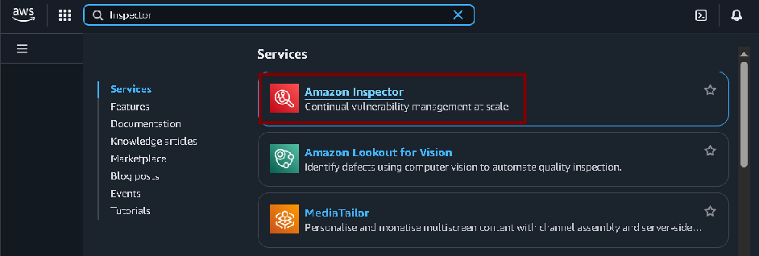
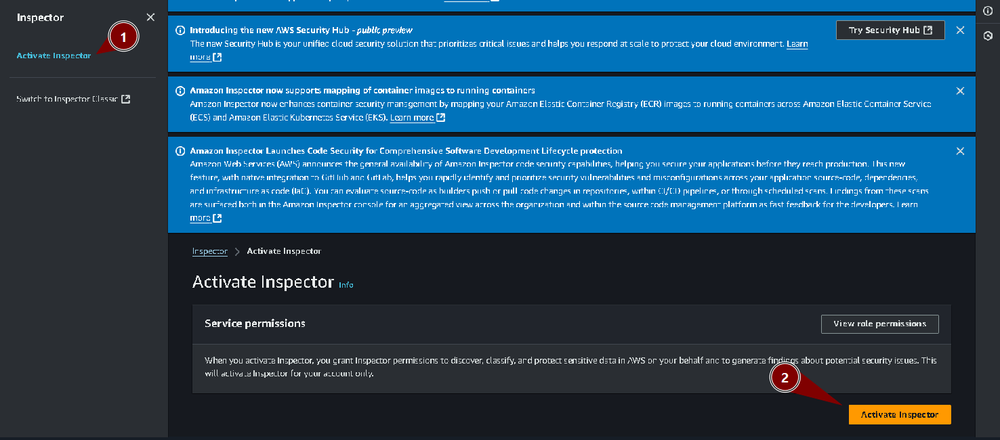
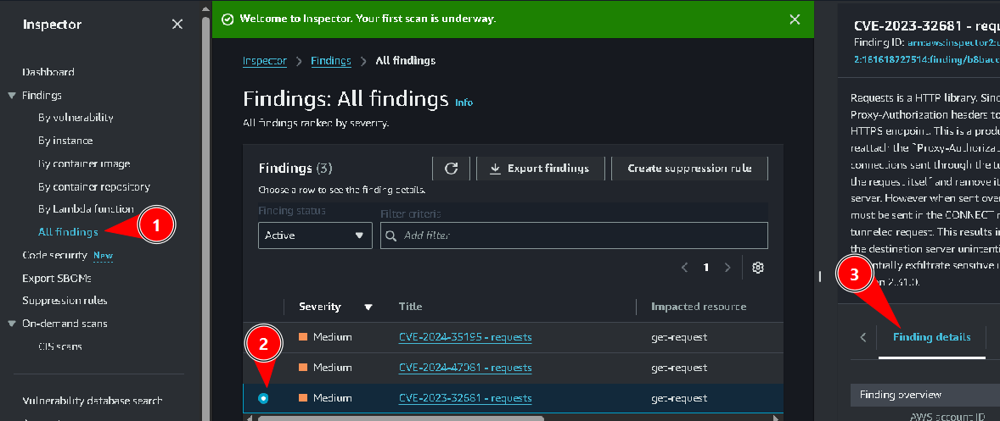
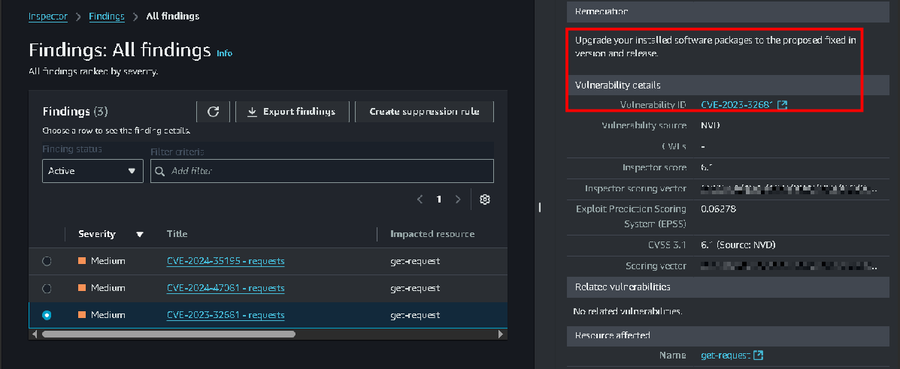
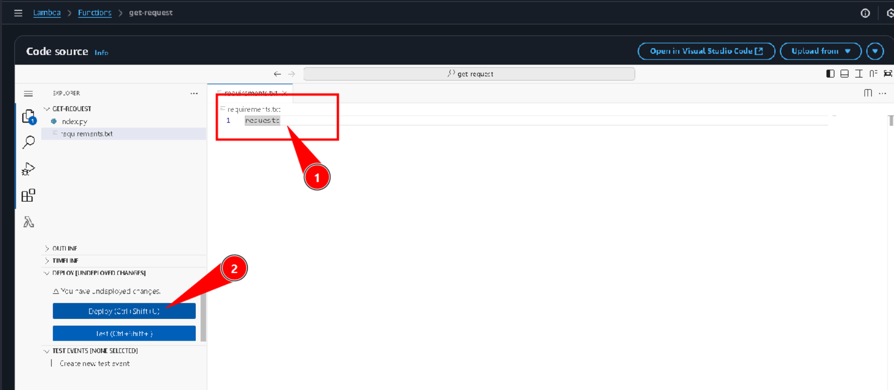
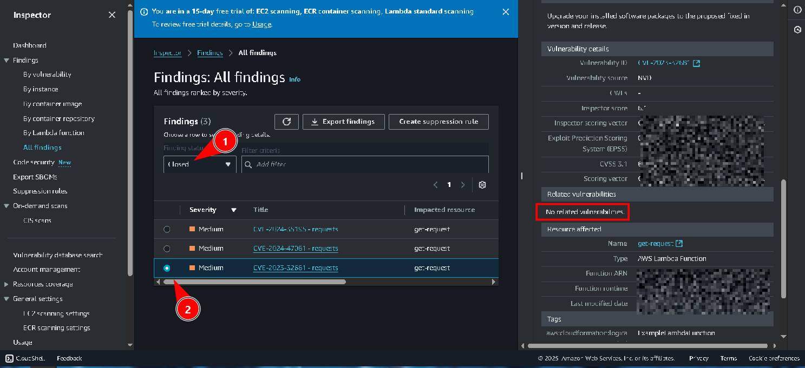
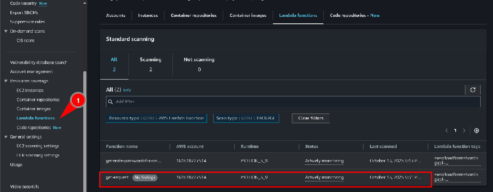

# Laboratório de endurecimento de rede - Segurança 💻🛡🔒
 
<h3>Neste laboratório vamos utilizar o Amazon Inspector para verificar vulnerabilidades em alguns recursos da AWS como o AWS Lambda.</h3> 

**Amazon Inspector**: Scanner de segurança automatizado para aplicações AWS.  

**AWS Lambda**: Função sem servidor que executa código sob demanda.  

## Task 1: Activate the Amazon Inspector

Iniciamos a task 1 acessando o **Amazon Inspector**:  

Em seguida ativamos o inspector:  

E após a ativação, podemos ver que o Lambda está sendo monitorado:  

## Task 2: Reviewing the inspected resources

<h3>Task 2.1: Reviewing your Lambda functions</h3>

Agora, para revisar as funções Lambda acessamos **"All findigns"** e selecionamos a terceira vulnerabilidade e visualizamos seu detalhes:  

Aqui podemos ver em **Remediation** uma breve explicação da vulnerabilidade e como resolve-la:  
  
* Neste caso o sistema nos diz que são pacotes desatualizados.

## Task 3: Remediating the vulnerabilities findings

<h3>Task 3.1: Remediating your Lambda function’s Package Vulnerabilities</h3>

Agora para resolver o problema, acessamos o Lambda e acessamos a *Function* que analisamos:  

Em seguida alteramos o arquivo **requirements.txt**, alterando <code>requests==2.20.0</code> para <code>requests</code>, dessa forma o sistema executará as funções utilizando os pacotes Python mais recentes, já que não especificamos nenhuma versão:  

Agora se retornamos para o painel onde vimos a vulnerabilidade, podemos ver que a que function que selecionamos anteriormente não contém mais vulnerabilidades:  

Podemos confirmar essa informação a aba abaixo, vendo a verificação mais recente da Lambda function:  
