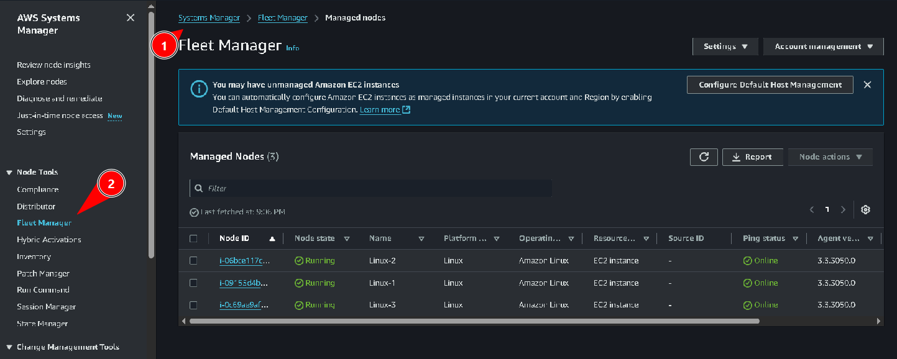
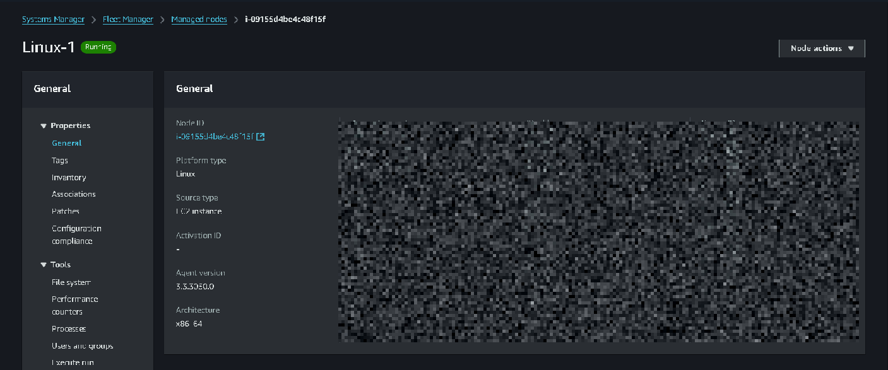
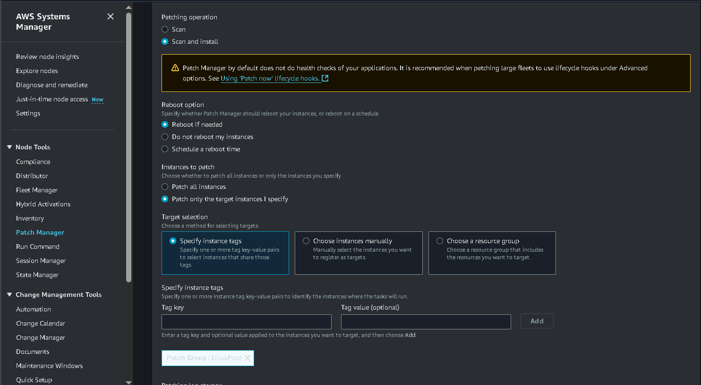
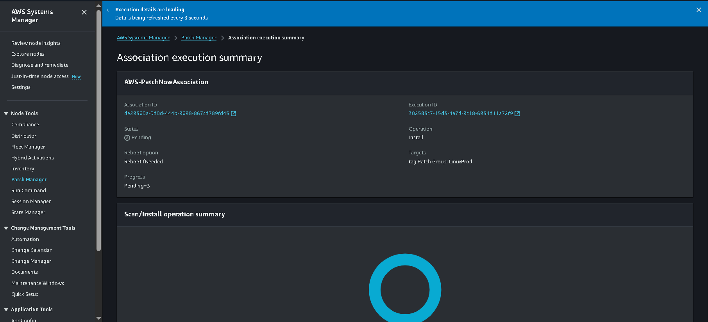
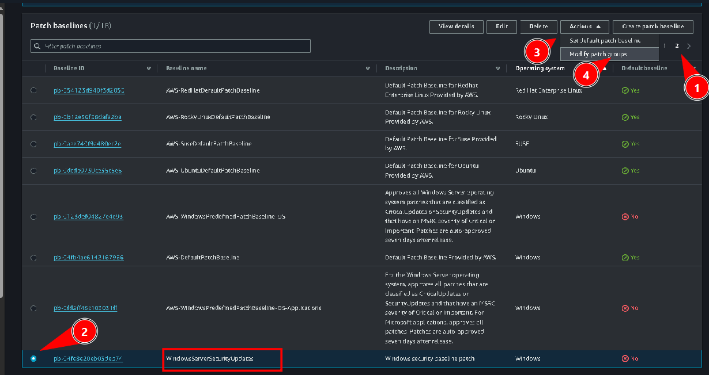
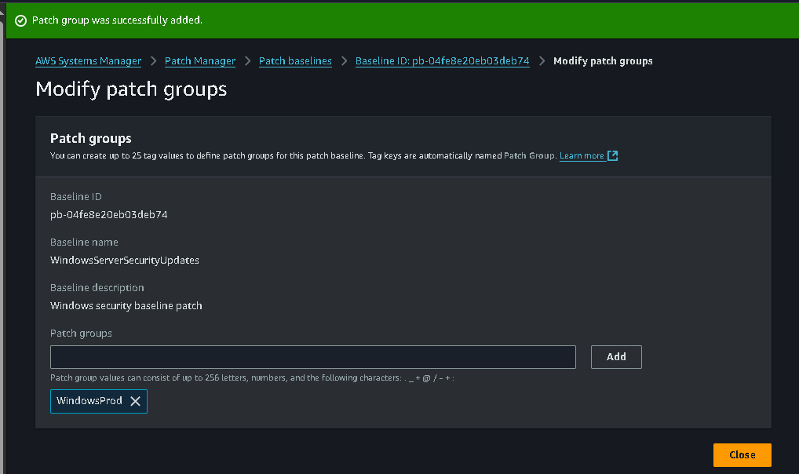
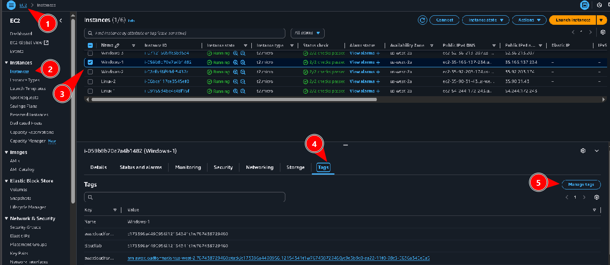
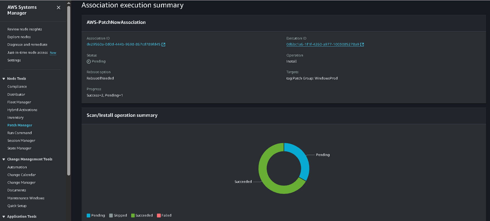

# Laboratório de endurecimento de sistemas - Segurança 💻🛡🔒

<h3>Neste laboratório vamos utilizar o Patch Manager, recurso do AWS Systems Manager para aplicar patches de atualização em instâncias EC2.</h3>

## Task 1: Patch Linux instances using default baselines

Primeiro iremos acessar o **Systems Manager**, na aba lateral vamos em *Fleet Manager*, aqui podemos ver os nós do nosso sistema:    

Selecionamos *Linux-1* e acessamos seus detalhes:  

Aqui podemos ver detalhes sobre essa instância, como tipo de plataforma, tipo de nó, nome do SO, e outros:  

Em seguida voltamos à página principal e acessamos **Patch Manager** e acessamos onde a tag 2 aponta:  

Fazemos a configuração e definimos que ela deve ser aplicada ao grupo *LinuxProd*:  

Em seguida criamos e aplicamos o patch:  

E agora podemos ver que ele foi aplicado às 3 instâncias Linux que nós temos:  

## Task 2: Create a custom patch baseline for Windows instances

Agora vamos criar uma linha de base de patches de atualização para as instâncias com Windows. Seguimos o caminho indicado na imagem:  

Realizamos a configuração da Patch Baseline, definindo nome, Sistema Operacional, definindo regras de SO...:  

Aqui criamos outra regra:  

  E em seguida criamos a Patch Baseline.

Agora selecionamos a *"PB"* que acabamos de criar, e vamos em **Modify Patch Groups**:  

Agora adicionamos o grupo *"WindowsProd"* para que o Patch seja aplicado às instâncias desse grupo:  

## Task 3: Patching the Windows instances
Nesta task vamos aplicar os patches às instâncias com base nas tags associadas a elas.

### Task 3.1: Tagging Windows instances

Acessamos o painel de instâncias em EC2, selecionamos uma das instâncias com Windows e vamos em tags, depois em "manage tags":  

Adicionamos a tag de WindowsProd e repetimos o processo para as três instâncias com Windows:  

### Task 3.2: Patching Windows instances

Agora, assim como fizemos para as instâncias Linux, faremos para as com SO Windows:  

E aqui podemos ver os patches sendo aplicados às instâncias:  

