# Laboratório de proteção de dados usando criptografia - Segurança 💻🛡🔒

<h3>Vamos conectar a um servidor na AWS, criar uma chave de segurança e usá-la para criptografar e descriptografar arquivos de texto. Vamos ver como os arquivos aparecem quando estão criptografados e depois vamos restaura-los ao formato normal.</h3>

**AWS CLI:** Ferramenta de linha de comando para interagir com os serviços da AWS.

**AWS KMS:** Serviço para criar e gerenciar chaves de criptografia.

**AWS Encryption CLI:** Ferramenta específica para criptografar e descriptografar arquivos usando as chaves do KMS.

## Task 1: Create an AWS KMS key

Iniciamos acessando o **AWS KMS key** e criando uma key: <br>
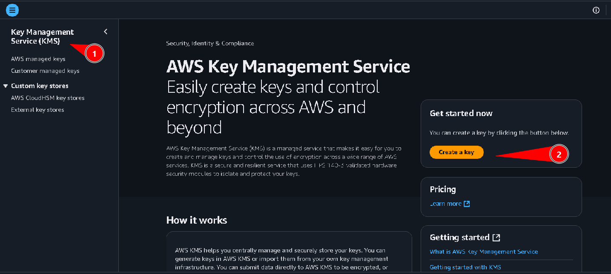

Para configurar a chave, selecionamos uma chave do tipo *simétrica* e de *encriptação e desencriptação*: <br>
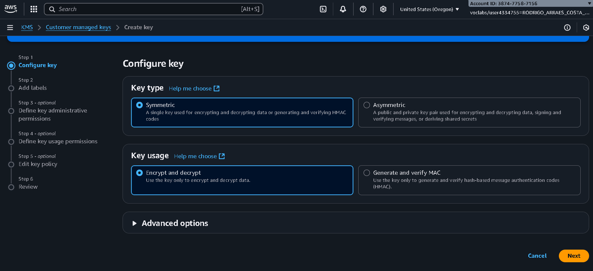

Agora definimos um *Alias*: <br>
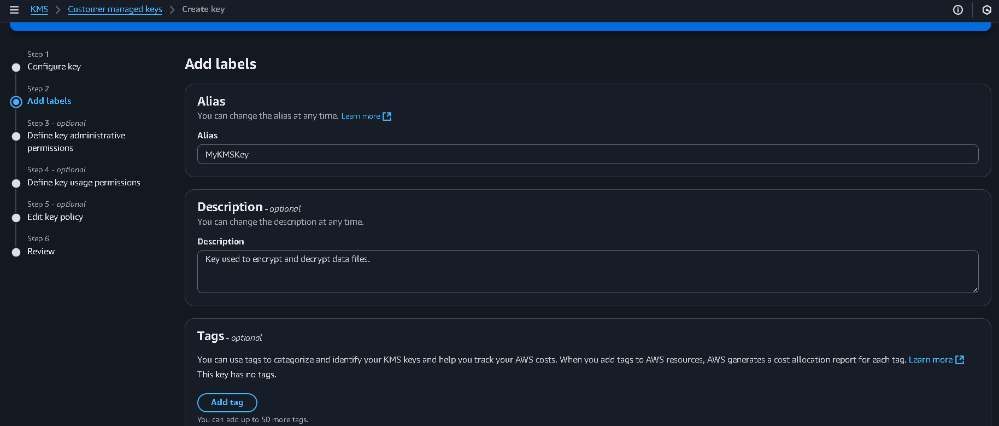

Selecionamos o nosso usuário(*voclabs*) como administrador e usuário da chave: <br>
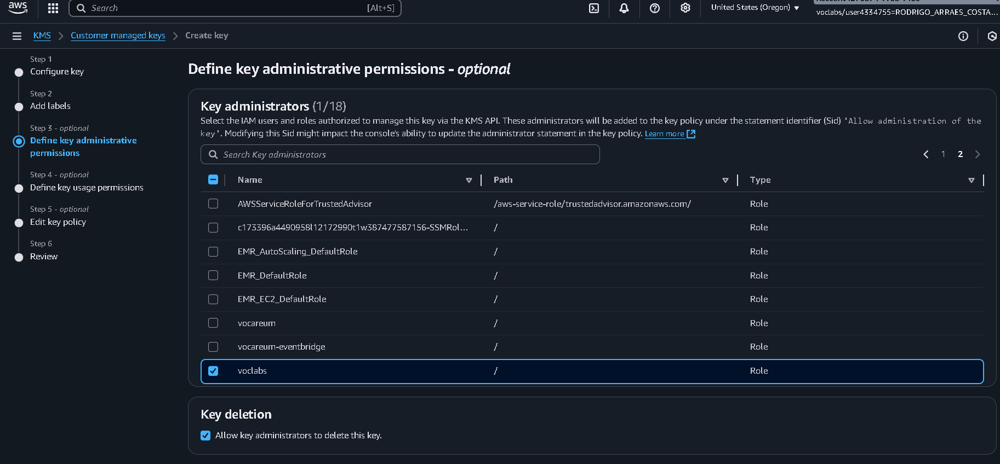


Aqui podemos ver a *"Key police"* ou *política de chave* da chave que estamos criando, essas políticas são implementadas através de um arquivo **JSON**: <br>
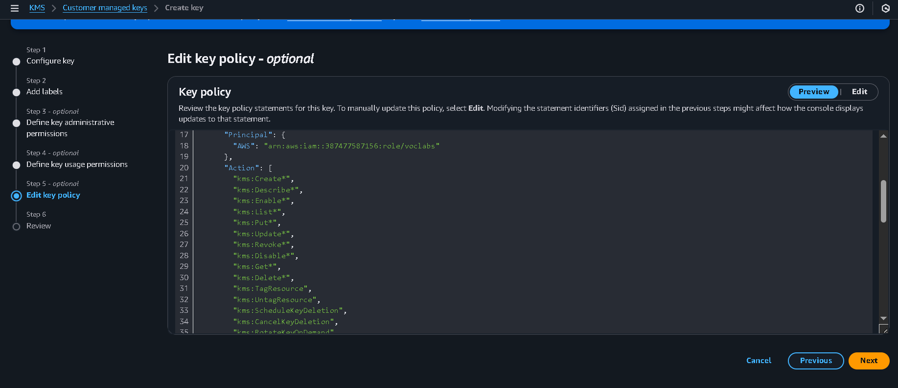

Após criarmos a chave, podemos acessá-la e visualizar sua **ARN**(é uma espécie de identificador para a chave): <br>
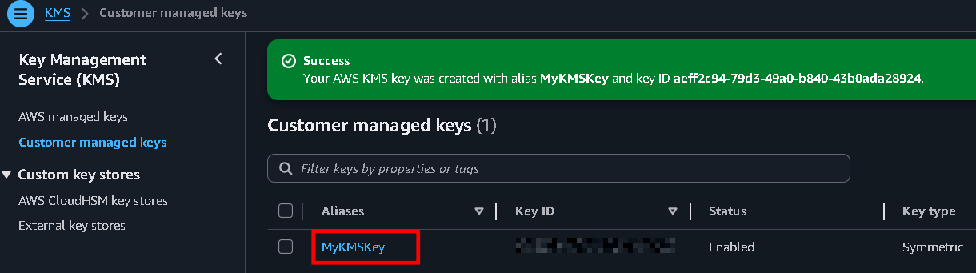
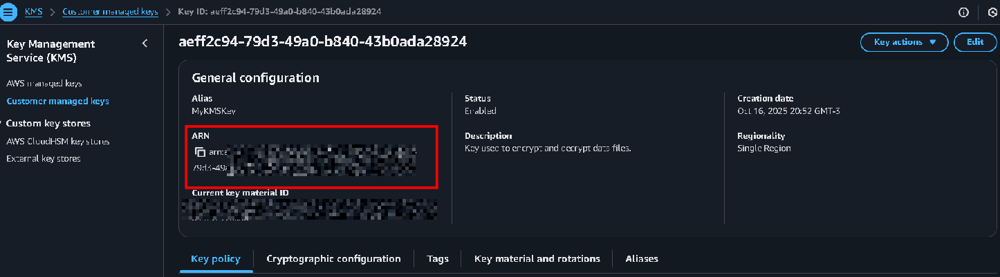


## Task 2: Configure the File Server instance

Depois acessamos a aba de instâncias EC2 e estabelecemos conexão com a instância *FileServer*: <br>
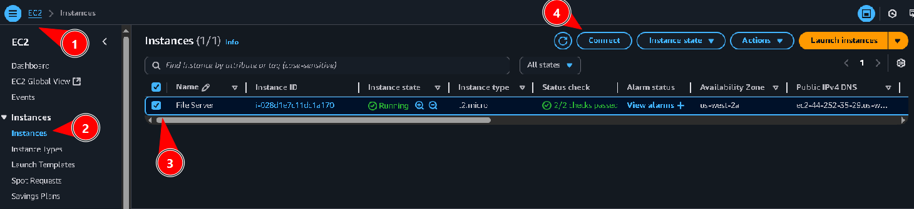
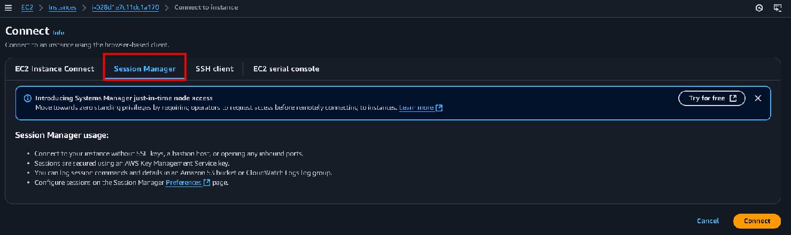

Adicionamos credenciais genéricas para podermos acessar o arquivo *credentials*: <br>
 <br>

E nele adiciono as minhas credenciais do laboratório: <br>
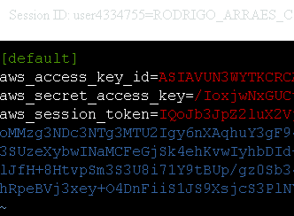 <br>

Aqui podemos ver que as credenciais forma adicionadas com sucesso e em seguida executei o comando <code>pip3 install aws-encryption-sdk-cli</code> para baixar a instalar a CLI do AWS Encryption SDK (ferramenta de criptografia e descriptografia): <br>
 <br>

Em seguida executamos <code>export PATH=$PATH:/home/ssm-user/.local/bin</code> para podermos usar essa CLI em qualquer diretório: <br>
 <br>


## Task 3: Encrypt and decrypt data

Agora criamos 3 arquivos, e adicionamos o texto: "*TOP SECRET 1!!!*" ao arquivo **secret1.txt** e depois criamos o diretório **output**: <br>
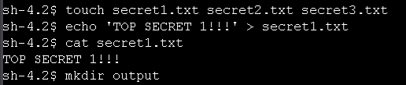 <br>

Criamos uma variável e adicionamos a ARN da chave que criamos: <br>
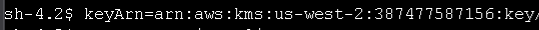

Agora usamos o comando: <br>
```
aws-encryption-cli --encrypt \
                     --input secret1.txt \
                     --wrapping-keys key=$keyArn \
                     --metadata-output ~/metadata \
                     --encryption-context purpose=test \
                     --commitment-policy require-encrypt-require-decrypt \
                     --output ~/output/.
```
Para criptografarmos o arquivo **secret1.txt** e direcionarmos o arquivo criptografado para a pasta *output*. Agora se usarmos <code>cat secret1.txt.encrypted</code> para observamos o conteúdo dentro do arquivo **secret1.txt.encrypted**, podemos ver que seus dados estão criptografados: <br>
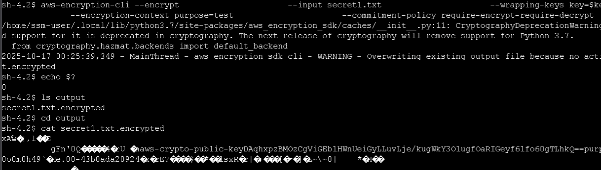

Agora usamos o comando: <br>
```
aws-encryption-cli --decrypt \
                     --input secret1.txt.encrypted \
                     --wrapping-keys key=$keyArn \
                     --commitment-policy require-encrypt-require-decrypt \
                     --encryption-context purpose=test \
                     --metadata-output ~/metadata \
                     --max-encrypted-data-keys 1 \
                     --buffer \
                     --output .
``` 
Para descriptografar o arquivo, e então podemos ver o conteúdo que está dentro dele, nesse caso: "*TOP SECRET 1!!!*" <br>


