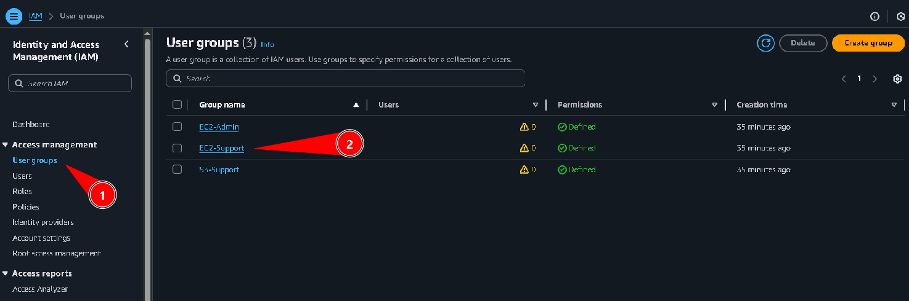
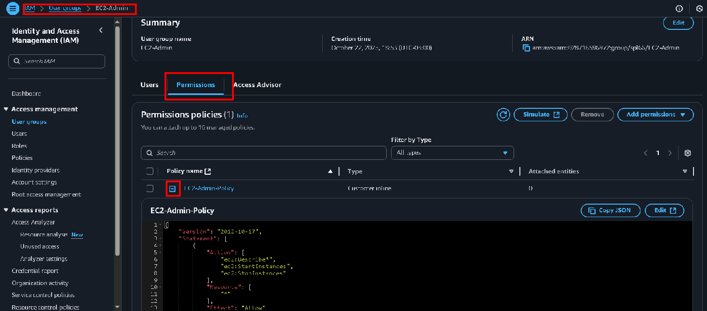
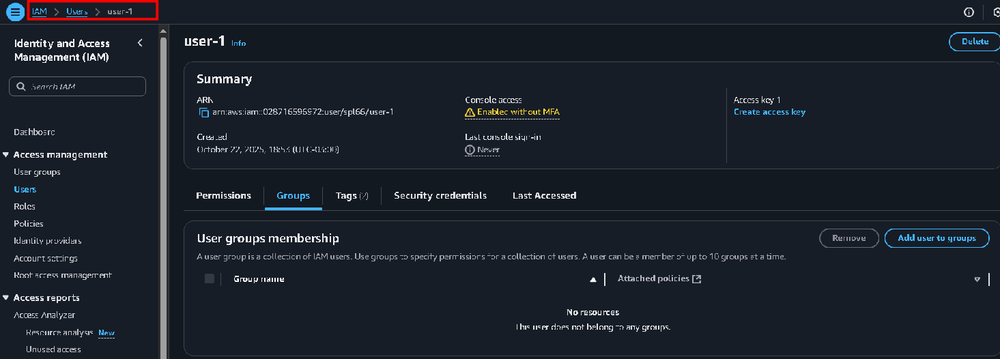
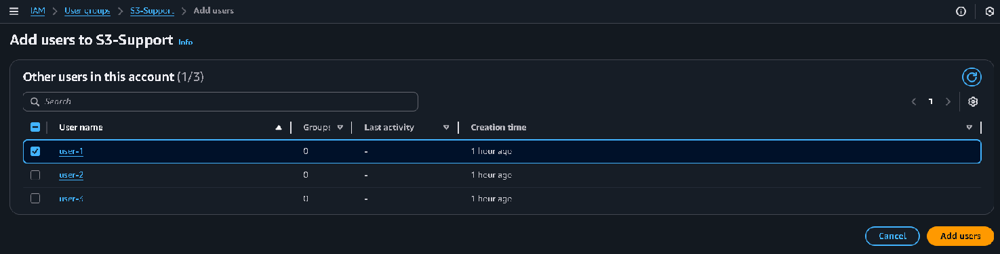
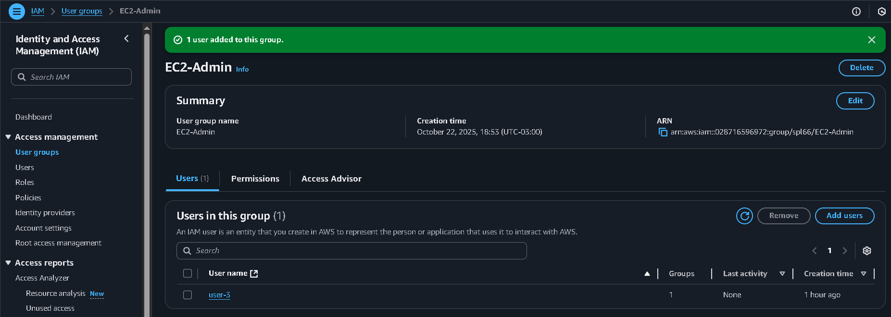
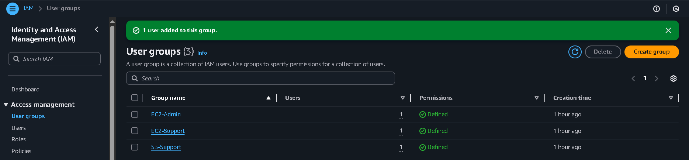
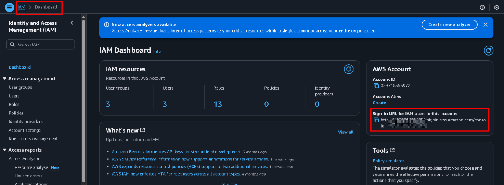
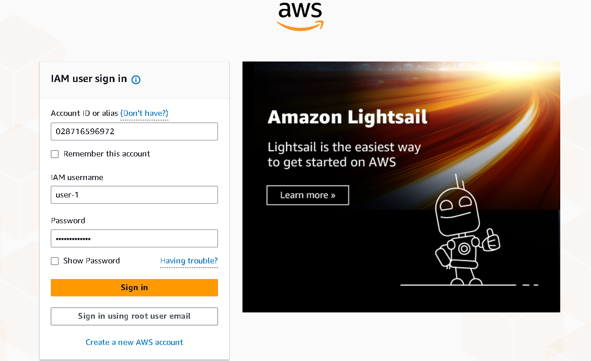
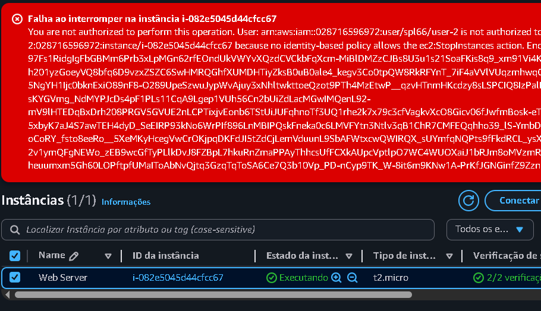

# Laboratório de introdução ao gerenciamento de acesso utilizando IAM - Segurança 💻🛡🔒.

<h3>Neste laboratório, vou aprender a controlar o acesso na AWS usando o IAM. Vou criar regras de senha, organizar usuários em grupos com permissões específicas e testar na prática como essas políticas permitem ou bloqueiam o acesso aos serviços, garantindo que apenas pessoas autorizadas consigam usar os recursos da rede.</h3>

**O IAM é o controle de acesso da AWS que define quem pode entrar e o que cada pessoa pode fazer dentro da conta.**

Abaixo temos a estrutura que vou montar neste laboratório:  

## Task 1: Create an account password policy

Nesta task, vamos criar uma política de senhas personalizada para a conta AWS. Iniciamos acessando o **IAM**, vamos em *Account Settings* e em seguida vamos editar as políticas de senha:  

Definimos as políticas de senha desejadas e à criamos:  

## Task 2: Explore users and user groups

Agora vamos analisar os grupos e usuários presentes neste laboratório. Poderemos ver suas políticas e permissões:

## Task 3: Add users to user groups

Aqui temos a tabela de como iremos estruturar os usuários para cada grupo:  

### Add user-1 to the S3-Support group

Aqui iremos adicionar o **user-1** ao grupo **S3-Support**:

### Add user-2 to the EC2-Support group

Aqui iremos adicionar o **user-2** ao grupo **EC2-Support**:

### Add user-3 to the EC2-Admin group

Agora iremos adicionar o **user-3** ao grupo **EC2-Admin**:

Agora podemos visualizar no campo *Users* que cada grupo tem um usuário:  

## Task 4: Sign in and test user permissions

Agora vamos acessar o painel AWS como esses usuários: 

Como acessamos como **user-1** que é do grupo **S3-Support**, podemos ver que ao acessar o painel de EC2, não temos permissão para sequer visualizar as instâncias, por vez que nossa permissão é apenas para S3:  

Agora trocamos o usuário para **user-2** que pertence ao grupo **EC2-Support**, podemos notar que ele consegue acessar o painel EC2, e fazer modificações simples, porém se tentarmos interromper a instância:  

Recebemos essa mensagem de erro, pois a permissão desse usuário não permite que ele interrompa uma instância:  

Porém, agora logado com o **user-3**, que pertence ao grupo **EC2-Admin**, conseguimos interromper a instância com sucesso, uma vez que esse usuário tem permissões de administrador:  

