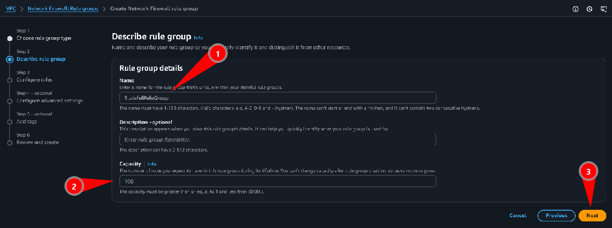
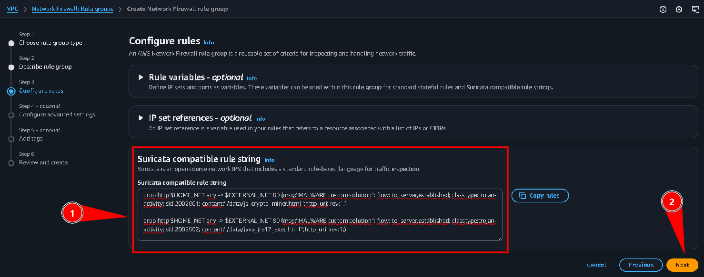
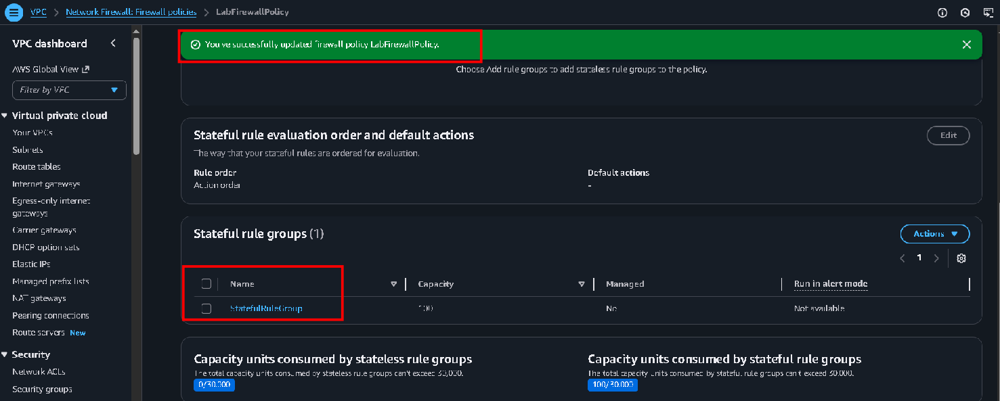
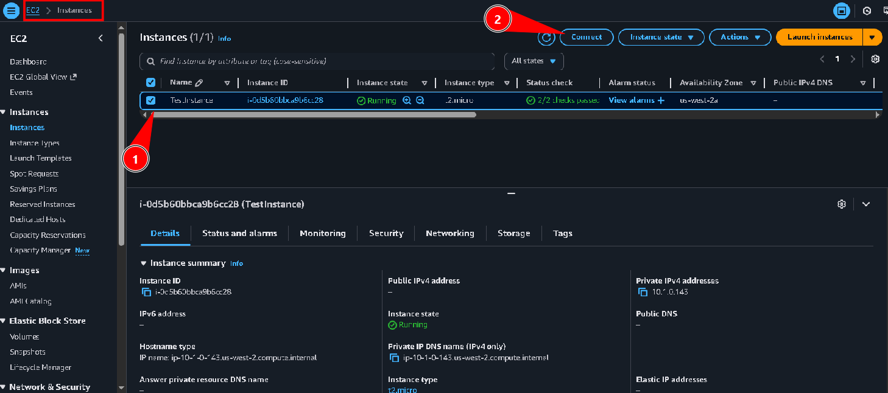

# Laboratório de detecção de firewall e malware - Segurança 💻🛡🔒

<h3>Neste laboratório vamos utilizar o AWS Network Firewall para criar regras que bloqueiem malware e atividades maliciosas em nossa rede. Vamos aprender a inspecionar o tráfego, criar regras baseadas em Suricata para detectar e bloquear downloads de malware, e validar que essas proteções estão funcionando corretamente.</h3>

**AWS Network Firewall**: Serviço que oferece proteção de firewall e detecção de invasões para sua VPC.  

**Suricata**: Engine de detecção de ameaças de código aberto que utiliza rules para inspecionar o tráfego de rede.  

**Malware Detection**: Capacidade de bloquear downloads e acessos a sites conhecidos por distribuir malware.  

## Task 1: Confirm Reachability

Nesta task vamos confirmar que conseguimos alcançar um site que contém malware simulado. Conectamos à instância EC2 e executamos comandos wget para baixar arquivos do site malware.wicar.org:  

Como podemos ver, conseguimos baixar os arquivos *js_crypto_miner.html* e *java_jre17_exec.html* com sucesso, o que significa que não há nenhuma proteção bloqueando esse acesso no momento.

## Task 2: Inspect the network firewall

Agora vamos acessar o painel do **AWS Network Firewall** para inspecionar a configuração existente. Navegamos até o firewall chamado *LabFirewall*:  

Podemos ver que o firewall já está criado e associado à política *LabFirewallPolicy*. Agora vamos acessar a política de firewall para ver as configurações atuais:  

Aqui visualizamos a página de *Firewall policies*, onde podemos ver que não há nenhum grupo de regras stateful associado à política atualmente. Existem apenas configurações de ações padrão.

## Task 3: Create a firewall rule group

Agora vamos criar um grupo de regras de firewall para detectar e bloquear malware. Acessamos a opção de criar um novo grupo de regras:  

Na primeira etapa, selecionamos o tipo de grupo de regras. Escolhemos **Stateful rule group** para inspecionar pacotes em contexto do fluxo de tráfego:  

Em seguida, descrevemos o grupo de regras com o nome *StatefulRuleGroup* e capacidade de 100. Na etapa de configuração de regras, adicionamos regras Suricata compatíveis que bloqueiam URLs maliciosas. As regras definem que qualquer tentativa de acessar URLs contendo *MALWARE* ou *js_crypto_miner.html* e *java_jre17_exec.html* será bloqueada:  

Continuamos com a criação do grupo de regras:  

O grupo de regras foi criado com sucesso, como confirmado pela mensagem verde indicando que o grupo *StatefulRuleGroup* foi criado.

## Task 4: Attach a rule group to the network firewall

Agora vamos associar o grupo de regras que acabamos de criar à política de firewall. Voltamos à página de regras do firewall:  

Aqui podemos ver a lista de grupos de regras disponíveis. Selecionamos nosso *StatefulRuleGroup* e o adicionamos à política. Após clicar em "Add rule groups to policy", conseguimos adicionar o grupo:  

A política foi atualizada com sucesso, como confirmado pela mensagem verde. Agora o grupo de regras *StatefulRuleGroup* está associado à política *LabFirewallPolicy* e está ativo na VPC.

## Task 5: Validate the solution

Agora vamos validar que as regras de firewall estão funcionando e bloqueando o acesso aos arquivos maliciosos. Conectamos novamente à instância EC2 e tentamos baixar os mesmos arquivos de antes:  

Como podemos ver, agora os downloads estão sendo bloqueados! A instância tenta acessar o site *malware.wicar.org*, mas o Network Firewall bloqueia a requisição. Os comandos wget não conseguem completar a conexão porque o firewall está interceptando o tráfego suspeito.

Para confirmar ainda mais, vamos ver que mesmo excluindo os arquivos e tentando novamente, eles continuam bloqueados:  

Os arquivos foram removidos, mas ao tentar baixá-los novamente, o firewall bloqueia o acesso. Isso confirma que nossas regras Suricata estão funcionando corretamente e protegendo a rede contra tentativas de download de malware.

**Conclusão**: Implementamos com sucesso um Network Firewall na VPC com regras de detecção de malware baseadas em Suricata. O firewall agora bloqueia qualquer tentativa de acessar URLs maliciosas conhecidas, protegendo os recursos da rede contra downloads e execução de malware.
