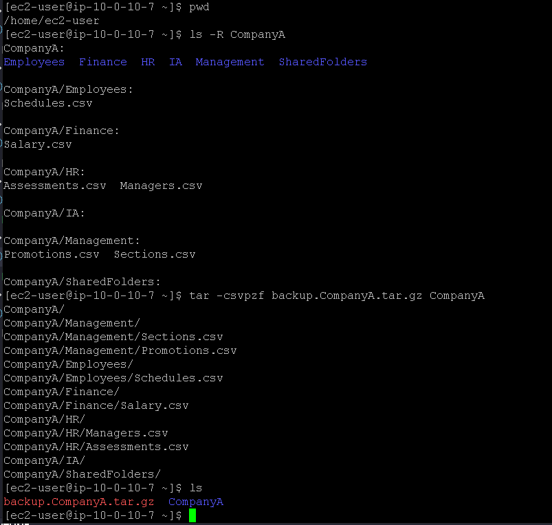
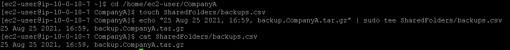
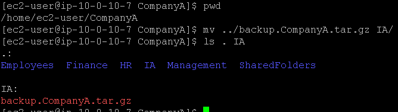

# Laboratório de trabalho com arquivos no Linux 📄📁🐧.

## Task 1: Use SSH to connect to an Amazon Linux EC2 instance

Na task 1, vamos realizar a conexão SSH assim como fizemos no laboratório anterior, veja em [Lab2 - Introdução ao Linux](https://github.com/RodrigoArraes07/Labs-AWS/blob/main/Lab2-IntroducaoLinux/README.md).

## Task 2: Create a backup

Nesta task, vamos usar o comandos novo a seguir:  
- <code>tar -csvpzf nome_arquivo nome_pasta</code>: Pode ser subdividido em: *tar* para criar/extrair um arquivo compactado, *-c* para criar um novo arquivo **tar**, *-s* ordenar os arquivos para entrar no archive, *-v* mostra os arquivos sendo processados, *-p* preserva as permissões dos arquivos, *-z* compacta com gzip, *-f* especifica o nome do arquivo de saída;  

Aqui verificamos se estamos na pasta correta, e então mudamos para *CompanyA*. Verificamos as pastas e seus arquivos com o comando <code>ls -R CompanyA</code>, que exibe os dados de forma recursiva. E então usamos o comando <code>tar -csvpzf backup.CompanyA.tar.gz CompanyA</code> para criar o arquivo tar, então podemos ver que o arquivo foi criado com sucesso:  

## Task 3: Log the backup

Nesta task vamos usar o seguinte comando novo:  
- <code>echo "mensagem" | sudo tee nome_arquivo</code>: O *echo* escreve a mensagem no terminal, em seguida a pipe "|" redireciona a mensagem para o comando *sudo tee* que escreve essa mensagem dentro do arquivo especificado;  

Iniciamos mudando para a pasta certa, e então usamos <code>touch SharedFolders/backups.csv</code> para criar o arquivo **.csv** que registra os logs de backups, após isso usamos <code>echo "25 Aug 25 2021, 16:59, backup.CompanyA.tar.gz" | sudo tee SharedFolders/backups.csv</code> para adicionar o log dentro do arquivo recém criado, podemos verificar se gravação do log foi feita de forma correta com o comando <code>cat SharedFolders/backups.csv</code>:  

## Task 4: Move the backup file

Agora, vamos mover o arquivo **tar** para a pasta *IA*, com o comando <code>mv ../backup.CompanyA.tar.gz IA/</code>, em seguida usamos <code>ls . IA</code> para verificar os dados da pasta atual e da pasta IA:  
