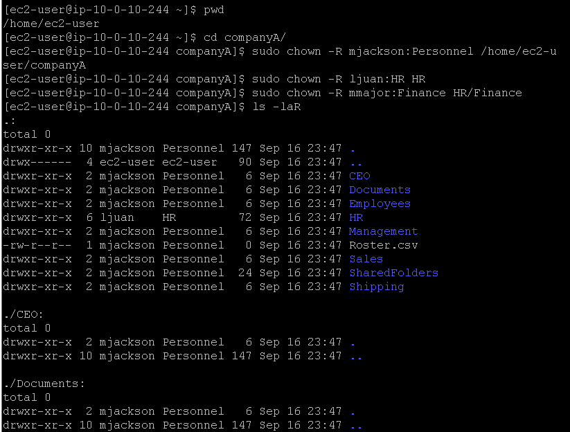
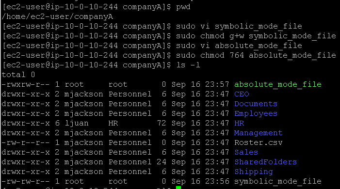
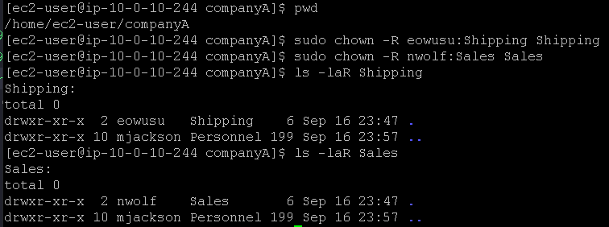

# Laboratório de gerenciamento de permissões de acesso a arquivos no Linux 📄📁🐧.

## Task 1: Use SSH to connect to an Amazon Linux EC2 instance

Na task 1, vamos realizar a conexão SSH assim como fizemos no laboratório anterior, veja em [Lab2 - Introdução ao Linux](https://github.com/RodrigoArraes07/Labs-AWS/blob/main/Lab2-IntroducaoLinux/README.md).

## Task 2: Change file and folder ownership

Nesta task, vamos usar o seguinte comando novo:  
- <code>sudo chown -R user:group diretório/arquivo</code>: Este comando altera o proprietário e o grupo do arquivo informado de forma recursiva, ou seja, se aplica a todos os dados dentro da pasta;  

Iniciamos verificando a nossa localização atual, e então mudamos para o diretório onde iremos realizar as operações. Agora, seguimos usando o comando <code>sudo chown -R user:group diretório/arquivo</code> conforme o laboratório pede, para alterar os proprietários e grupos dos arquivos informados. Em seguida usamos <code>ls -laR</code> para verificar os proprietários e grupos de cada diretório/arquivo:  

## Task 3: Change permission modes

Nesta task usamos os seguintes comandos novos:  
- <code>sudo chmod g+w symbolic_mode_file</code>: Utiliza o modo simbólico para adicionar(**+**) ao grupo(**g**roup) a permissão de escrita(**w**rite) no arquivo **symbolic_mode_file**;  
- <code>sudo chmod 764 absolute_mode_file</code>: Define as seguintes permissões sobre o arquivo **abslute_mode_file**:  
1º-user: *7 = 4(read) + 2(write) + 1(execute)*;  
2º-group: *6 = 4(read) + 2(write)*;  
3º-other: *4(read)*;  

Neste lab, criamos os arquivos symbolic_mode_file e absolute_mode_file com os respectivos comandos: <code>sudo vi symbolic_mode_file</code> e <code>sudo vi absolute_mode_file</code>. Em seguida alteramos a permissão sobre estes arquivos com os comandos: <code>sudo chmod g+w symbolic_mode_file</code> adicionando a pemissão simbólica de escrita, e <code>sudo chmod 764 absolute_mode_file</code> adicionando a permissão absoluta de leitura, escrita e execução para o proprietário, leitura e escrita para o grupo e leitura para outros. Em seguida podemos verificar as permissões alteradas:  

## Task 4: Assign permissions

Agora, vamos alterar os proprietários das pastas *Shipping* e *Sales* com os respectivos comandos: <code>sudo chown -R eowusu:Shipping Shipping</code> e <code>sudo chown -R nwolf:Sales Sales</code>; Após isso usamos <code>ls -laR nome_diretório</code> para verificar se as modificações funcionaram:  

## Conclusão
<h3>Este laboratório é de fundamental importância, pois no mercado de trabalho precisamos dominar bem o controle de permissões sobre determinados serviços, pois o impacto de ações incorretas sobre estes serviços pode causar prejuízos à empresa, por isso devemos entender como fazer o controle de permissionamento, o que pudemos praticar nesse laboratório.</h3>