# Laboratório de introdução ao Amazon EC2 ☁️🖥️

# Task 1: Lauching Your EC2 Instance

Na homepage, buscamos pelo serviço EC2, e em seguida acessamos o EC2 Dashboard:
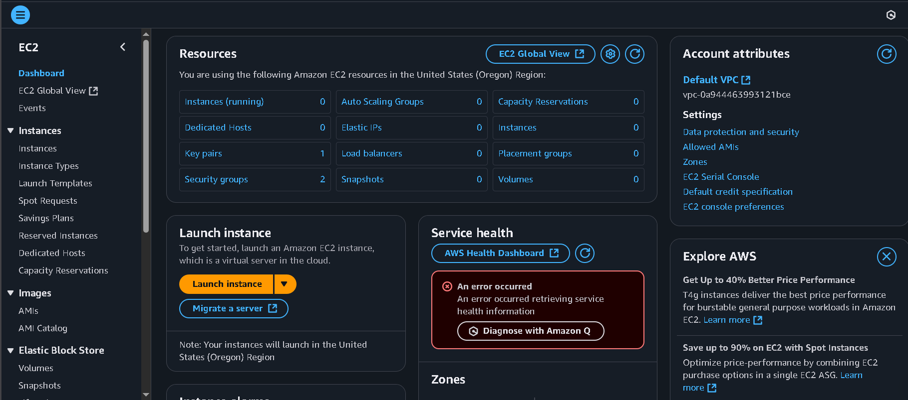
Nessa página, clicamos em <code>Launch Instance</code>

## Step 1: Naming your EC2 instance
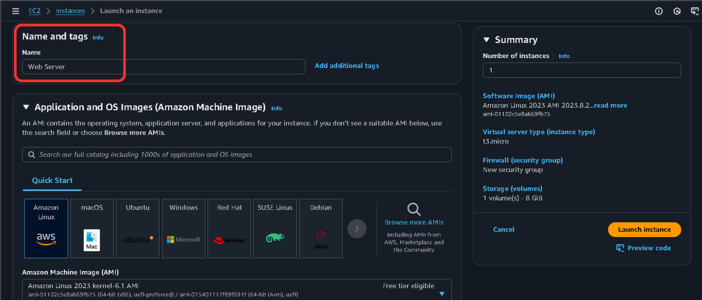
Nomeei como _Web Server_

## Step 2: Choosing an Amazon Machine Image (AMI)
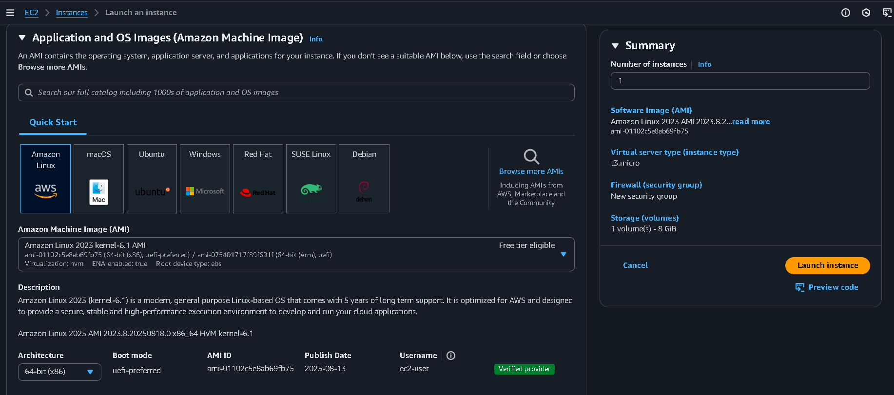
Para este laboratório, vamos manter a AMI padrão.

## Step 3: Choosing an instance type
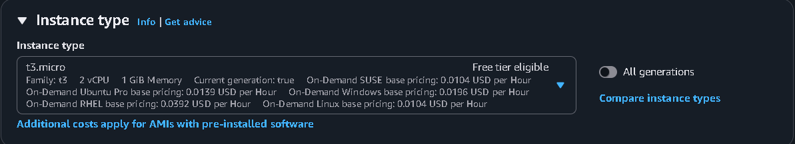
 O tipo de instância, nós também manteremos como padrão, o **t3.micro**

## Step 4: Configuring a key pair
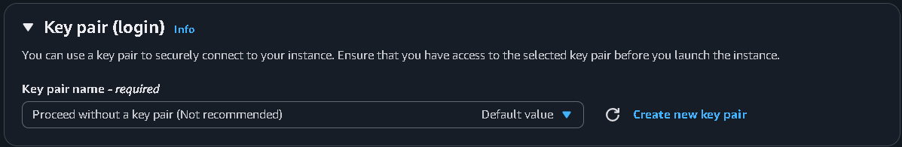
 Para este laboratório, também não vamos adicionar nenhuma key pair.

## Step 5: Configuring the network settings 
No campo de Network Settings, acessamos <code>Edit</code> : 
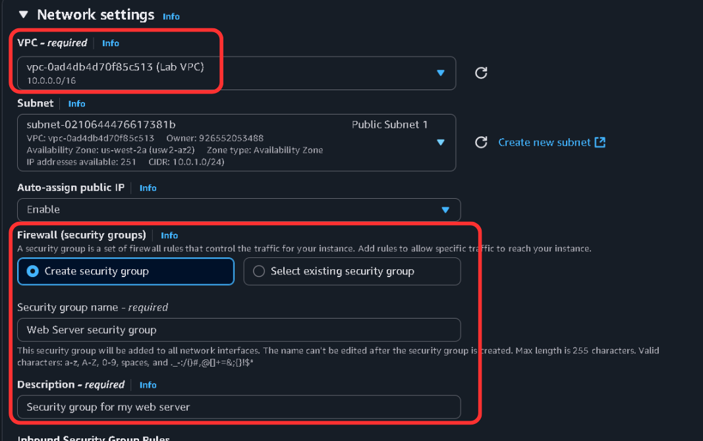
Determinamos a *VPC*: **Lab VPC**, e colocamos o nome do *Security Group*: 
*Security group name*: **Web server security group**; 
*Description*: **Security group for my web server**; 

Agora, após adicionar as informações que foram solicitadas, vamos em <code>Remove</code>
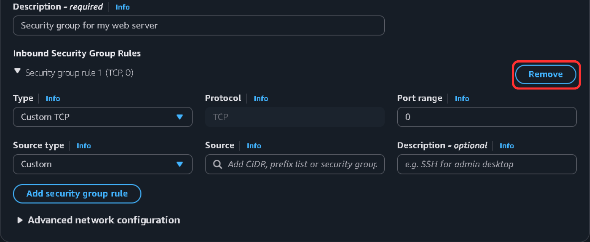

## Step 6: Adding storage
No campo de configuração do armazenamento, mantemos o padrão para este laboratório:
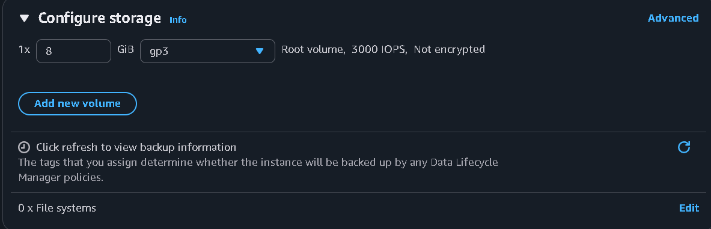

## Step 7: Configuring advanced details 
Buscamos **"Termination protection"**, e colocamos **Eneble**.
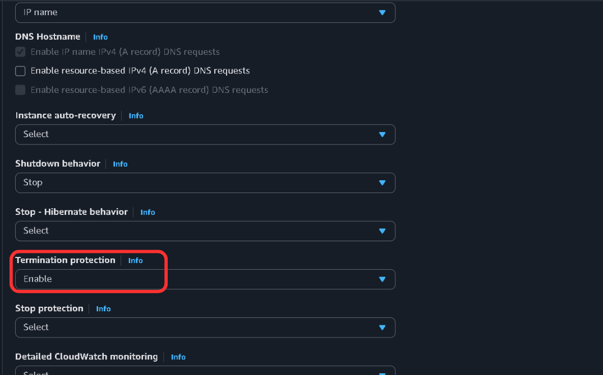

Em seguida vamos até o final da página e econtramos o campo **"User Data"** e colamos o script solicitado no lab:
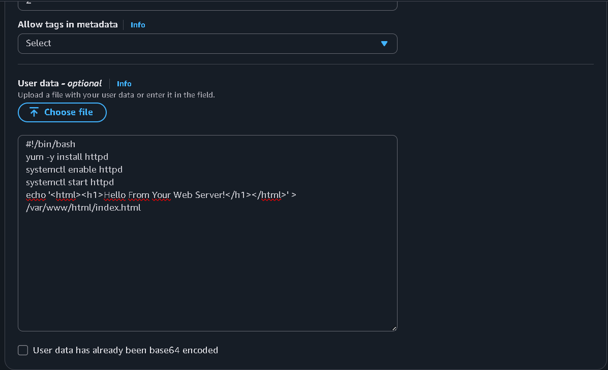
### O script faz o seguinte: 
- Instala um servidor web Apache (httpd) 
- Configura o servidor web para iniciar automaticamente  na inicialização
- Ativa o servidor Web 
- Cria uma página web simples 

## Step 8: Launching an EC2 instance
Para inciar a intância, vamos em <code>Lauch Instance</code> em laranja:
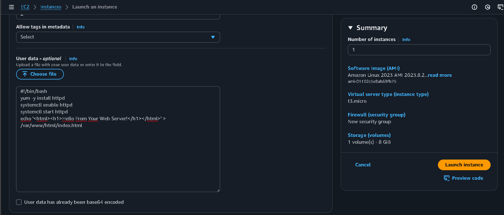

E aguardamos a intância ser iniciada e checada, analisando o campo **"Status check"**
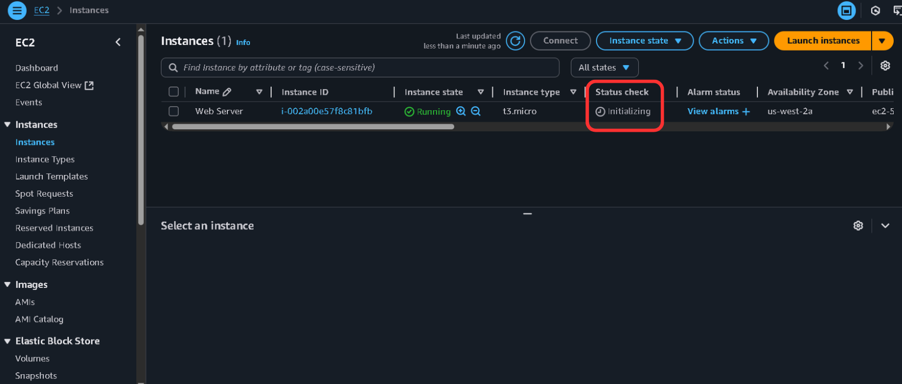

# Task 2: Monitor Your Instance
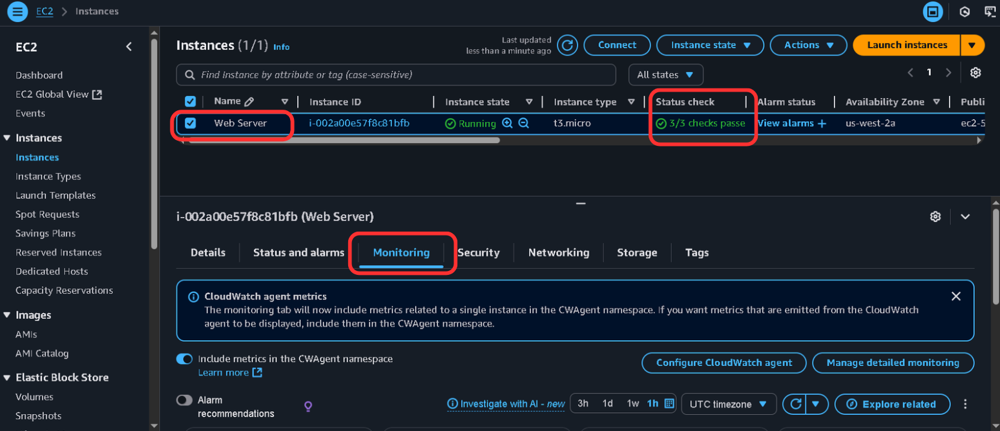
Agora podemos ver em **"Status check"** que a nossa intância não teve problemas em sua execução. E ao selecionarmos a nossa instância, também podemos realizar o monitoramento na aba **"Monitoring"** que exibe métricas do Amazon CloudWatch. 

Em seguida, acessamos <code>Actions -> Monitor and troubleshoot -> Get instance screenshot</code> :
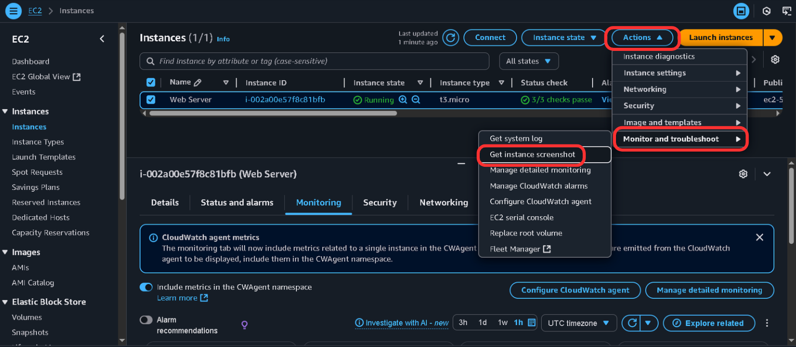
E podemos ver a intância sendo executada: 
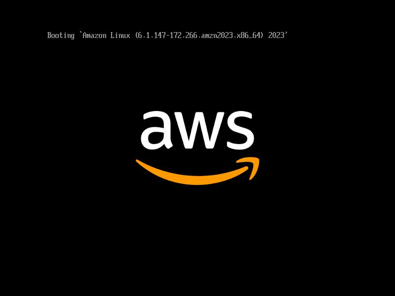

# Task 3: Update Your Security Group and Access the Web Server
Retornando para a página de instâncias, clicamos em **"Intance ID"**, e veremos a seguinte página:
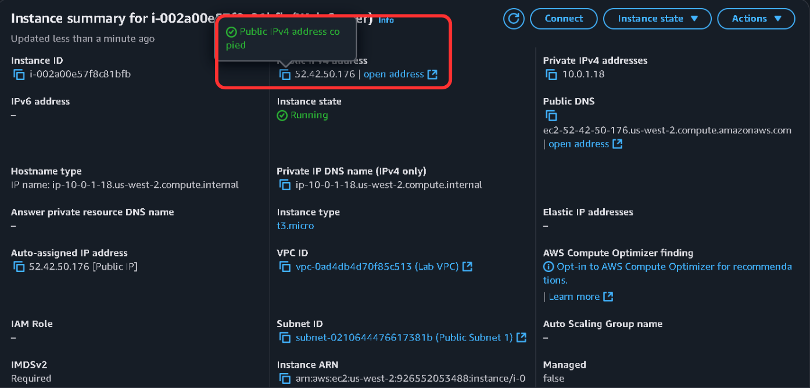
Então vamos copiar o endereço IPv4 dessa intância, e vamos tentar acessar pelo navegador. Porém nçao vamos conseguir acessar, pois o *Security Group* que criamos não está permitindo trafego de entrada na porta 80, que é utilizada para solicitações HTTP da web.

Então, na barra lateral na esquerda buscamos <code>Network & Security -> Security Groups</code>, e vamos editar nosso *Security Group* para podermos acessar esta página.
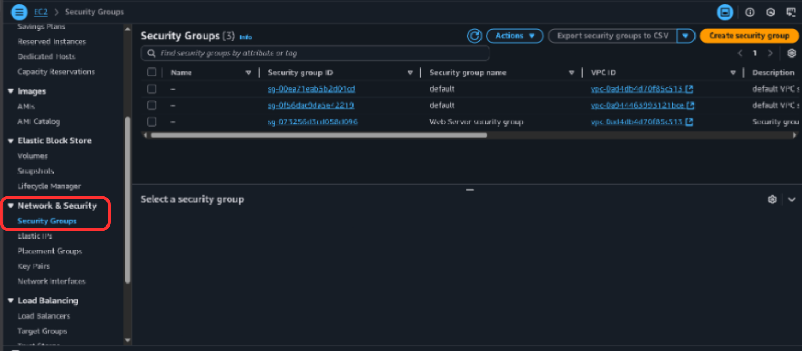

Selecionamos o *Security Group* que criamos anteriomente, vamos em <code>Inbound Rules -> Edit inbound rules</code>
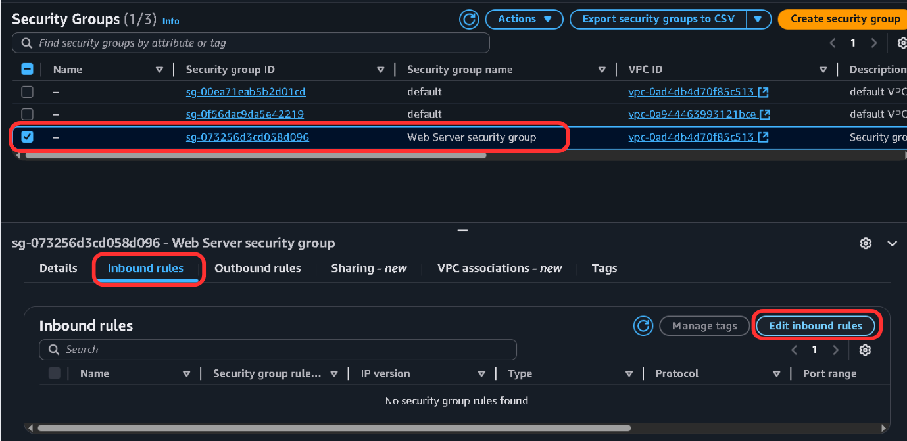

Selecionamos <code> Add rule</code> e teremos a seguinte tela:
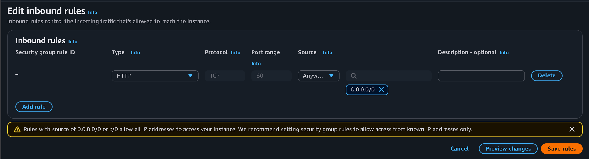
Nos campos <code>Type</code> e <code>Source</code> e colocamos respectivamente: *HTTP* e *Anywhere-IPv4*. 

E então já podemos acessar a página Web: 

# Task 4: Resize Your Instance: Instance Type and EBS Volume
Para realizar a alteração do  tipo de armazenamento, primeiro precisamos stopar  a instância:
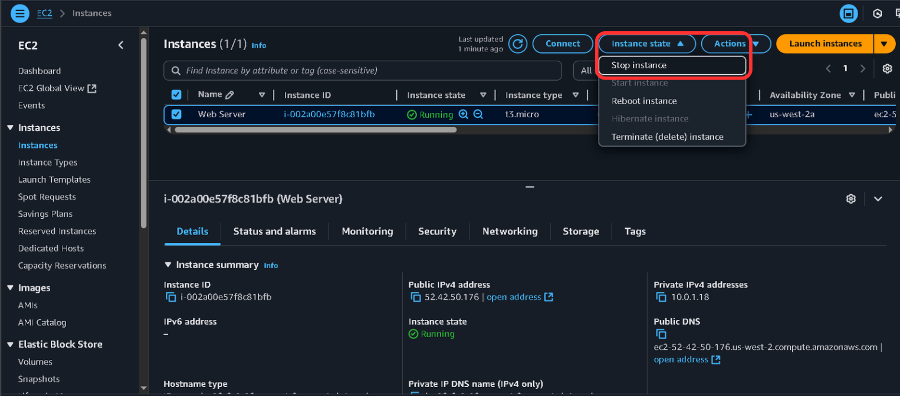
Lembrando que devemos aguardar que apareça *"Stopped"* em *Instance state* para prosseguir.

Em seguida vamos em <code>Actions -> Instance settings -> Change instance type</code>
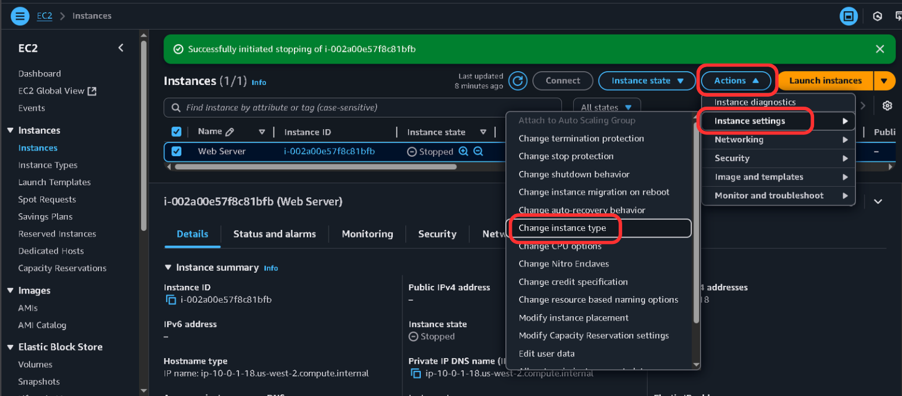

Seremos direcionados para a página abaixo, onde vamos alterar o tipo de *t3.micro* para *t3.small*

No fim da página, clicamos em <code>Change instance type</code>.

Temos o retorno de que *Instance type* foi alterado com sucesso.
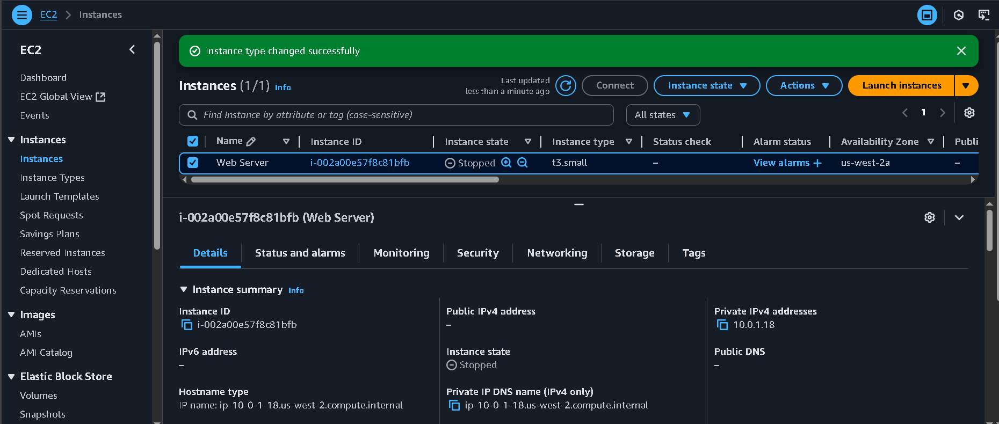

Em seguida, na barra lateral acessamos <code>Elastic Block Store -> Volumes</code>, em seguida vamos em <code>Actions -> Modify volume</code>.
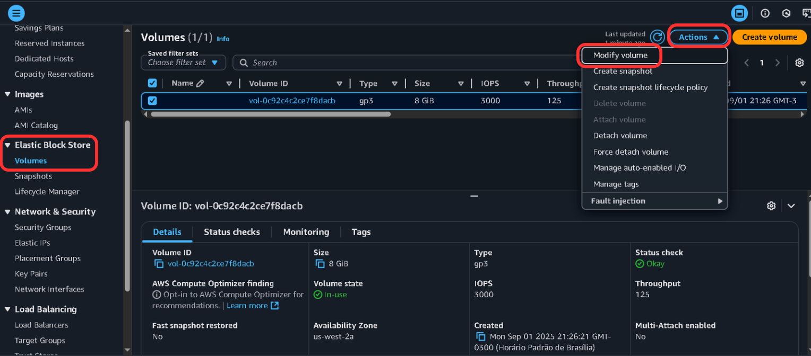

Seremos direcionados para esta página, onde eu alterei **"Size(GiB)"** de 8 para 10.
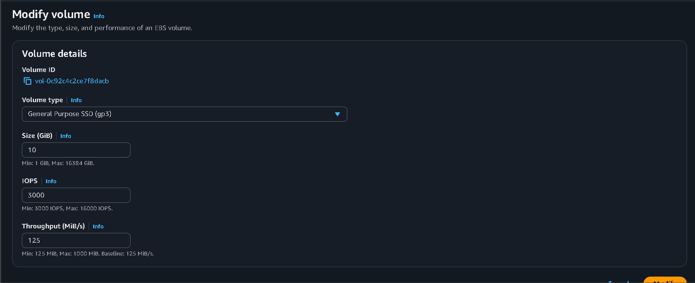
E em seguida confirmei  alteração em <code>Modify</code>

Aqui em **"Size"** podemor ver o armazenamento já alterado.
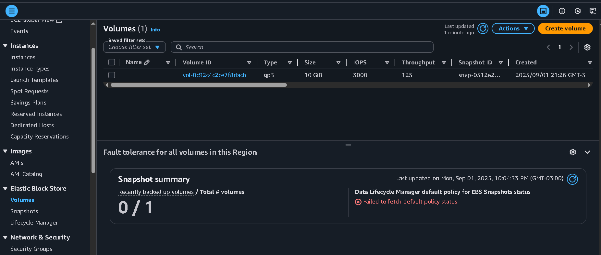

Voltamos para a página das intâncias através da barra lateral <code>Instances -> Instances</code> e vamos startar a instância em <code>Instance state -> Start instance</code>.
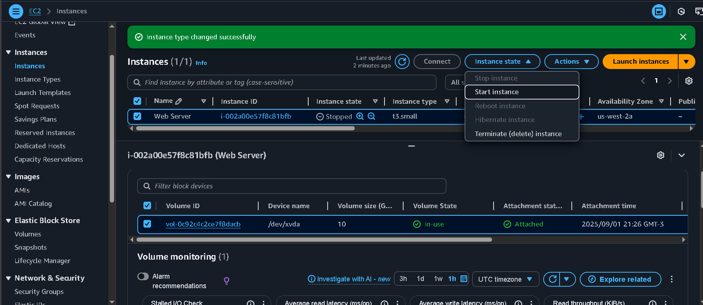
E temos que nossa instância será inicializada com sucesso, e com as alterações de *Instance Type* e *Volume* realizadas.

## Task 5: Test Termination Protection
Com a instância rodando, se formos em <code>Instance state -> Terminate (delete) instance</code>:
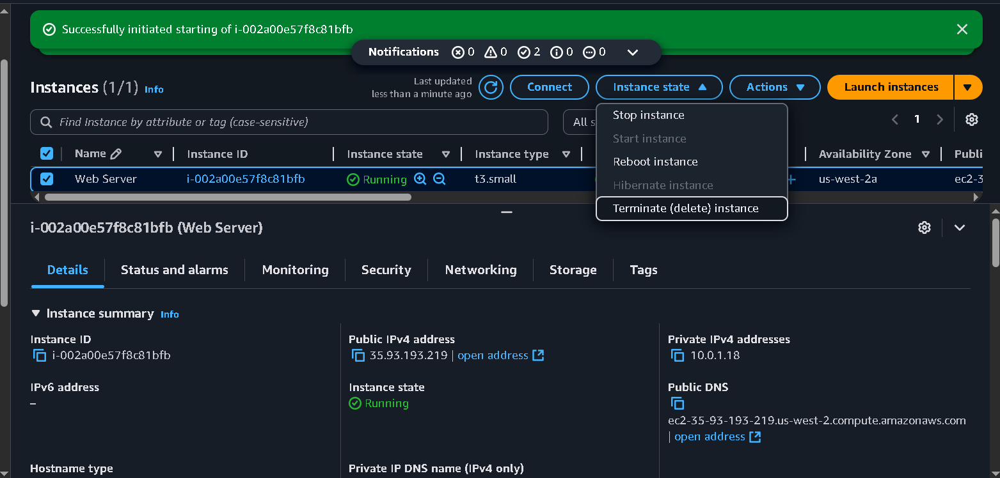

Podemos ver que a instância não pode ser terminada, pois na sua criação, habilitamos o campo **"Termination protection"** em *"Advanced settings"*, que é um recurso de segurança para proteger a instância de um encerramento acidental. 
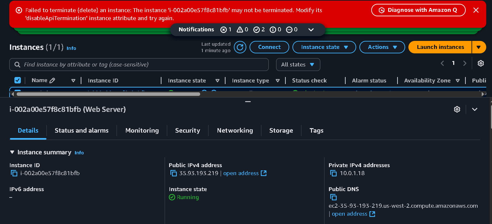

Para desativarmos este recurso, e podermos finalizar a instância, acessamos em <code>Actions -> Instance settings -> Change terminate protection</code> e desabilitamos essa função.
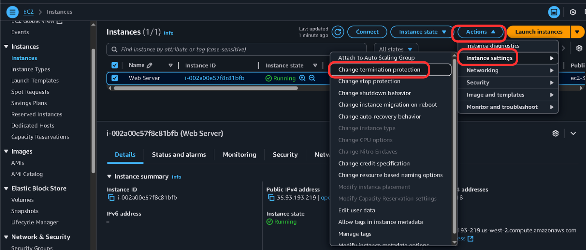

Com a proteção removida, podemos acessar <code>Instance state -> Terminate (delete) instance</code>:
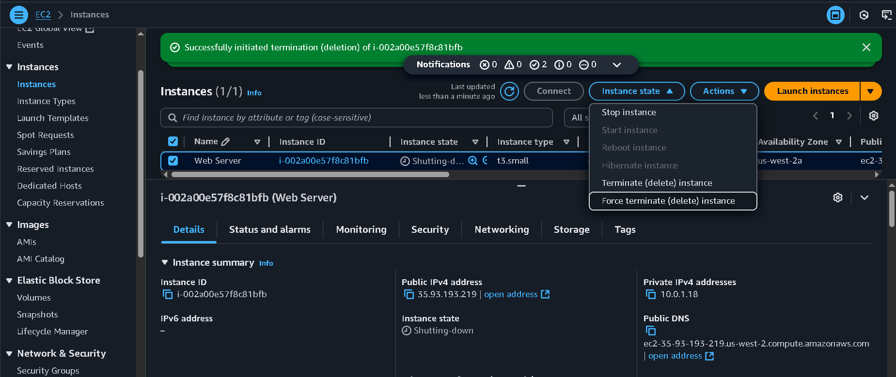

E então, podemos observar que a intância foi terminada com sucesso.
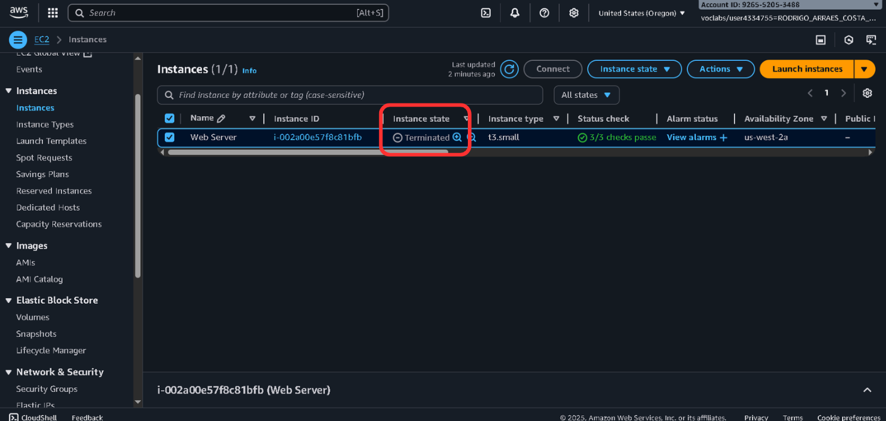

## Conclusão:
<h3>
Por fim, neste laboratório, eu pude praticar a criação e configuração de uma instância EC2, entendendo como criar, iniciar, redimensionar, gerenciar e monitorar esta intância. E então, após concluir este laboratório eu aprendi: </h3>

- Como inciar um servidor web com proteção de encerramento habilitada; 
- Como monitorar uma intância EC2; 
- Como modificar o *Security Group* do meu servidor para permitir acesso HTTP; 
- Como redimensionar minha instância do Amazon EC2 para escalar; 
- Como realizar a proteção de término; 
- Como encerrar a intância; 
