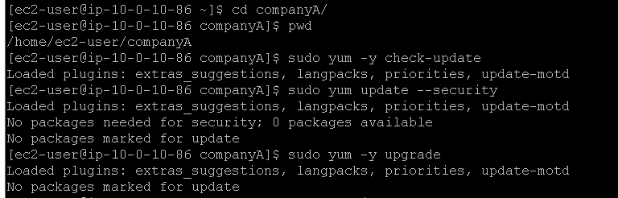
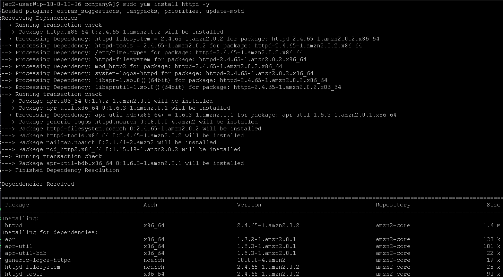
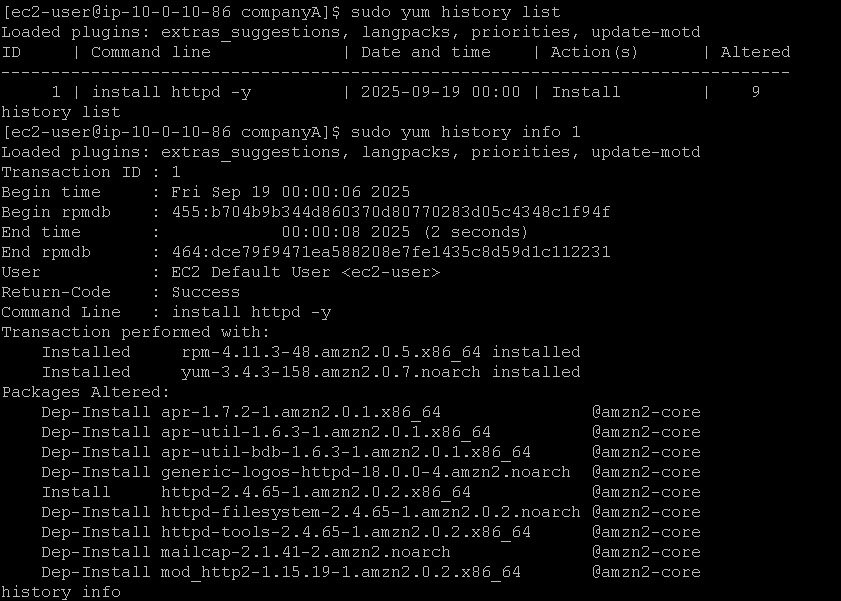
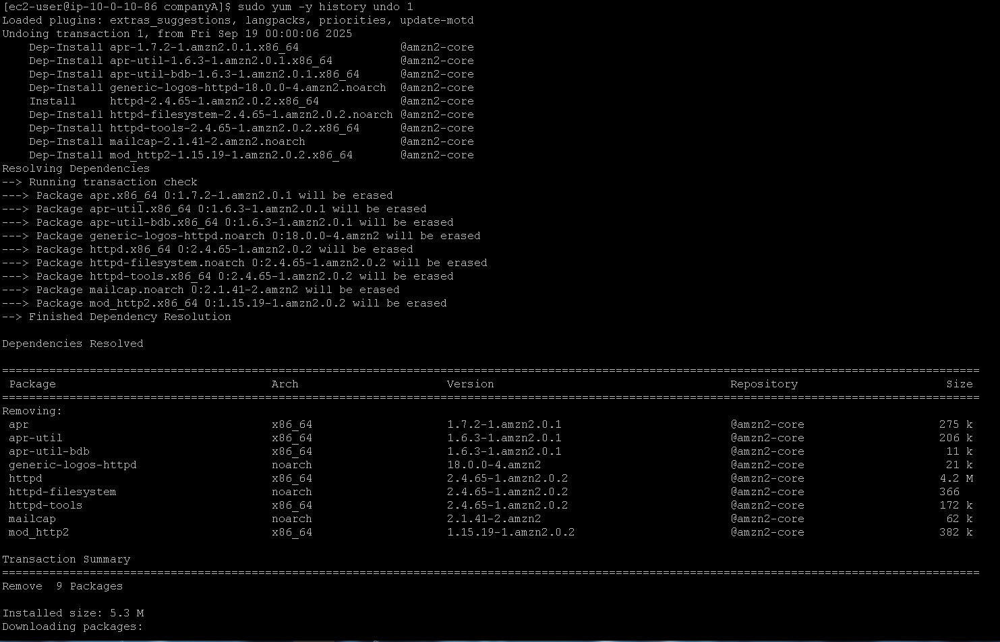
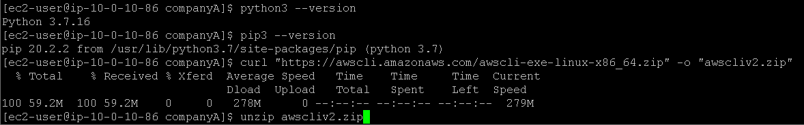
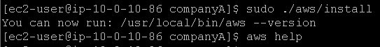
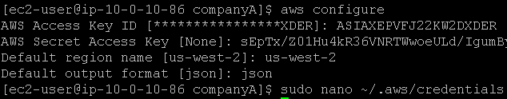
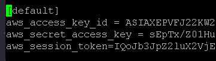
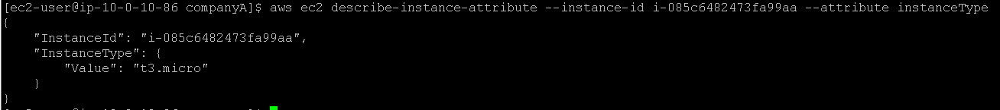

# Laboratório de gerenciamento de softwares no Linux 🐧.

## Task 1: Use SSH to connect to an Amazon Linux EC2 instance

Na task 1, vamos realizar a conexão SSH assim como fizemos no laboratório anterior, veja em [Lab2 - Introdução ao Linux](https://github.com/RodrigoArraes07/Labs-AWS/blob/main/Lab2-IntroducaoLinux/README.md).

## Task 2: Update your Linux machine
Iniciamos verificando as atualizações e atualizando o que era possível:  
  
Em seguida usamos o comando <code>sudo yum install httpd -y</code> para instalar o httpd:  

## Task 3: Roll back a package

Agora, vamos utilizar <code>sudo yum history list</code> para listar o histórico de ações recentes. Em seguida usamos o *ID* que aparece no retorno do comando acima para realizar o comando <code>sudo yum history info 1</code>, que vai nos retornar informações sobre a instalação:  

Agora utilizamos <code>sudo yum -y history undo 1</code> para remover os pacotes instalados na operação:  

## Task 4: Install the AWS CLI on Red Hat Linux

Começamos usando o comando <code>python3 --version</code> para verificarmos se o **Python** está instalado. Em seguida usamos <code>pip3 --version</code> para verificarmos se o gerenciador de pacotes **pip** está instalado. Depois usamos <code>curl "https://awscli.amazonaws.com/awscli-exe-linux-x86_64.zip" -o "awscliv2.zip"</code> para baixar a **AWS CLI** num arquivo *.zip*, e por fim descompactamos este arquivo com <code>unzip awscliv2.zip</code>:  

Agora vamos executar o programa de instalação com <code>sudo ./aws/install</code>  e depois usamos <code>aws help</code> para verificar se está funcional:  

## Task 5: Configure the AWS CLI to connect to your AWS account

Agora usamos <code>aws configure</code> para adicionar os dados de segurança:  

Aqui dentro do nano podemos ver os dados adicionados:  

Agora usamos o comando <code>aws ec2 describe-instance-attribute --instance-id <id_instancia> --attribute instanceType</code> para obter informações sobre a instância que estamos usando:  
