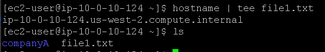
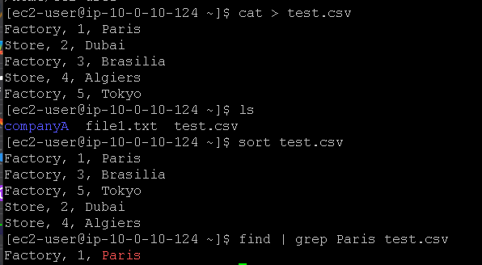
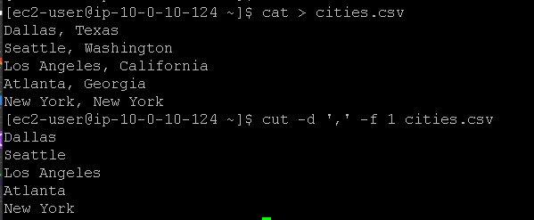
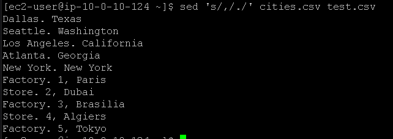

# Laboratório de trabalho com comandos no Linux 🐧.

## Task 1: Use SSH to connect to an Amazon Linux EC2 instance

Na task 1, vamos realizar a conexão SSH assim como fizemos no laboratório anterior, veja em [Lab2 - Introdução ao Linux](https://github.com/RodrigoArraes07/Labs-AWS/blob/main/Lab2-IntroducaoLinux/README.md).

## Task 2: Use the tee command

Nesta task, usamos o comando <code>hostname | tee file1.txt</code> para pegar o nome da instância, exibi-lo no terminal e em seguida gravar esse nome no arquivo *file1.txt*. Em seguida usamos <code>ls</code> para verificarmos se o arquivo foi realmente criado:  
  

## Task 3: Use the sort command and pipe operator

Agora, usamos o comando <code>cat > test.csv</code> para criar o arquivo *test.csv* e inserir os seus dados através do terminal, e em seguida usamos *Ctrl+D* para salvar as informações inseridas. Então usamos <code>ls</code> para verificar se o arquivo foi criado. Após isso, usamos <code>sort test.csv</code> para ordenar as linhas do arquivo em ordem alfabética, como podemos ver no retorno do comando. Após isso, usamos o comando <code>find | grep Paris test.csv</code> para buscar as linhas que contém a palavra *"Paris"* dentro do arquivo *test.csv* e exibi-las no terminal:  

## Task 4: Use the cut command

Agora usamos o comando <code>cat > cities.csv</code> para criar e adicionar informações no arquivo *cities.csv* assim como fizemos anteriormente. Depois disso, usamos o comando <code>cut -d ',' -f 1 cities.csv</code> para extrair partes específicas de cada linha do arquivo, usando as virgulas como delimitadoras e pegando apenas o primeiro campo, que é o nome das cidades:  

## Additional Challenge:

Agora, no desafio adicional, vamos usar o comando <code>sed 's/,/./' cities.csv test.csv</code> para substituir o a primeira virgula por um ponto para todas as linhas dos arquivos *cities.csv* e *test.csv*:  

