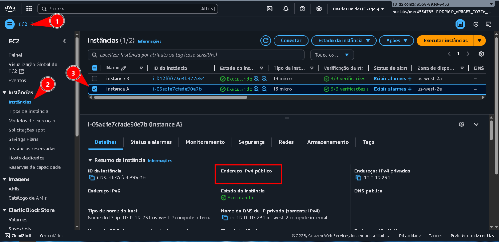

# Laboratório de endereços IPs públicos e privados -  Redes🌐📡

<h3>Este laboratório simula uma situação de suporte a um cliente que encontrou problemas com conectividade de instâncias EC2</h3>

## Task 1: Investigate the customer's environment
Aqui podemos ver o email que recebemos do cliente, informando o que estava acontecendo, tentando tirar uma dúvida e anexando a estrutura da VPC.

Ao acessarmos o painel AWS do cliente, e:  
1. Acessar o serviço **EC2**;  
2.  Acessar **Instâncias** na barra lateral;  
3.  Marcar *Instância A*;  
  
Se analisarmos o retângulo vermelho, a *Instância A* não contém um IP público, apenas o privado, essa informação vai ser importante para solucionarmos o problema.  

Se marcarmos a *Instância B*, podemos analisar que ela contém endereço IP público.  

## Task 2: Send the Response to the customer

 
<blockquote>
Olá, Jess!  
 
Após analisar a situação das suas instâncias EC2, pude constatar o problema: A Instância A não contém endereço IP público, e por isso ela não pode ter acesso à internet e também não pode ser acessada via SSH. Por conter apenas o endereço privado, esta instância é capaz de se comunicar apenas dentro de sua sub-rede.  
 
Sobre sua dúvida  sobre o intervalo de endereços IP para uma VPC, você não pode usar o intervalo de IP público <code>12.0.0.0/16</code> pois ele já é utilizado por outra organização, e seleciona-lo pode dar conflitos de endereçamento IP e fazer com que a VPC trate esses IPs como internos, impossibilitando o acesso à internet.  
Sempre use intervalos privados reservados pelo **RFC 1918**, como:  
- <code>10.0.0.0/8</code> 
- <code>172.16.0.0/12</code>  
- <code>192.168.0.0/16</code>  
 

Espero ter ajudado, estou à disposição!  
Rodrigo  
Suporte de Nuvem.
</blockquote>
