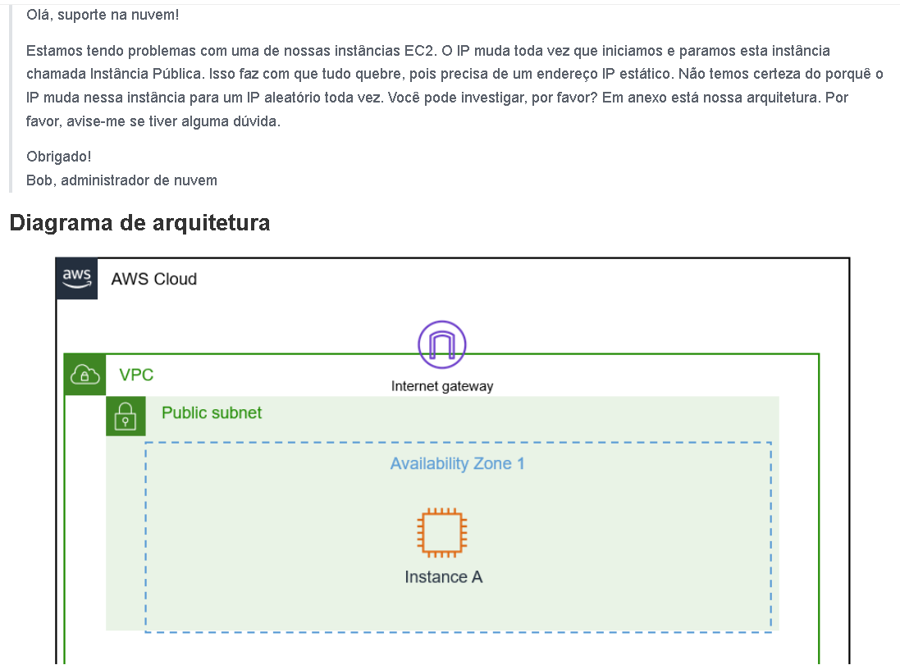
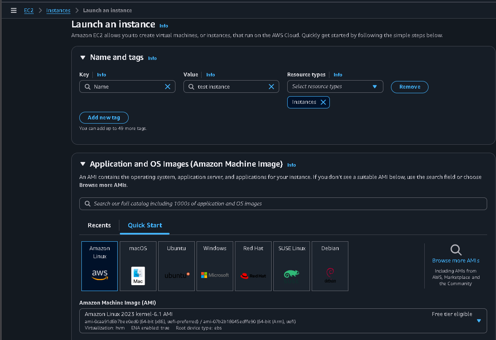
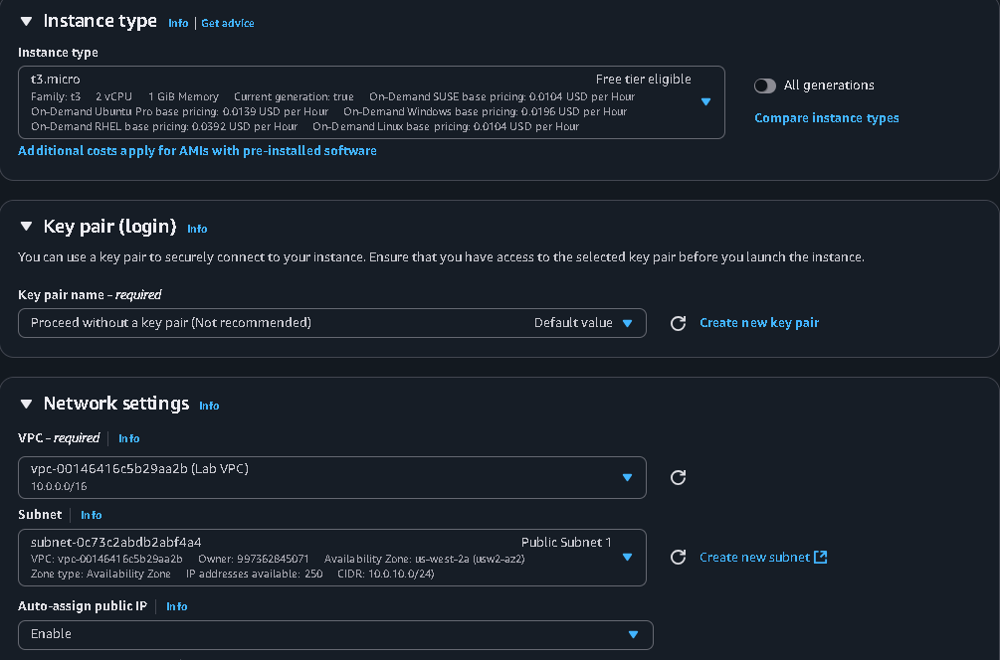
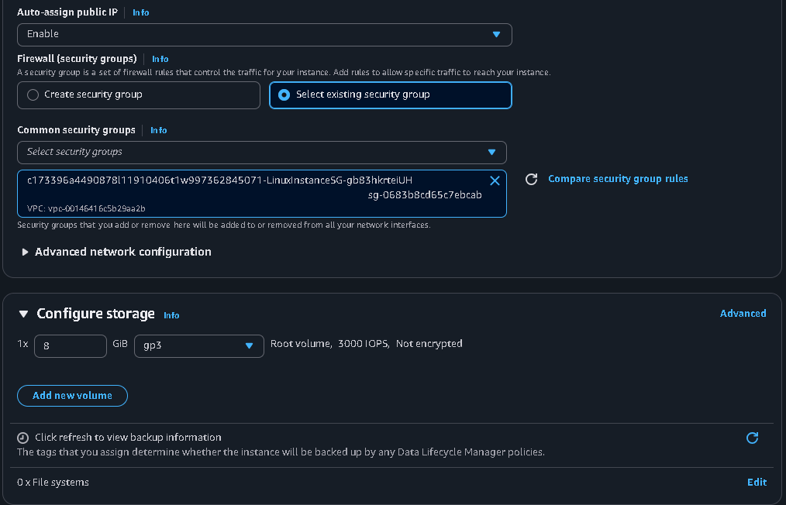
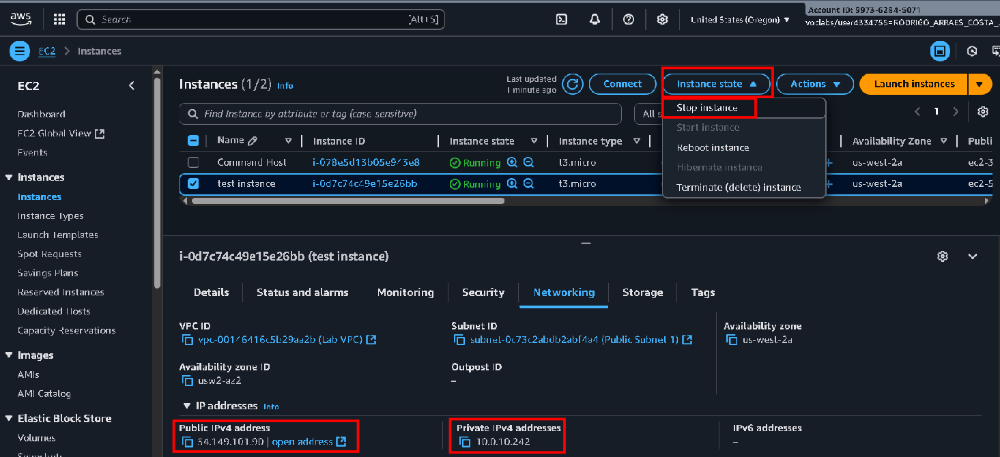
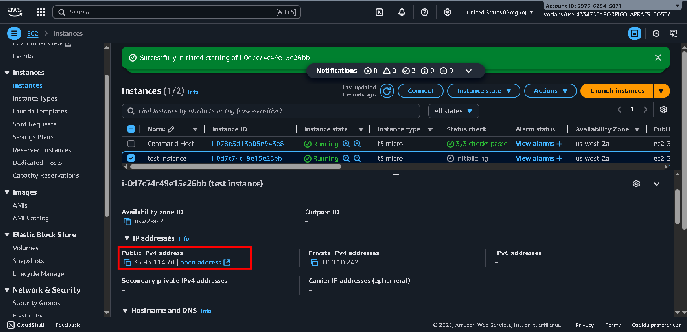
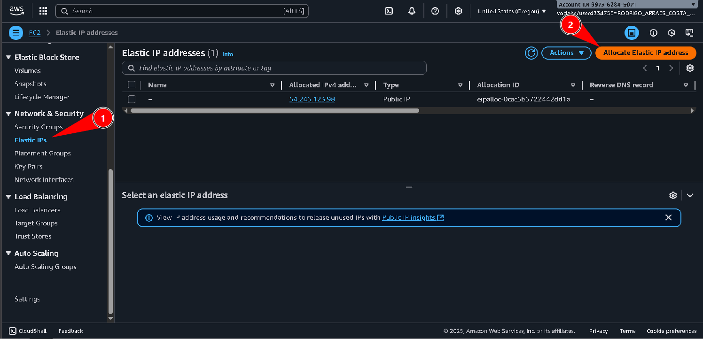
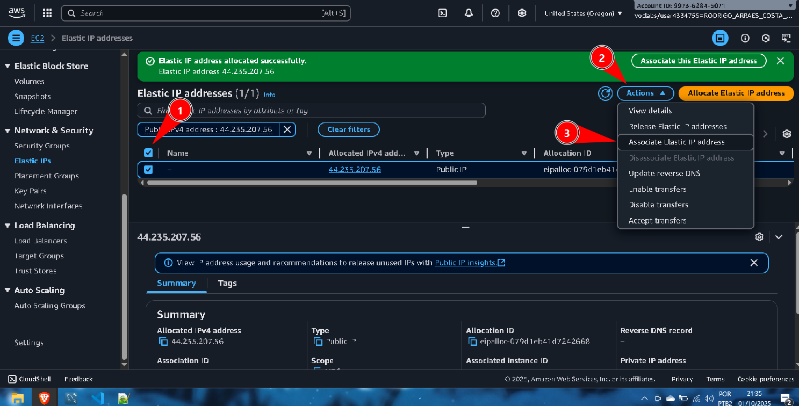
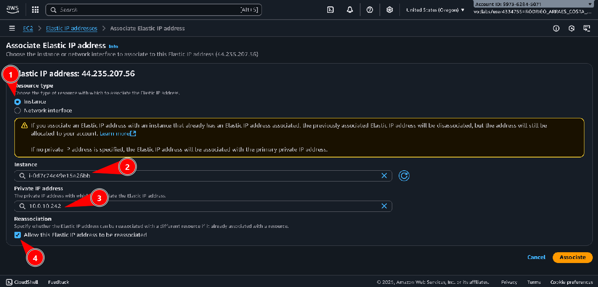

# Laboratório de endereços IPs públicos e privados -  Redes🌐📡

<h3>Este laboratório simula uma situação de suporte a um cliente que encontrou problemas com conectividade de instâncias EC2, resultado do endereço dinâmico de sua máquina.</h3>

  
Aqui temos o email do cliente, informando o problema.

## Task 1: Investigate the customer's environment
Nesta task, vamos criar uma nova instância EC2 para testar situações e encontramos o problema na instância do cliente. Abaixo temos as configurações desta instância:  

Ao criarmos a instância, vamos verificar os endereços IP público e privado da instância que criamos. Após isso vamos estopar esta instância:  
  

Ao inicializarmos a instância novamente, podemos verificar que o endereço IP público mudou, então podemos concluir que a instância do cliente conta com um endereço IP dinâmico (que muda constantemente) e por isso ele está enfrentando o problema de frequente desconexão:  

Para atribuirmos um endereço IP estático para a instância, seguiremos os seguintes passos:

1. Na barra lateral, buscamos **Network & Security** e em seguida vamos em **Elastic IP's**.  
2. No canto superior direito, vamos em **Allocate Elastic IP adress**.  

Agora, seguiremos os seguintes passos:

1. Vamos selecionar o IP alocado;
2. Vamos em **Actions**;
3. Vamos em **Associate Elastic IP address** para associar esse endereço estático à nossa instância:  

Na página de associação, seguiremos:

1. Marcamos *Instance* em **Resource type**;
2. Selecionamos a instância desejada em **Instance**;
3. Selecionamos o IP privado da nossa instância em **Private IP address**
4. Marcamos a caixinha *Allow this Elastic IP address to be reassociated* no campo **Reassociation**:  

Após aplicar essa configuração, a nossa instância contará com um endereço IP público estático, resolvendo o problema do cliente de desconexão frequente.

## Task 2: Send the Response to the customer

<blockquote>
Olá, Bob!  

Após analisar o problema que foi relatado por você, pude constatar que a sua instância contava com o endereço IP dinâmico, e por isso sempre que era inicializada seu endereço IP mudava, e por isso ela se desconectava de todas as máquinas e serviços, para resolver isso, somente precisei adicionar um IP público estático à sua máquina.  

Espero ter ajudado, estou à disposição!  
Rodrigo  
Suporte de Nuvem.
</blockquote>