# Laboratório de recursos de rede e VPC -  Redes🌐📡

<h3>Este laboratório simula uma situação de suporte a um cliente que encontrou problemas com conectividade de instâncias EC2 com a internet.</h3>

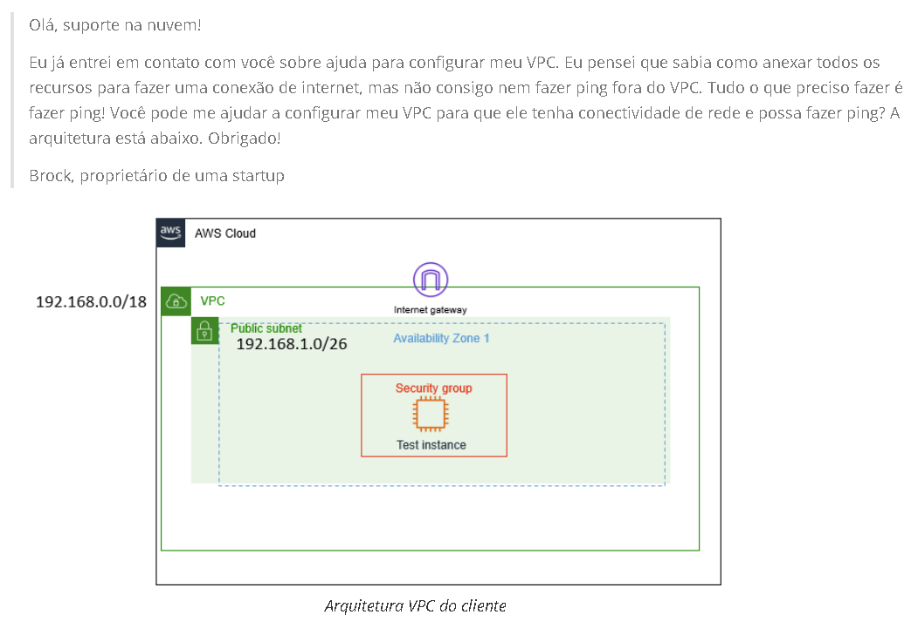  
Aqui temos o email do cliente, informando o problema.

## Task 1: Investigate the customer's needs

<h4>Para resolver esse problema, vamos recriar a estrutura do cliente e identificar o problema.</h4>

### Creating the VPC
Iniciamos criando uma VPC (É uma rede virtual isolada dentro da AWS onde você pode executar seus recursos com controle total sobre endereçamento IP, sub-redes e segurança). Abaixo você pode identificar como configuramos nossa VPC teste:  
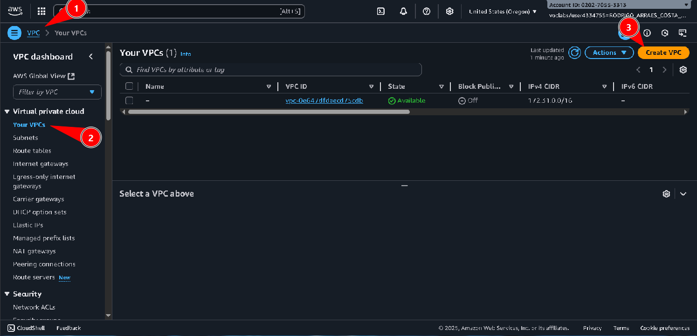

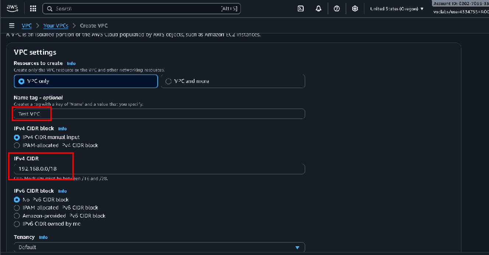

### Creating Subnets
Agora vamos criar e configurar sub-redes (É uma subdivisão da VPC que organiza e isola recursos em diferentes faixas de endereços IP dentro da mesma rede), abaixo podemos ver onde e como criamos a sub-rede:  
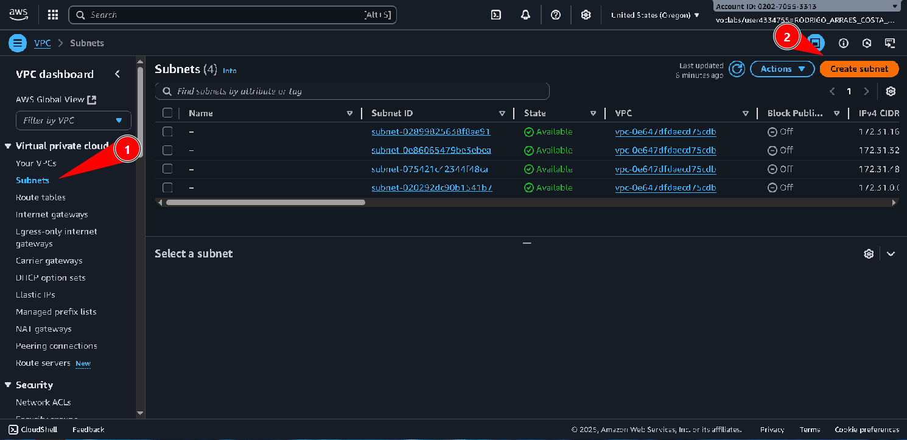

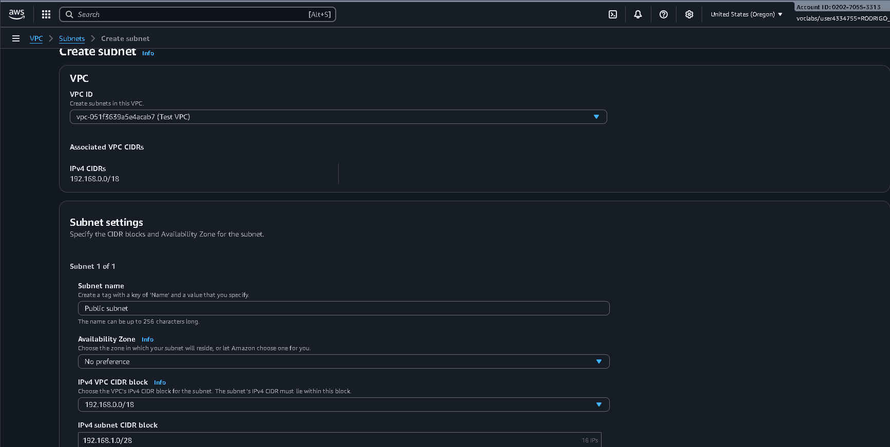

### Create Route Table

Agora vamos criar uma tabela de rotas (Define as regras de roteamento que determinam para onde o tráfego de rede de uma sub-rede deve ser direcionado) e configurá-la:  
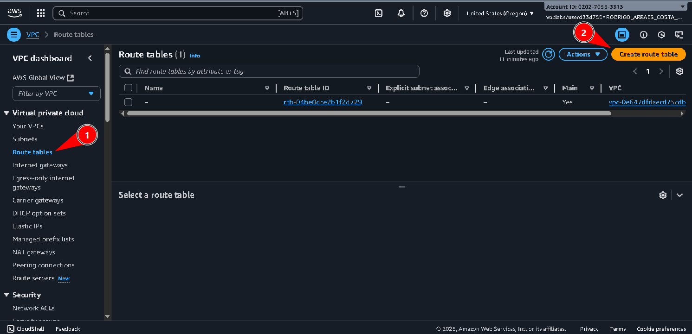

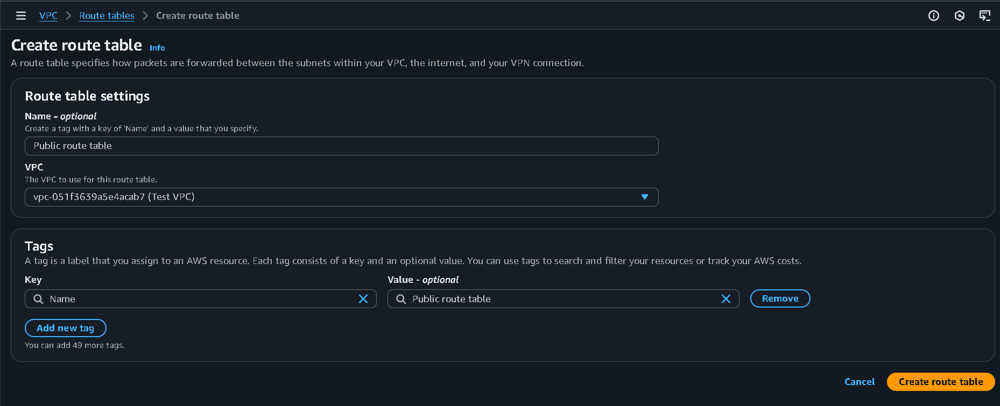

### Create Internet Gateway and attach Internet Gateway

Agora vamos criar e configurar um Internet Gateway (É um componente que conecta a VPC à internet, permitindo comunicação bidirecional entre recursos internos e externos), e vamos atribui-lo à uma VPC:  
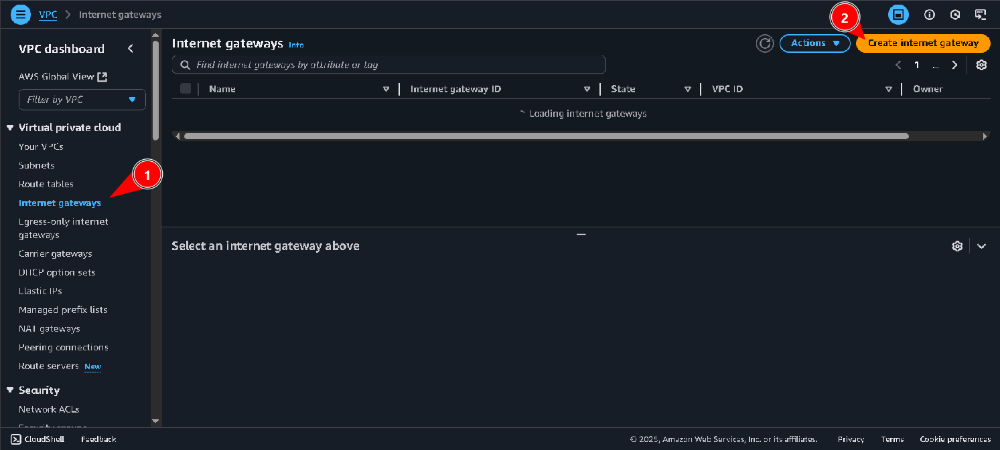

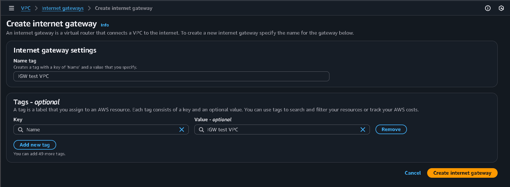

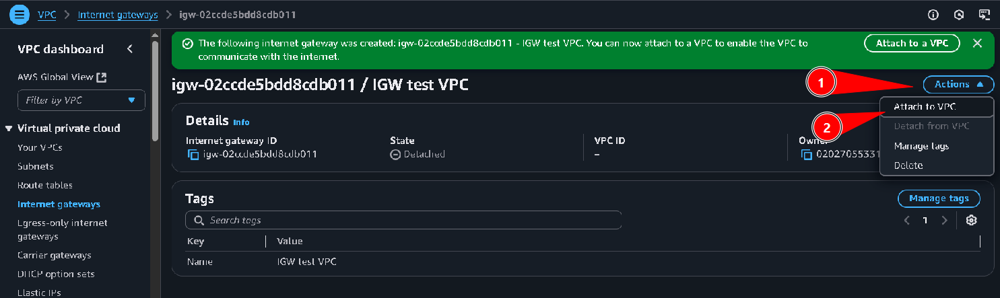

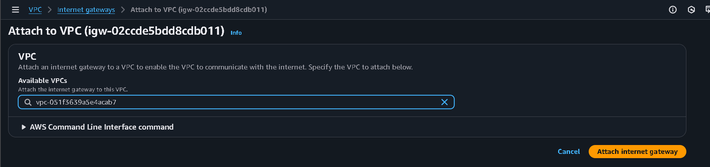

### Add route to route table and associate subnet to route table

Agora vamos adicionar rotas (são regras dentro da tabela de rotas que definem o caminho que o tráfego deve seguir dentro ou fora da VPC) à Route Table:  
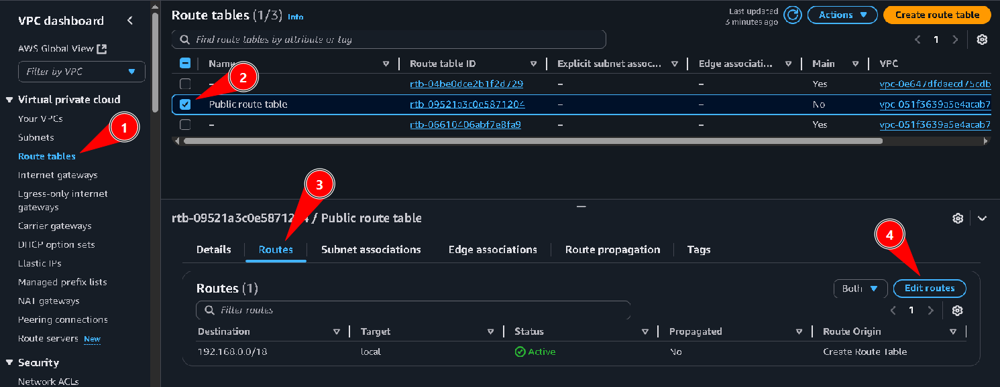

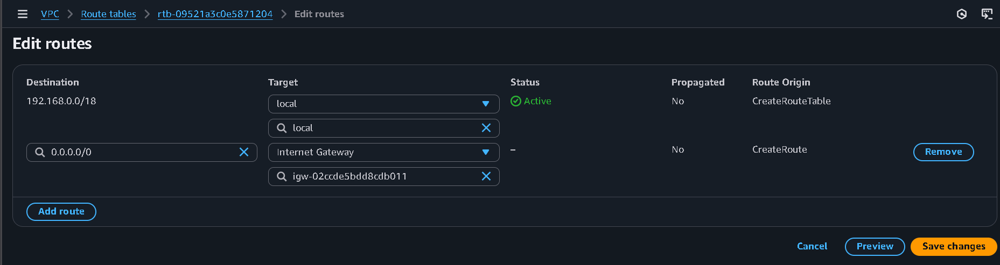

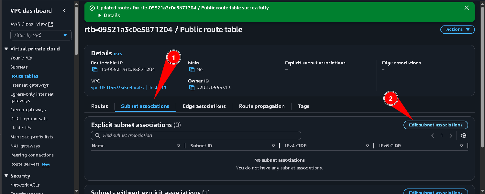

### Creating a Network ACL

Agora vamos criar e configurar uma Network ACL (é uma camada de segurança em nível de sub-rede que controla o tráfego de entrada e saída com regras explícitas de permissão e negação), como você pode visualizar abaixo:  
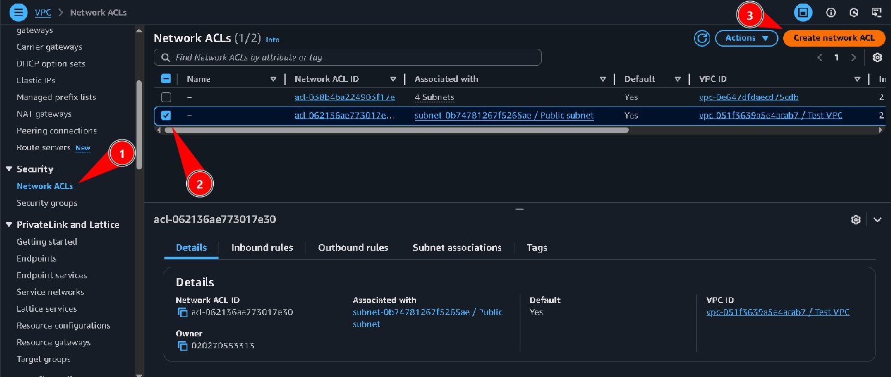

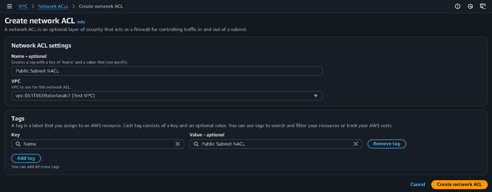

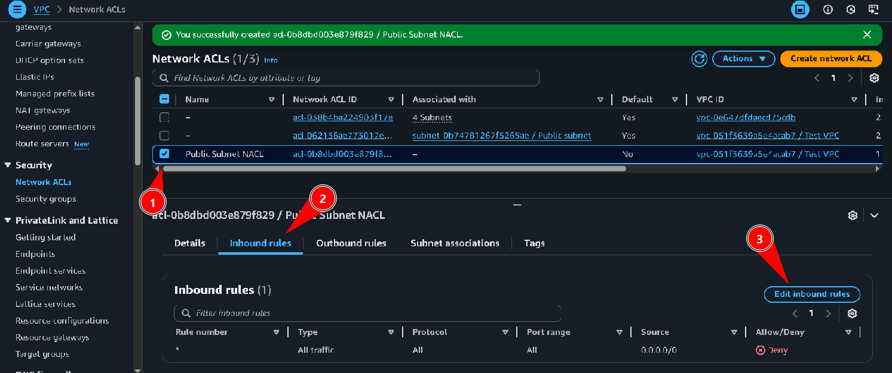

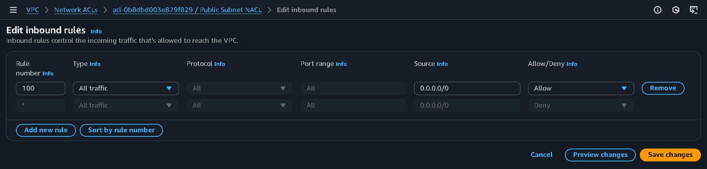

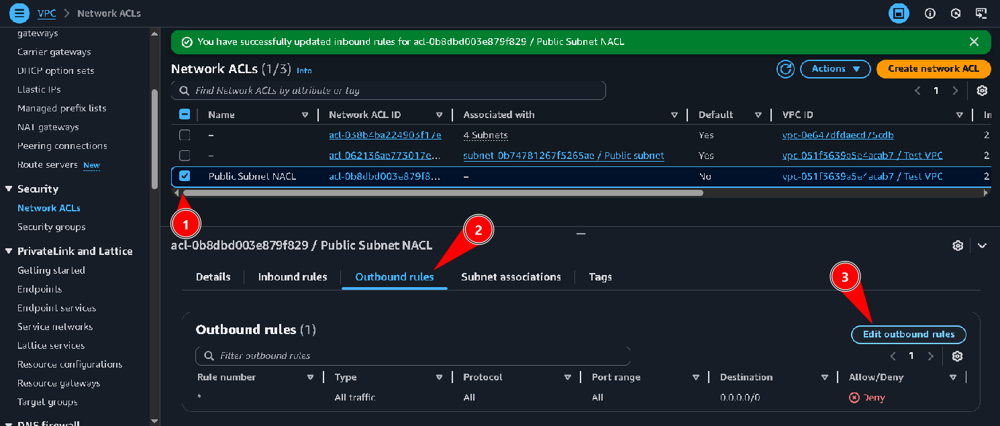

### Creating a Security Group

Agora vamos criar e configurar um grupo de segurança (é uma camada de segurança em nível de instância que controla o tráfego de rede permitido para os recursos associados, funcionando como um firewall virtual), você pode ver abaixo:  
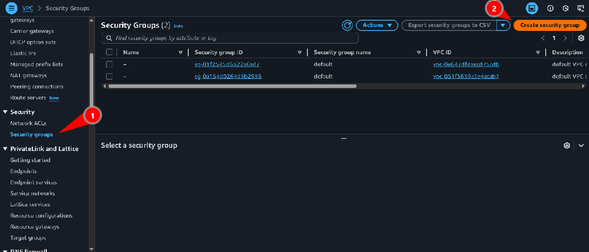

## Task 2: Launch EC2 instance and SSH into instance

Agora criei uma EC2 padrão, como já criamos outras vezes, para testar se a configuração que aplicamos à todos os elementos da estrutura desenvolvida, que replica a do cliente:  
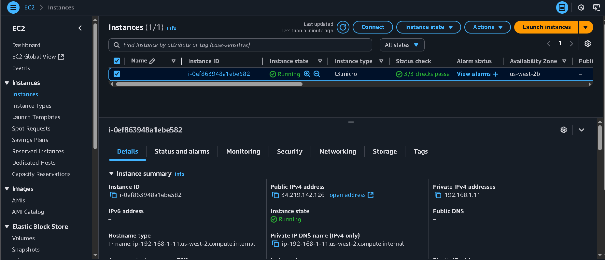

## Task 3: Use ping to test internet connectivity

Aqui, após acessar a instância que criamos, podemos ver que o ping que o cliente tentava executar antes, agora é executado com sucesso:  
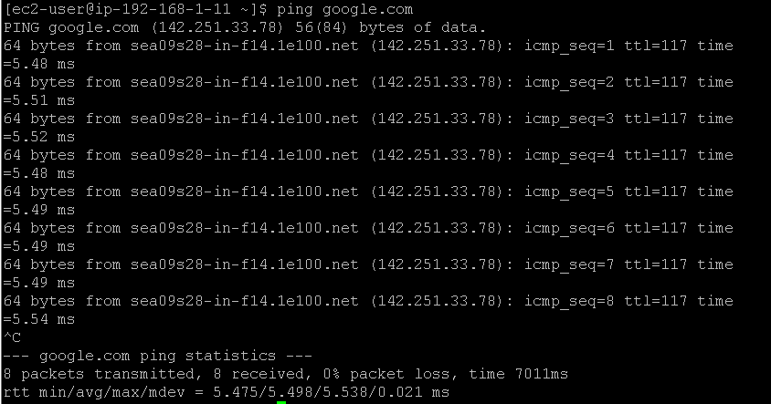

