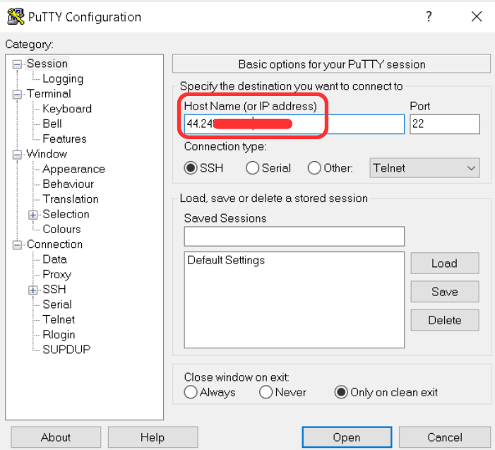
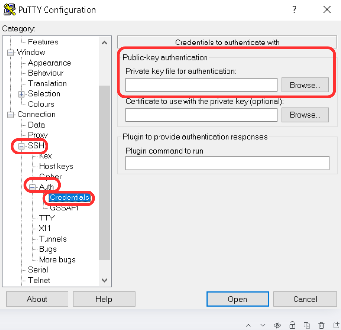
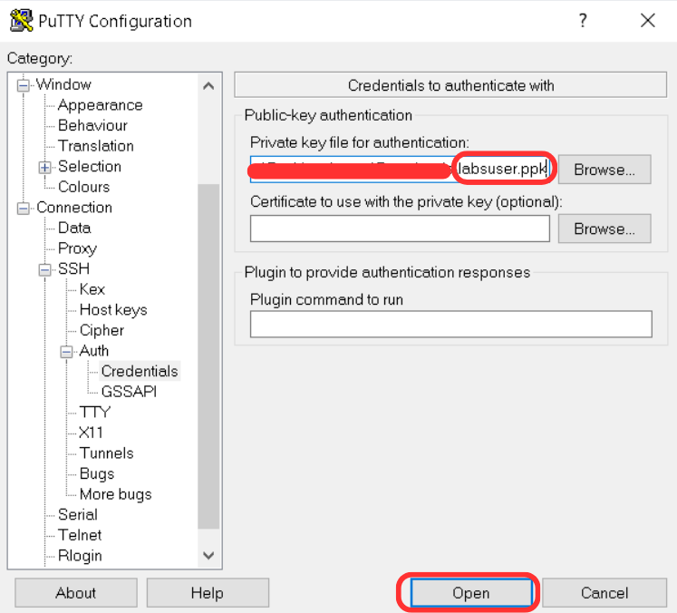
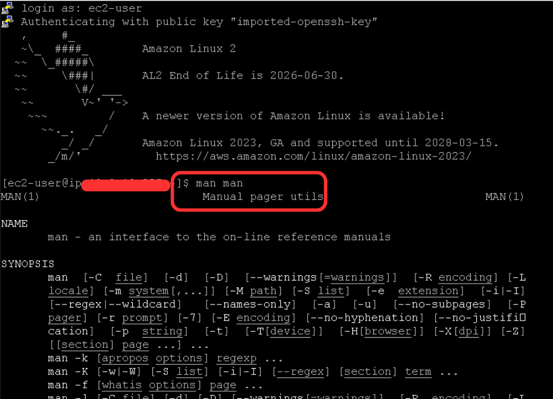

# Laboratório de introdução ao Amazon Linux 🐧💻

## Task 1: Use SSH to connect to an Amazon Linux EC2 instance
Nesta primeira etapa, iremos usar o software [PuTTY](https://the.earth.li/~sgtatham/putty/latest/w64/putty.exe) para realizar a conexão SSH com uma intância Amazon EC2 Linux existente.

Abrindo o PuTTY, nos deparamos com a seguinte página, onde vamos inserir o **Public Id** da nossa intância, no campo <code>Host Name(or IP adress)</code>: 

Após isso, na barra lateral esquerda, expandimos <code>SSH</code> e <code>Auth -> Credentials</code>:

No campo <code>Public-key authentication -> Private key file for authentication</code> buscamos um arquivo <code>**.ppk**</code> que podemos obter na criação de uma intância. Neste caso, essa chave foi disponibilizada pela plataforma de estudos, pois o objetivo deste laboratório é se familiarizar com os comandos por linha, do linux.

Com a chave <code>**.ppk**</code> selecionada, podemos clicar em <code>Open</code>:

Após isso, abrirá uma janela com o nome **PuTTY Security Alert**, você pode clicar em <code>Accept</code>.

## Task 2: Exercise - Explore the Linux man pages

Após clicar em <code>Accept</code>, abrirá uma janela de conexão à intância, já com o terminal, onde você irá inserir o usuário. Para estes laboratórios, utilizamos o usuário padrão **"ec2-user"**

Como podemos ver, após efetuar o login, utilizei o comando <code>man man</code> para abrir o manual do comando.

## Conclusão:
<h3>Neste laboratório, eu pude entender e praticar como realizar a conexão SSH entre a minha máquina e uma instância EC2 Linux. Além disso, também pude revisar a funcionalidade de diversos comandos através do comando <code>man</code>.</h3>