# Laboratório de criação e estruturação de VPC para servidor Web -  Redes🌐📡

<h3>Neste laboratório vamos criar uma VPC do zero para e montar toda a sua estrutura para criar um servidor Web, abaixo podemos ver a sua estrutura:</h3>

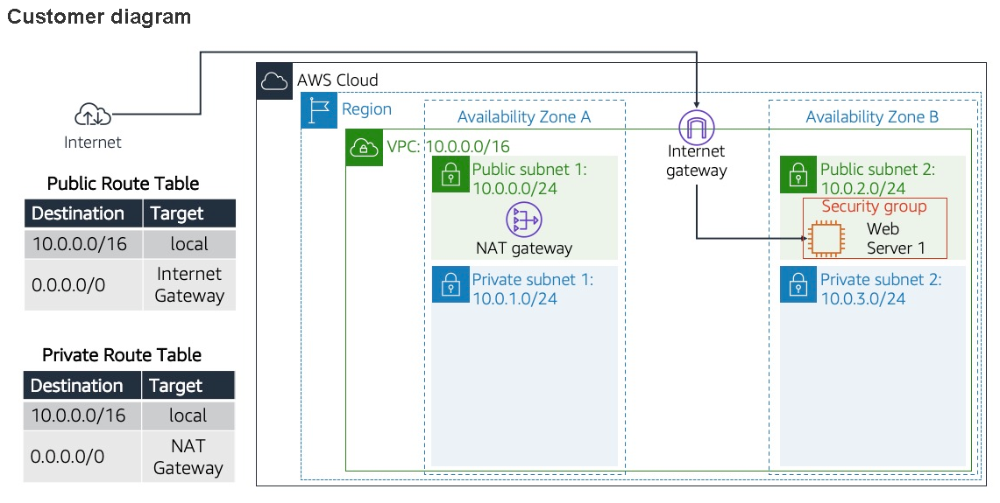

## Task 1: Create your VPC

Na tarefa 1, iniciamos criando e estruturando uma VPC de acordo coma necessidade mencionada na atividade: <br>
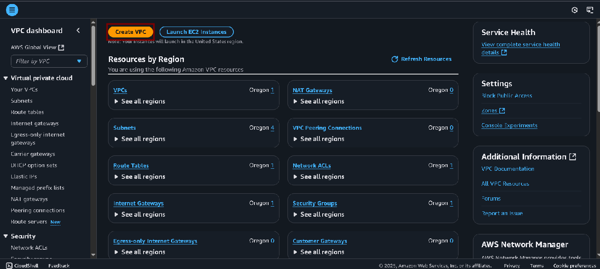

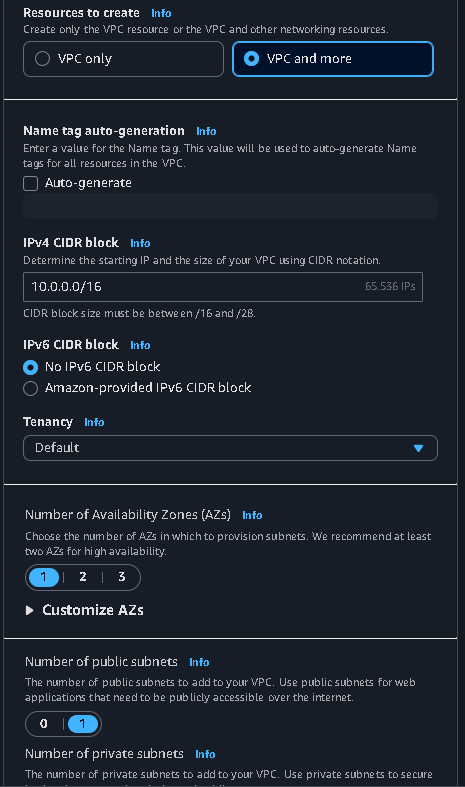

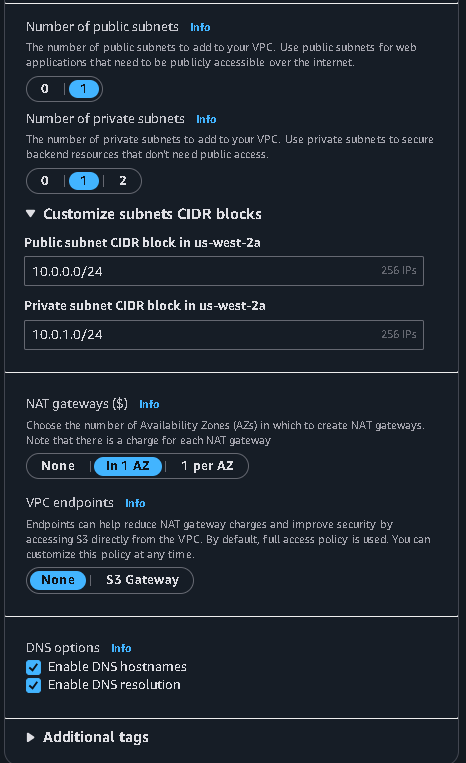

Aqui temos uma demonstração da estrutura da VPC com duas sub-redes (uma pública e outra privada) e duas tabelas de rota: <br>
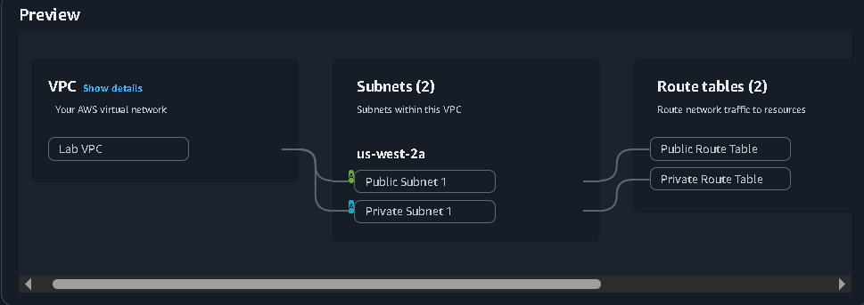

Por fim, criamos a VPC: <br>
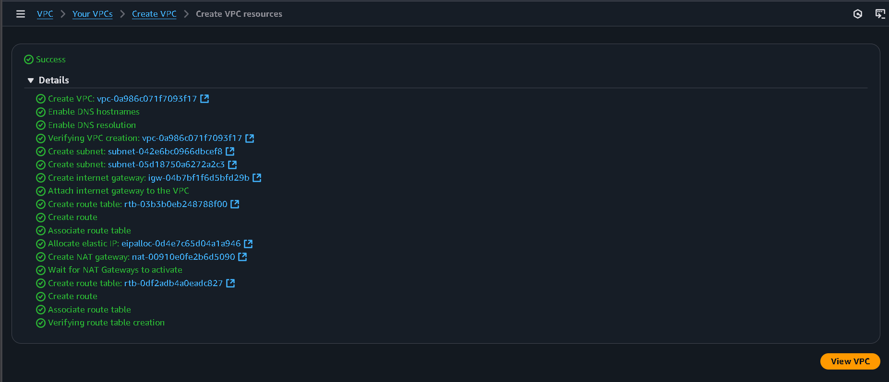

## Task 2: Create additional subnets

Agora vamos criar sub-redes adicionais nesta VPC: <br>
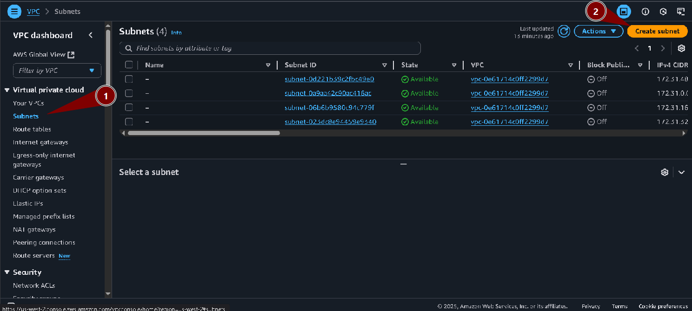

Uma pública: <br>
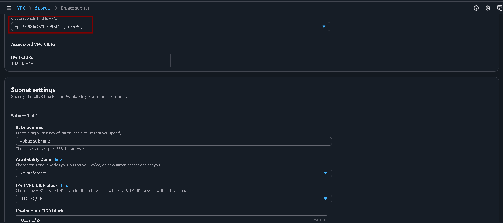

E outra privada: <br>


## Task 3: Associate the subnets and add routes

Agora vamos associar essas sub-redes à tabelas de rota: <br>
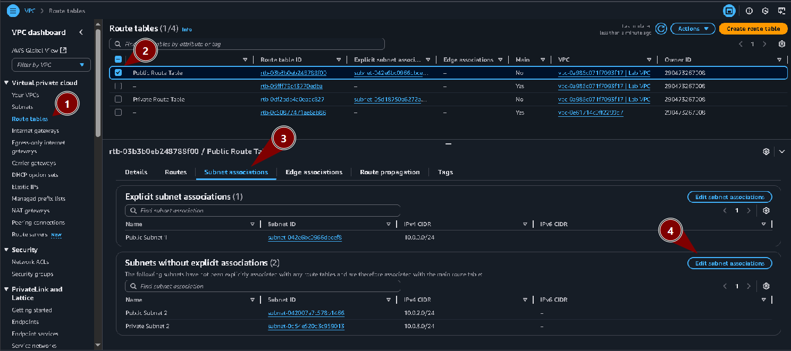

Sub-redes privada e pública 1, e privada e pública 2. Repetimos o processo para dos dois pares: <br>
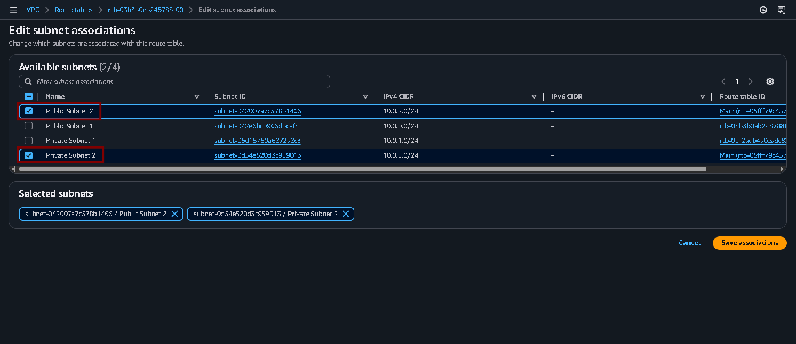

Aqui temos uma demonstração de como está ficando a nossa estrutura (ainda sem Security Group): <br>
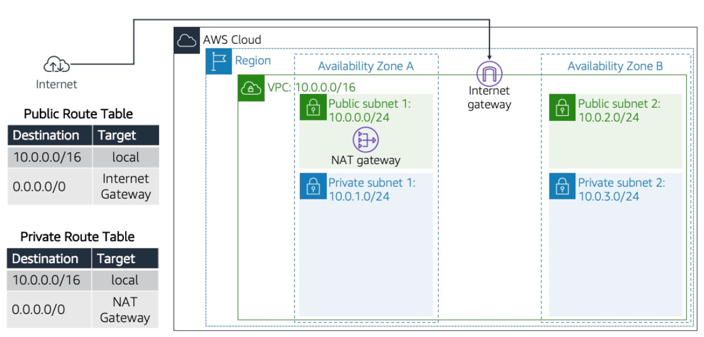


## Task 4: Create a VPC security group

Agora sim iremos criar o grupo de segurança para nosso servidor: <br>
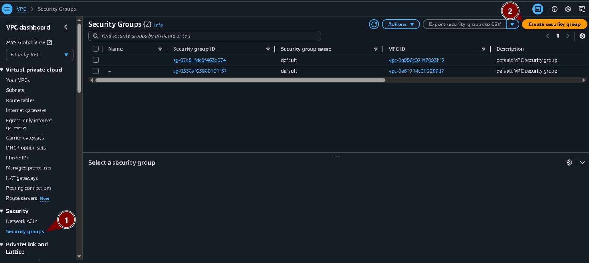

Adicionamos as informações do grupo e da VPC que criamos, e também o configuramos para conexões *HTTP*: <br>
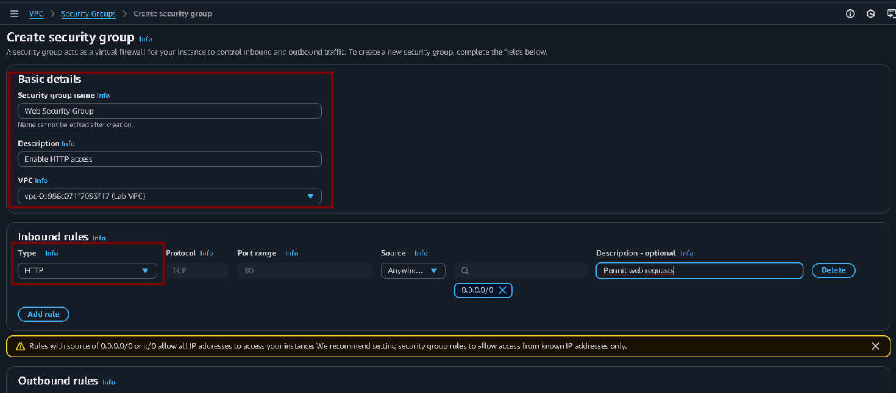

## Task 5: Launch a web server instance

Agora criamos uma instância EC2 com uma estrutura padrão, porém alteramos as informações a seguir: <br>
Destinamos a instância à VPC que criamos anteriormente e selecionamos o Security Group que também criamos: <br>
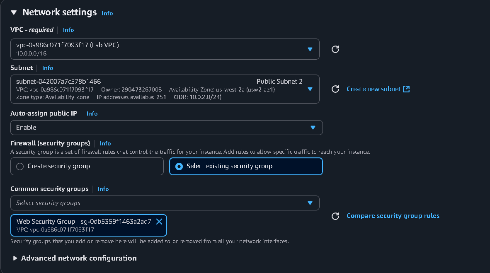

Depois em **"Advanced Details"** usamos o seguinte prompt para realizar a configuração do servidor: 
1. Atualizar o sistema;
2. Instalar o Apache, PHP, wget e unzip, e o banco de dados MariaDB;
3. Baixar os arquivos do site;
4. Configurar o servidor com os arquivos baixados;
5. Configurar o banco de dados;


Aqui podemos ver o script bash: <br>
```
#!/bin/bash
# ==============================================================
# Script: Build Your VPC and Launch a Web Server
# Compatível com Amazon Linux 2023
# ==============================================================
# Atualizar pacotes
sudo dnf update -y

# Instalar Apache, PHP, wget e unzip
sudo dnf install -y httpd php wget unzip

# Instalar MariaDB (substituto do MySQL no Amazon Linux 2023)
sudo dnf module enable mariadb:10.6 -y
sudo dnf install -y mariadb-server

# Baixar os arquivos do laboratório
wget https://aws-tc-largeobjects.s3.us-west-2.amazonaws.com/CUR-TF-100-RESTRT-1/267-lab-NF-build-vpc-web-server/s3/lab-app.zip

# Descompactar os arquivos na pasta do servidor web
sudo unzip lab-app.zip -d /var/www/html/

# Habilitar e iniciar Apache
sudo systemctl enable httpd
sudo systemctl start httpd

# Habilitar e iniciar MariaDB
sudo systemctl enable mariadb
sudo systemctl start mariadb
```
Em geral, o script transforma um servidor Linux básico em um servidor web completo com banco de dados, pronto para hospedar um site/aplicação web.


E abaixo podemos ver a página funcionando, acessada pelo navegador: <br>
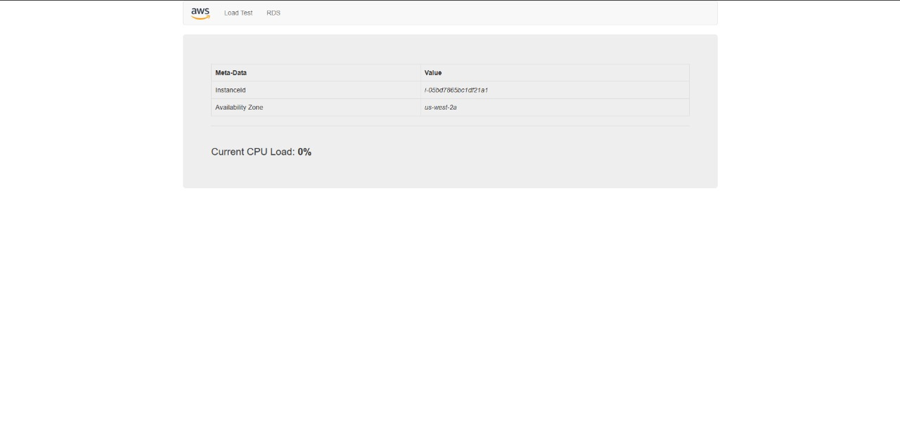