# Laboratório de monitoramento de instância EC2 - Segurança e Monitoramento 💻🛡📊

<h3>Neste laboratório vou aprender a implementar monitoramento e alertas na AWS. Vou criar um alarme no CloudWatch que dispara quando a utilização de CPU da instância EC2 excede um limite específico, configurar notificações via Amazon SNS para receber emails de alerta, realizar um teste de estresse na instância para simular um ataque e criar um dashboard personalizado para visualizar métricas em tempo real.</h3>

**Amazon CloudWatch**: Serviço de monitoramento e observabilidade que coleta métricas, logs e eventos dos recursos AWS. <br>

**Amazon SNS (Simple Notification Service)**: Serviço de mensageria gerenciado para comunicação aplicação-para-aplicação (A2A) e aplicação-para-pessoa (A2P). <br>

**CPU Utilization**: Métrica que indica a porcentagem de uso do processador, fundamental para detectar anomalias e possíveis ataques. <br>

## Task 1: Configure Amazon SNS

Nesta task vamos configurar o Amazon SNS para enviar notificações por email quando o alarme for acionado. Primeiro acessamos o **Amazon SNS** e navegamos até a seção de *Topics*: <br>


Agora criamos um novo tópico SNS do tipo *Standard* com o nome **MyCwAlarm**: <br>
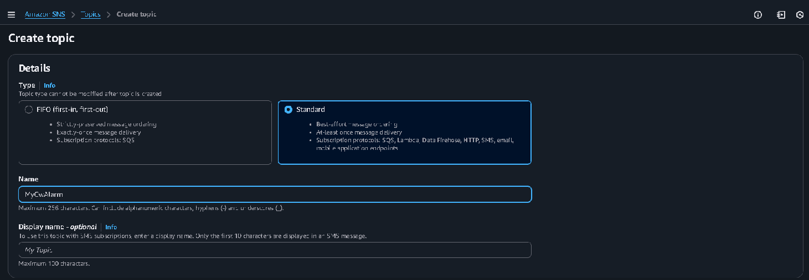

Após criar o tópico com sucesso, podemos ver seus detalhes. Agora precisamos criar uma subscription (inscrição) para receber as notificações: <br>
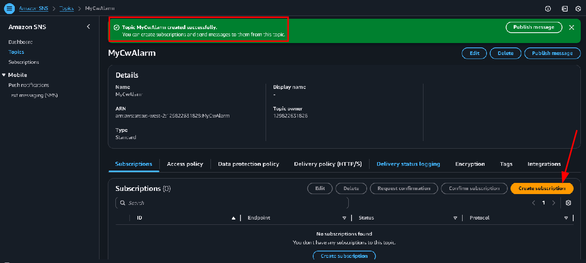

Na página de criação da subscription, configuramos o protocolo como *Email* e inserimos um endereço de email válido que será usado para receber os alertas: <br>


O email de confirmação é enviado automaticamente pela AWS. Precisamos abrir o email e confirmar a inscrição clicando no link fornecido: <br>
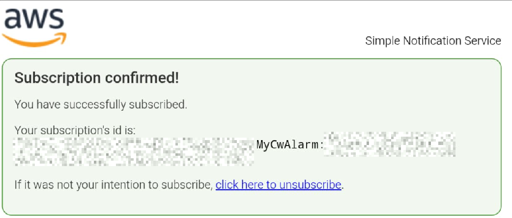

Após confirmar, voltamos ao console AWS e podemos ver que o status da subscription mudou para *Confirmed* (Confirmado): <br>
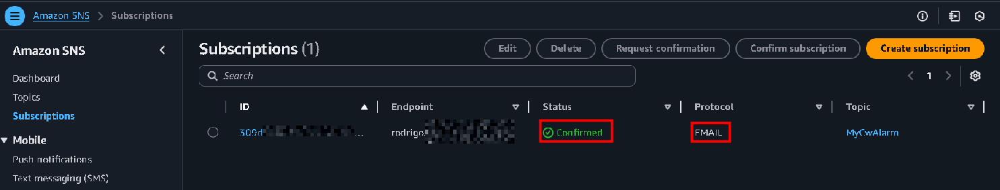

Agora o tópico SNS está pronto para enviar notificações por email quando for acionado por um alarme do CloudWatch.

## Task 2: Create a CloudWatch alarm

Nesta task vamos criar um alarme no CloudWatch que monitora a utilização de CPU da instância *Stress Test* e dispara quando ultrapassar 60%. Primeiro acessamos o **CloudWatch** e navegamos até a seção *Metrics*: <br>


Selecionamos as métricas EC2 e escolhemos *Per-Instance Metrics* para visualizar métricas específicas da instância. Aqui podemos ver um gráfico mostrando a utilização da CPU próxima de zero: <br>


Agora vamos para a seção *Alarms* e clicamos em *Create alarm* para criar um novo alarme: <br>


Selecionamos a métrica *CPUUtilization* da instância *Stress Test*: <br>


Na página de especificação de métrica e condições, configuramos os detalhes do alarme. Definimos a estatística como *Average*, período de *1 minuto*, e o threshold (limite) de *60%*: <br>
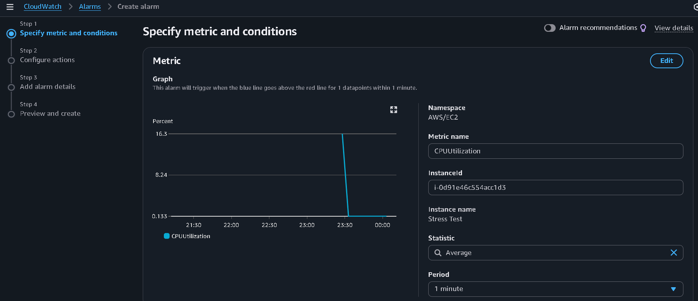

Na seção de condições, configuramos o tipo de threshold como *Static* (Estático), definindo que o alarme deve disparar quando CPUUtilization for *Greater* (maior) que *60*: <br>


Agora configuramos a ação do alarme. Selecionamos o estado *In alarm* e escolhemos o tópico SNS *MyCwAlarm* que criamos anteriormente para enviar notificações: <br>


Definimos o nome do alarme como *LabCPUUtilizationAlarm* e adicionamos uma descrição: "CloudWatch alarm for Stress Test EC2 instance CPUUtilization": <br>
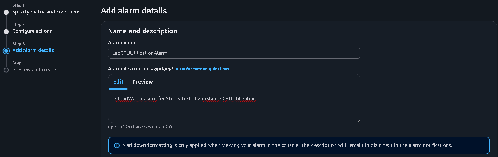

O alarme foi criado com sucesso e agora está monitorando a instância EC2.

## Task 3: Test the Cloudwatch alarm

Agora vamos testar o alarme executando um teste de estresse na instância EC2. Conectamos à instância *Stress Test* via Systems Manager e executamos o comando de stress test: <br>
```bash
sudo stress --cpu 10 -v --timeout 400s
```

Este comando simula uma carga de CPU de 100% por 400 segundos, executando 10 workers simultâneos: <br>
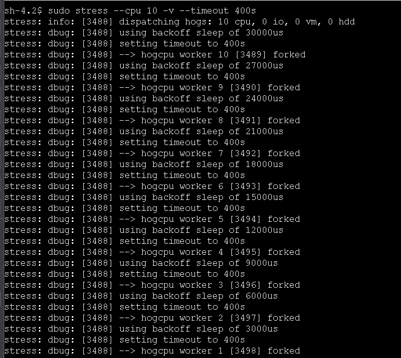

Em outro terminal, executamos o comando `top` para visualizar em tempo real o uso da CPU. Podemos ver que está em **100%** (10 processos stress, cada um usando 10.0% da CPU): <br>


Voltando ao console do CloudWatch, podemos ver que o alarme *LabCPUUtilizationAlarm* entrou no estado **In alarm** (Em alarme). O gráfico mostra claramente o pico de CPU ultrapassando o threshold de 60%: <br>
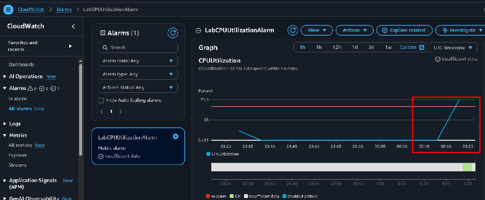

Recebemos um email de notificação da AWS informando que o alarme foi acionado. O email contém todos os detalhes, incluindo o nome do alarme, descrição, timestamp e o motivo: "Threshold Crossed: 1 out of the last 1 datapoints was greater than the threshold (60.0)": <br>
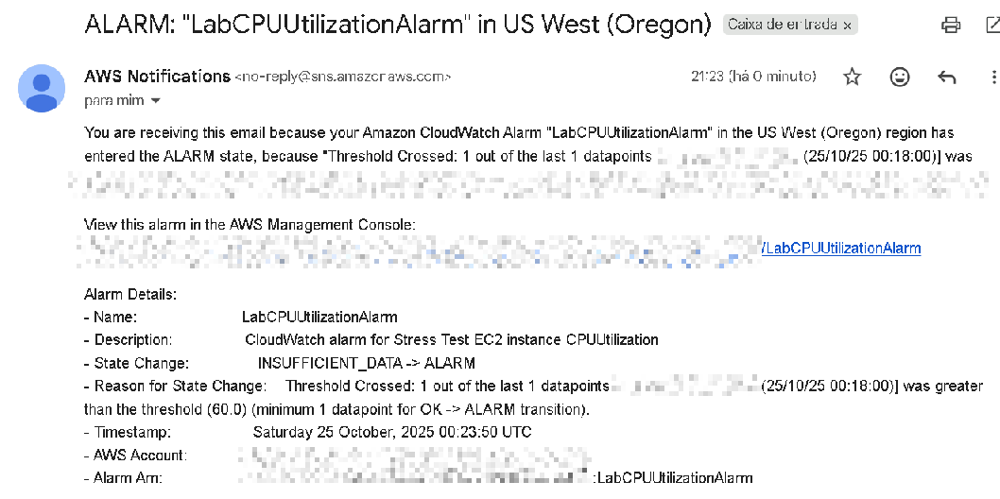

Isso simula perfeitamente o cenário de um ataque onde um ator malicioso ganha controle da instância e causa um spike de CPU, que pode indicar malware ou mineração de criptomoedas.

## Task 4: Create a CloudWatch dashboard

Por fim, vamos criar um dashboard personalizado no CloudWatch para ter acesso rápido às métricas importantes. Acessamos a seção *Dashboards* e criamos um novo dashboard chamado *LabEC2Dashboard*. Selecionamos o tipo de widget *Line* (Linha) para exibir métricas ao longo do tempo: <br>


Selecionamos a métrica *CPUUtilization* da instância *Stress Test* para adicionar ao gráfico: <br>
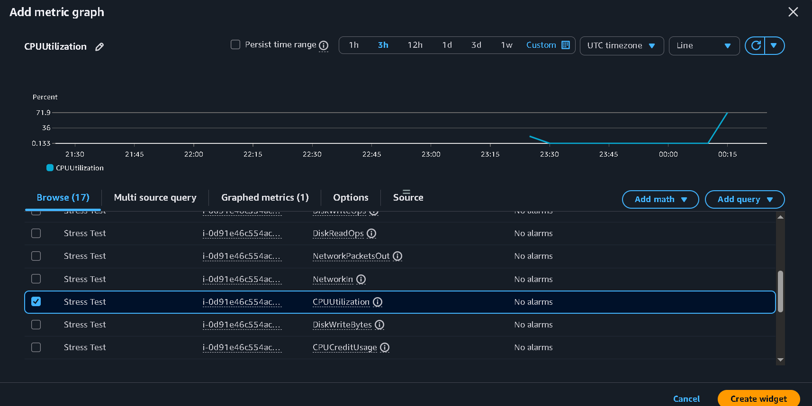

O dashboard é criado com sucesso, mostrando o widget com o gráfico de utilização de CPU. Podemos ver claramente o pico que ocorreu durante o teste de estresse: <br>
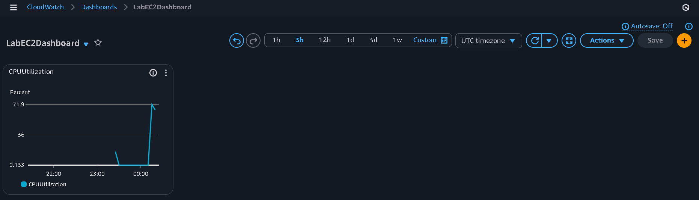

Agora no overview do CloudWatch, podemos visualizar rapidamente o alarme recente e seu estado. O dashboard fornece uma visão centralizada de todos os alarmes e métricas importantes: <br>


**Conclusão**: Implementamos com sucesso um sistema completo de monitoramento e alertas na AWS. Criamos um alarme CloudWatch que detecta quando a utilização de CPU excede 60%, configuramos notificações SNS por email, testamos o sistema simulando uma sobrecarga de CPU (similar a um ataque de malware) e criamos um dashboard personalizado para visualização em tempo real. Este tipo de monitoramento é essencial para detectar atividades maliciosas, anomalias de performance e garantir a segurança e disponibilidade dos recursos na nuvem.
