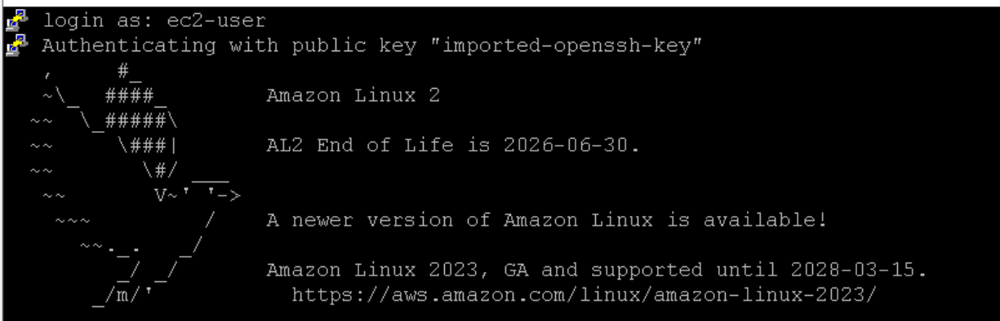
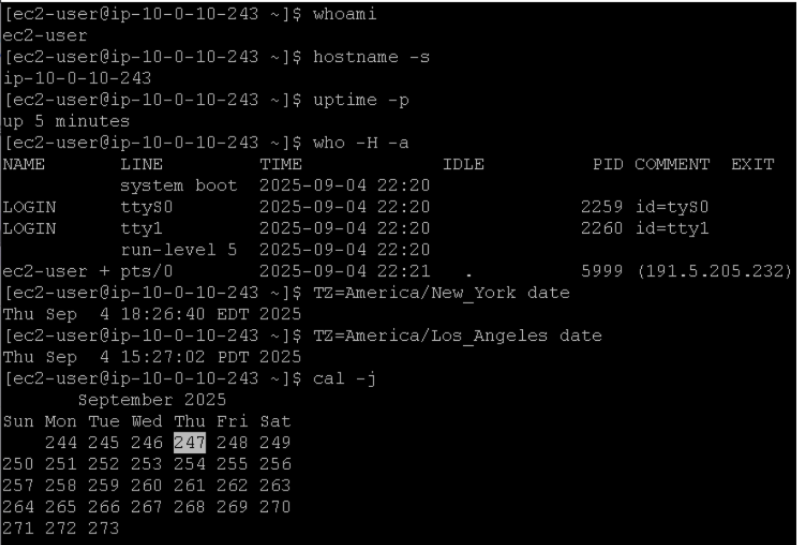
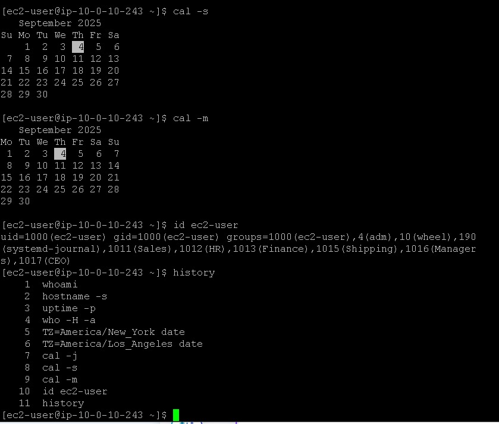
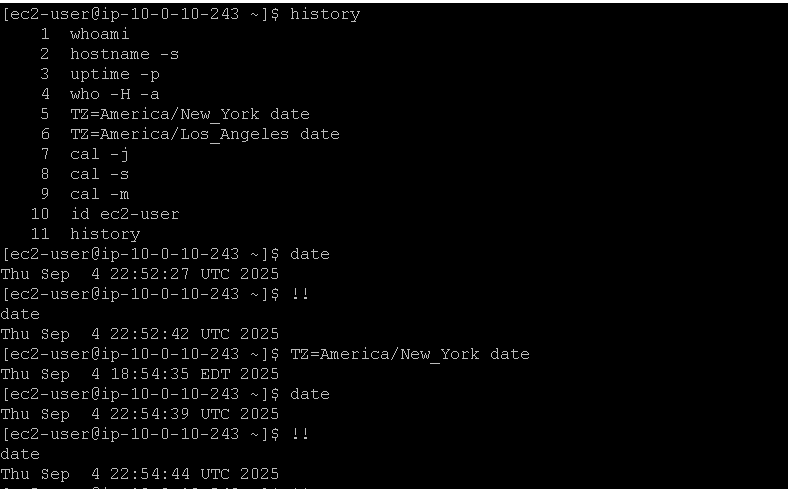

# Laboratório de introdução à linha de comando do Linux 🐧💻

## Task 1: Use SSH to connect to an Amazon Linux EC2 instance

Na task 1, vamos realizar a conexão SSH assim como fizemos no laboratório anterior, veja em [Lab2 - Introdução ao Linux](https://github.com/RodrigoArraes07/Labs-AWS/blob/main/Lab2-IntroducaoLinux/README.md).

  Conexão SSH e logins realizados.

## Task 2: Run familiar commands

Na task 2, iremos conhecer e praticar alguns comandos úteis do linux:  

<h3> Os comandos acima têm as seguintes funções: </h3>

- <code>whoami</code>: Exibe o nome do usuário atual;
- <code>hostname -s</code>: Exibe uma versão abreviada do host da instância;
- <code>uptime -p</code>: Exibe o tempo de execução da intância em formato legível;
- <code>who -H -a</code>: Exibe informações sobre os usuários logados;
- <code>TZ=America/New_York date</code> e <code>TZ=America/Los_Angeles date</code>: Exibe data e hora de outros locais do mundo;
 - <code>cal -j</code>: Exibe o calendário juliano no terminal. Algumas empresas utilizam o calendário juliano, que não reinicia a contagem de dias ao passar para de um mês para outro;

   

 <h3> Os comandos acima têm as seguintes funções: </h3>

 - <code>cal -s</code>: Exibe o calendário com a semana iniciando no domingo(sunday);
 - <code>cal -m</code>: Exibe o calendário com a semana iniciando na segunda-feira(monday);
 - <code>id [Nome_do_usuário]</code>: Exibe o *id* do seu usuário, o *id* e os nomes dos grupos que seu usuário pertence;
 
 
 ## Task 3: Improve workflow through history and search
 Como temos no print anterior, nesta task vamos conhecer formas de melhorar o nosso fluxo de trabalho:
 
 - <code>history</code>: Exibe um histórico dos comandos utilizados recentemente;
 - **Ctrl+R** abre uma pesquisa de histórico no seu terminal, utilizei esse atalho para pesquisar o comando <code>TZ=America/New_York date</code>;
 - <code>date</code>: Exibe data e hora local da instância;
 - <code>!!</code>: Re-executa o comando anterior, exibindo qual comando está sendo executado, e o seu retorno, no caso eu re-executei o comando <code>date</code>;

 ## Conclusão
 <h3>Neste laboratório, eu pude conhecer, entender e praticar comandos básicos do Linux, que com certeza serão úteis em algum momento desta minha jornada de Cloud Pratictioner.</h3>
