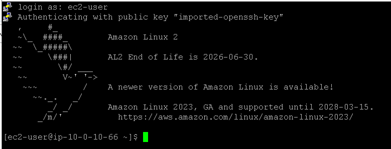
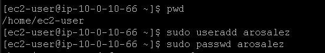
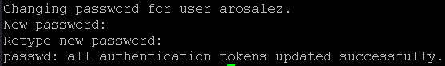
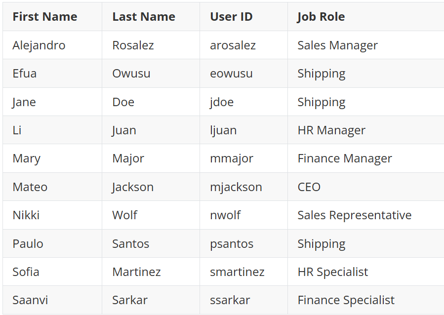
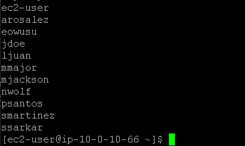
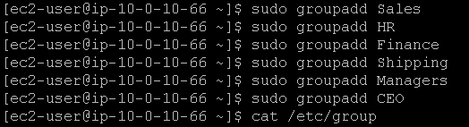
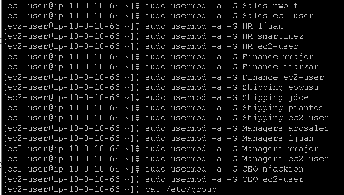
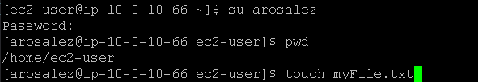
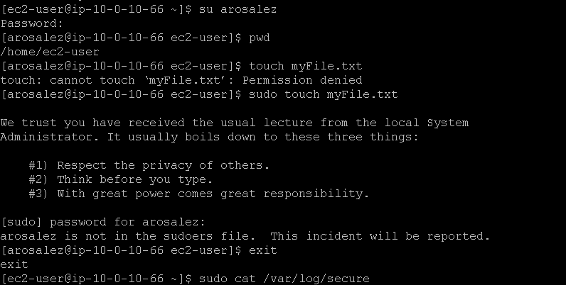
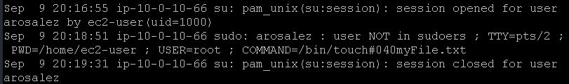

## Laboratório de introdução aos usuários e grupos no Linux 🐧💻

## Task 1: Use SSH to connect to an Amazon Linux EC2 instance

Na task 1, vamos realizar a conexão SSH assim como fizemos no laboratório anterior, veja em [Lab2 - Introdução ao Linux](https://github.com/RodrigoArraes07/Labs-AWS/blob/main/Lab2-IntroducaoLinux/README.md).

Conexão realizada:  

## Task 2: Create Users

### Comandos novos que utilizaremos nesta task:

- <code>pwd</code>: Abreviação para *Print Working Directory*: Exibe o caminho para o diretório que estamos atualmente.  
- <code>sudo useradd nome_usuario</code>: Adiciona um novo usuário ao sistema.  
- <code>sudo passwd nome_usuario</code>: Cria ou altera a senha do usuário informado.  
- <code>sudo cat /etc/passwd | cut -d: -f1</code>: Exibe o conteúdo presente no arquivo *"/etc/passwd"*, e filtra para exibir apenas os elementos da primeira coluna de texto, que é o nome dos usuários.

Iniciamos com o comando <code>pwd</code>, em seguida criamos um usuário e definimos uma senha para este usuário, com os comandos <code>sudo useradd nome_usuario</code> e  <code>sudo passwd nome_usuario</code> respectivamente:  
  

Em seguida, repetimos todo esse processo para os seguintes usuários:  
  
Definindo suas respectivas senhas.

E após adiciona-los, podemos usar o comando <code>sudo cat /etc/passwd | cut -d: -f1</code> para confirmar a adição:  

## Task 3: Create Groups

### Comandos novos que utilizaremos nesta task:

- <code>sudo groupadd nome_grupo</code>: Adiciona um novo grupo ao sistema.  
- <code>cat /etc/group</code>: Exibe os grupos presentes no arquivo */etc/group*.
- <code>sudo usermod -a -G nome_grupo nome_usuario</code>: Adiciona o usuário ao grupo especificado.  

Primeiro criamos os grupos com o comando <code>sudo groupadd nome_grupo</code>:  
  
Depois, com o comando <code>cat /etc/group</code>, vamos verificar se os grupos foram criados corretamente:  

Agora vamos utilizar o comando <code>sudo usermod -a -G nome_grupo nome_usuario</code> para adicionar os usuários aos respectivos grupos, solicitados pela atividade na tabela mostrada anteriormente:  

Depois, com o comando <code>cat /etc/group</code>, vamos verificar se os usuários foram adicionados aos grupos de forma correta:  

## Task 4: Log in using the new users

### Comandos novos que utilizaremos nesta task:

- <code>su nome_usuario</code>: Troca para o usuário especificado;
- <code>touch myFile.txt</code>: Cria um arquivo vazio chamado myFile.txt, caso ele já exista, vai atualizar a data e hora da última modificação;
- <code>sudo touch myFile.txt</code>: Faz a mesma coisa do comando anterior, porém, tentando utilizar a permissão de administrador para executar o comando;
- <code>exit</code>: Sai da seção atual, nesse caso, encerra o <code>su</code>;
- <code>sudo cat /var/log/secure</code>: Exibe o conteúdo do arquivo */var/log/secure*, esse arquivo é um **log** de registros de segurança, guarda tentativas de login, usos de <code>sudo</code> e autenticações.

Trocamos para o usuário *arosalez* utilizando o comando <code>su arosalez</code>:  
  
Quando utilizamos o comando <code>touch myFile.txt</code>, o sistema retorna que não temos permissão para realizar a ação. Em seguida, tentamos utilizar o comando sudo, porém o usuário *arosalez* não faz parte da lista de Administradores. Portanto não pode usar *sudo*:  
  
Aqui, após executar o comando <code>sudo cat /var/log/secure</code>, podemos ver o log que informa as ações "de risco" que tentamos realizar com o usuário *arosalez*:  

## Conclusão:

<h3>
Neste laboratório, pude conhecer e praticar comandos básicos para o controle de usuários e grupos no Linux, conhecimento que é de suma inportância no meio de trabalho. De forma resumida, neste laboratório aprendi: 
</h3>

- Criar novos usuários e novos grupos;  
- Definir senhas para usuários;  
- Adicionar usuários a grupos específicos;  
- Visualizar as informações de usuários e de grupos;  
- Trocar de usuário;  
- Vizualizar logs de segurança.  