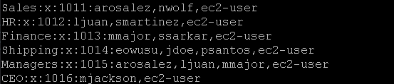

## Laboratório de introdução aos usuários e grupos no Linux 🐧💻

## Task 1: Use SSH to connect to an Amazon Linux EC2 instance

Na task 1, vamos realizar a conexão SSH assim como fizemos no laboratório anterior, veja em [Lab2 - Introdução ao Linux](https://github.com/RodrigoArraes07/Labs-AWS/blob/main/Lab2-IntroducaoLinux/README.md).

Conexão realizada:  

## Task 2: Create Users

### Comandos que utilizaremos nesta task:

<code>pwd</code>: Abreviação para *Print Working Directory*: Exibe o caminho para o diretório que estamos atualmente.  
<code>sudo useradd nome_usuario</code>: Adiciona um novo usuário ao sistema.  
<code>sudo passwd nome_usuario</code>: Cria ou altera a senha do usuário informado.  
<code>sudo cat /etc/passwd | cut -d: -f1</code>: Exibe o conteúdo presente no arquivo *"/etc/passwd"*, e filtra para exibir apenas os elementos da primeira coluna de texto, que é o nome dos usuários.

Iniciamos com o comando <code>pwd</code>, em seguida criamos um usuário e definimos uma senha para este usuário, com os comandos <code>sudo useradd nome_usuario</code> e  <code>sudo passwd nome_usuario</code> respectivamente:

Em seguida, repetimos todo esse processo para os seguintes usuários:
  
Definindo suas respectivas senhas.

E após adiciona-los, podemos usar o comando <code>sudo cat /etc/passwd | cut -d: -f1</code> para confirmar a adição:  

## Task 3: Create Groups

## Task 4: Log in using the new users

