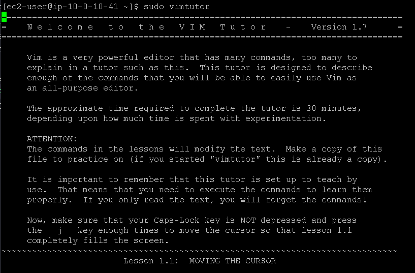
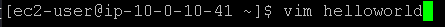
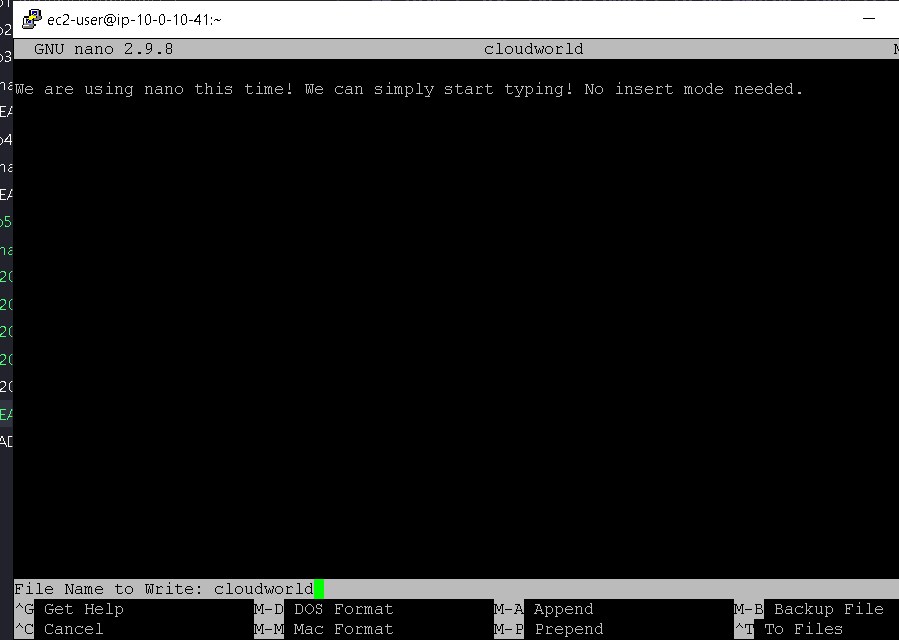

## Laboratório de edi;áo de arquivos no Linux 📄📁🐧.

## Task 1: Use SSH to connect to an Amazon Linux EC2 instance

Na task 1, vamos realizar a conexão SSH assim como fizemos no laboratório anterior, veja em [Lab2 - Introdução ao Linux](https://github.com/RodrigoArraes07/Labs-AWS/blob/main/Lab2-IntroducaoLinux/README.md).

## Task 2: Exercise - run the Vim tutorial

Nesta task, o nosso objetivo é aprender mais sobre o editor de arquivos *vim*, por isso usamos o comando <code>sudo vimtutor</code> para abrir o "manual" do vim, e podermos entender como trabalhar com ele:  
  

## Task 3: Exercise - edit a file in Vim
Nessa task, usamos o comando <code>vim nome_arquivo</code> para criar o arquivo helloworld com o vim:  
  
Depois de criarmos o arquivo, somos direcionados para a página do vim, dentro do arquivo helloworld, onde usamos os seguintes comandos:  
 - <code>i</code>: entra no modo de Inserção, e podemos digitar;  
 - <code>:wq</code>: Para salvar (**w**rite) e sair do vim (**q**uit);  
 - <code>:q!</code>: Para forçar a saída, e sair sem salvar possíveis alterações;  
 - <code>dd</code>: Deletar toda a linha onde o cursor está;   
 - <code>u</code>: Para desfazer a última ação (**u**ndo), como o Ctrl + Z;  
- <code>:w</code>: Para salvar sem sair do arquivo;  

## Task 4: Exercise - edit a file in nano

Agora vamos utilizar outro editor de arquivos, o *nano*, para criarmos e entrar em um arquivo, usamos o comando <code>nano nome_arquivo</code> para criar o arquivo cloudword e entramos nele:  

Após entrar, já podemos editar o arquivo diretamente:  
  
E no nano, temos um mini-manual em baixo, orientando quais ações podemos realizar, no caso eu usei:  
- *Ctrl + O*: Para salvar as alterações do arquivo;  
- *Ctrl + X*: Para sair do arquivo;  

## Conclusão:

<h3>Neste laboratório, pude entender e praticar a utilização de dois famosos editores de arquivos diferentes, o vim e o nano, onde puder criar, editar e salvar arquivos. Práticas que serão muito comuns e presentes no futuro. </h3>