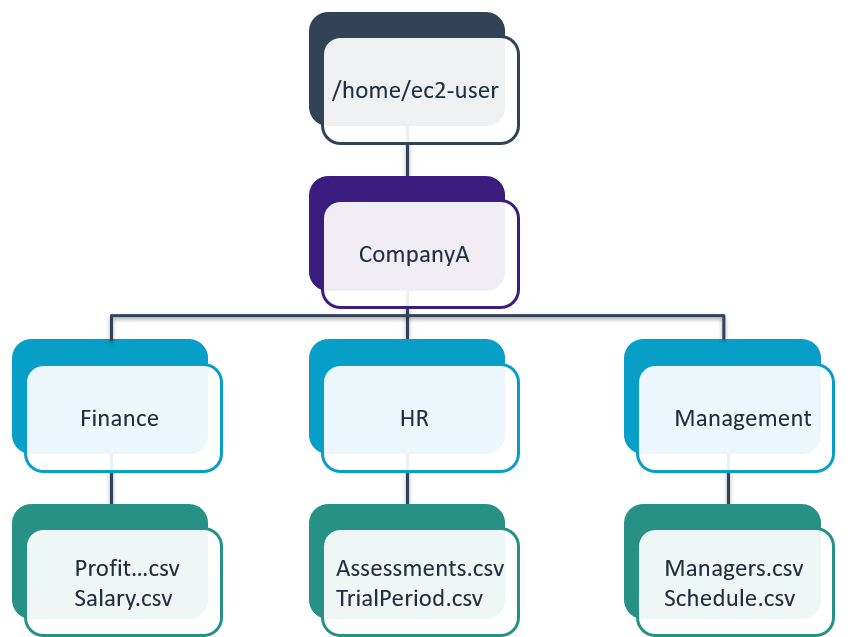
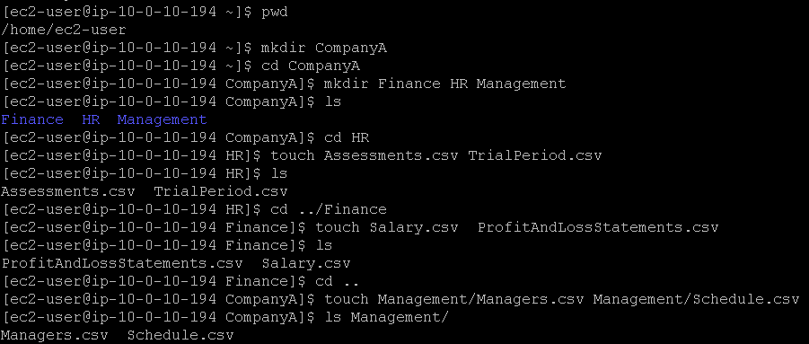
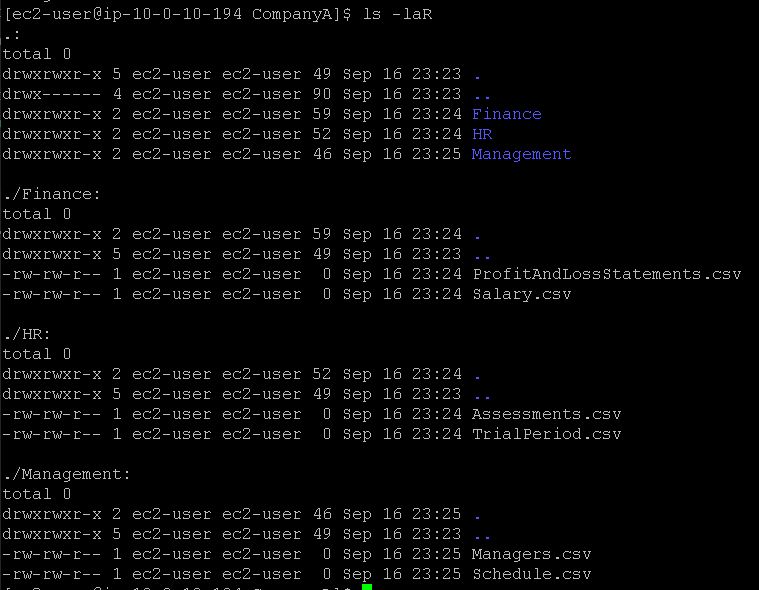
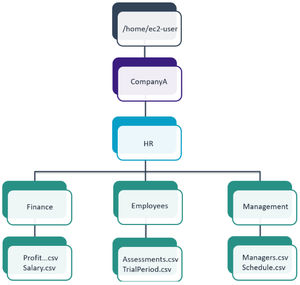
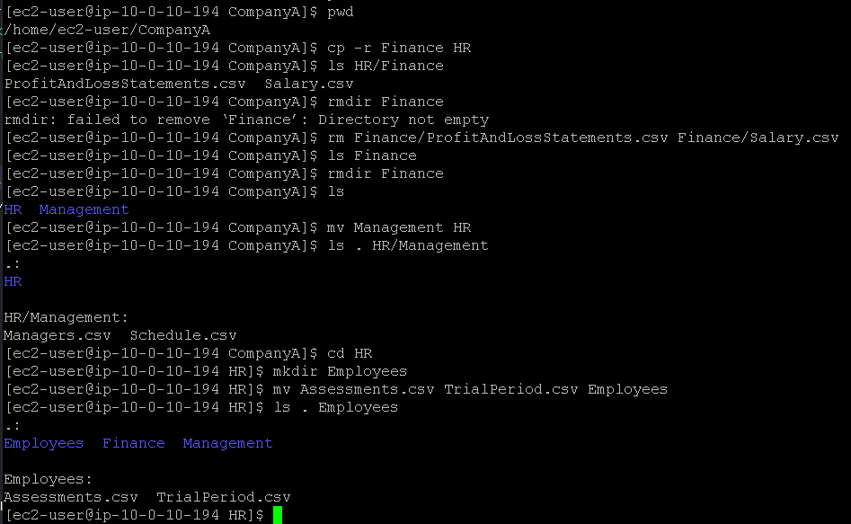

# Laboratório de sistemas de arquivos no Linux 📄📁🐧.

## Task 1: Use SSH to connect to an Amazon Linux EC2 instance

Na task 1, vamos realizar a conexão SSH assim como fizemos no laboratório anterior, veja em [Lab2 - Introdução ao Linux](https://github.com/RodrigoArraes07/Labs-AWS/blob/main/Lab2-IntroducaoLinux/README.md).

## Task 2: Create a Folder Structure

Nesta task, vou criar a estutura de pastas e arquivos a seguir:   

Para isso, usaremos os comandos novos:  
- <code>mkdir nome_pasta</code>: Esse comando serve para criar uma pasta, (**m**a**k**e **dir**ectory);  
- <code>cd nome_pasta</code>: Serve para mudar para a pasta informada, (**c**hange **d**irectory). Neste comando, o *(cd ..)* serve para voltar para a pasta acima;  
- <code>ls -laR</code>: *ls* para listar, *-l* para exibir no formato detalhado, *-a* para exibir os arquivos ocultos, *-R* para mostrar de forma recursiva: pastas, subpastas e arquivos.

Aqui, verificamos se estamos no diretório certo com <code>pwd</code>, e em seguida usamos o comando <code>mkdir CompanyA</code> para criar a pasta *CompanyA*, <code>cd CompanyA</code> para entrar nessa pasta, e repetimos o comando <code>mkdir</code> para criar novas pastas. Verificamos com <code>ls</code>, e assim por diante utilizamos estes comandos para montar a estrutura que é pedida no laboratório:   
  

Em seguida, com o comando <code>ls -laR</code>, verificamos se as pastas e arquivos foram adicionados corretamente, podemos ver as pastas de *CompanyA*, e os arquivos que estão dentro de cada pasta:  

## Task 3: Delete and reorganize folders

Agora, nesta task vamos alterar a estrutura que montamos anteriormente para este novo formato:  

Para esta task, usaremos os comandos novos:  
- <code>cp -r pasta1 pasta2</code>: Copia todas as pastas e arquivos da pasta 1 para a pasta 2;  
- <code>rmdir pasta</code>: Remove a pasta se ela estiver vazia;  
- <code>rm arquivo</code>: Remove os arquivos passados;  
- <code>mv pasta1 pasta2</code>: Move os dados da pasta1 para a pasta2;  
- <code>mv arquivo pasta</code>: Move o(s) arquivo(s) informados para a pasta especificada;  

Iniciamos usando <code>cp -r Finance HR</code> para copiar os dados da pasta *Finance* para a pasta *HR*. Tentamos deletar a pasta Finance com <code>rmdir Finance</code>, porém só é possível se a pasta estiver vazia, então usamos <code>rm Finance/ProfitAndLossStatements.csv Finance/Salary.csv</code> para esvaziar essa pasta e então poder excluí-la. Em seguida seguimos utilizando comandos já conhecidos para reconstruir a estrutura de dados como a solicitada no laboratório:  

## Conclusão
<h3>Neste laboratório eu pude entender e praticar a manipulação das estruturas da pastas e arquivos no linux, criando, copiando, movendo e deletando pastas e arquivos. Esta prática é fundamental para o trabalho com linux, e um conhecimento muito importante para o cotidiano. </h3>