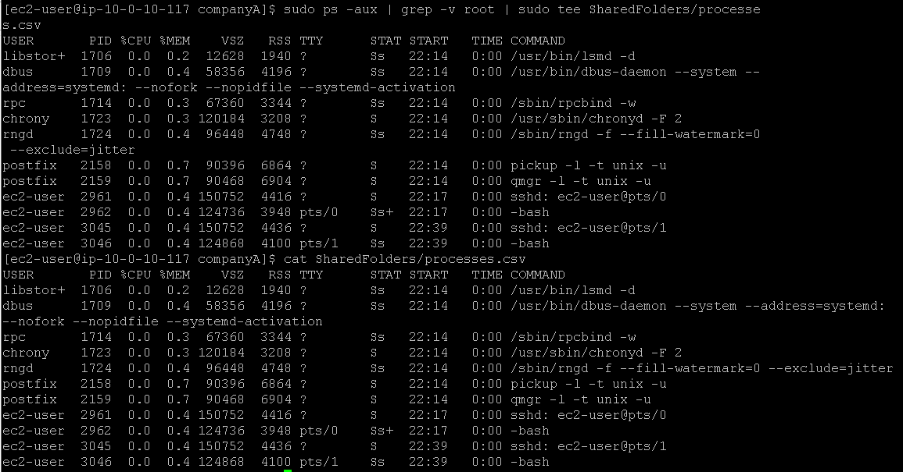
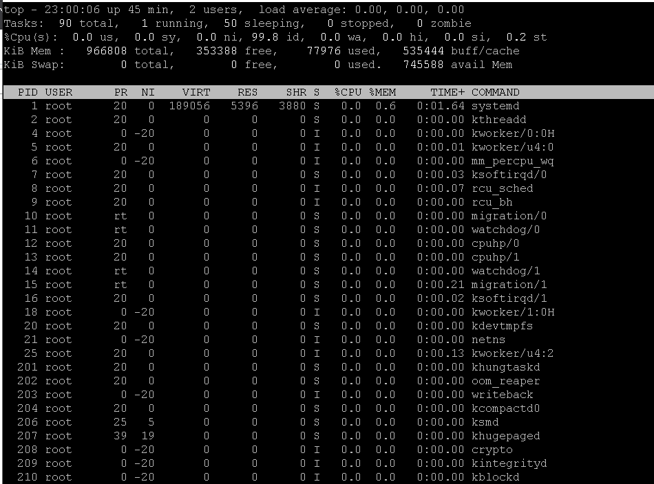
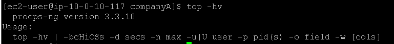
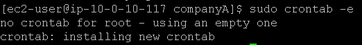
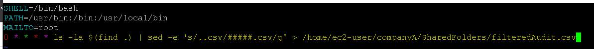
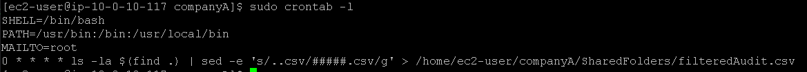

# Laboratório de gerenciamento de processos no Linux 🐧.

## Task 1: Use SSH to connect to an Amazon Linux EC2 instance

Na task 1, vamos realizar a conexão SSH assim como fizemos no laboratório anterior, veja em [Lab2 - Introdução ao Linux](https://github.com/RodrigoArraes07/Labs-AWS/blob/main/Lab2-IntroducaoLinux/README.md).

## Task 2: Exercise - Create List of Processes

Iniciamos executando o comando <code>sudo ps -aux | grep -v root | sudo tee SharedFolders/processes.csv</code> para exibir todos os processos em execução no sistema, exluindo os processos que são do usuário root, e em seguida salvar a saida no arquivo processes.csv. Após isso, executamos o <code>cat SharedFolders/processes.csv</code> para ver se a saída foi registrada normalmente dentro do arquivo:  

## Task 3: Exercise - List the processes using the top command

Agora, utilizaremos o comando <code>top</code> para visualizar o desempenho do sistema, listar os processos e threads que estão ativos no sistema e outras informações de monitoramento da máquina (semelhante ao *Gerenciador de Tarefas* do Windows):  

Em seguida usamos <code>top -hv</code> para ver informações de ajuda e versão do top:  

## Task 4: Exercise - Create a Cron Job

Agora vamos usar o comando <code>sudo crontab -e</code> para editar o *crontab* do root (o crontab é uma espécie de agendador de tarefas):  

Dentro do *crontab*, adicionamos os seguintes dados, que vão definir informações de execução e de comunicação das tarefas:  

Depois usamos <code>sudo crontab -l</code> para listar o conteúdo do crontab do root:  

