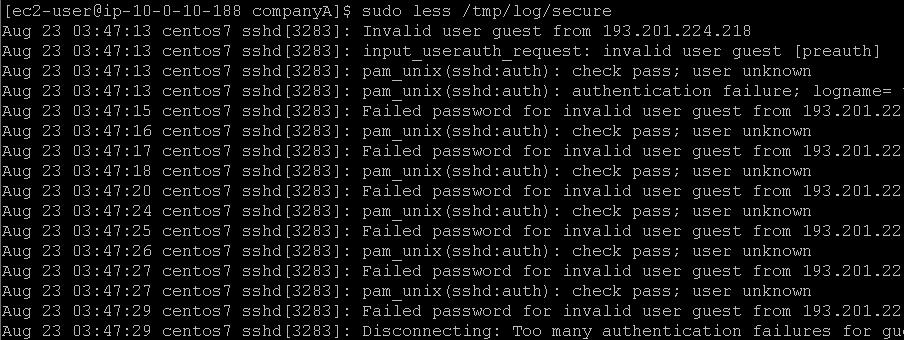

# Laboratório de gerenciamento de arquivos de log no Linux 🐧.

## Task 1: Use SSH to connect to an Amazon Linux EC2 instance

Na task 1, vamos realizar a conexão SSH assim como fizemos no laboratório anterior, veja em [Lab2 - Introdução ao Linux](https://github.com/RodrigoArraes07/Labs-AWS/blob/main/Lab2-IntroducaoLinux/README.md).

## Task 2: Review secure log files

Nesta task, iniciamos utilizando o comando <code>sudo less /tmp/log/secure</code> para visualizar informações do arquivo de log de segurança do sistema de forma interativa (graças ao **less**), que contém informações como tentativas de login, autenticações de usuários, logs do uso do usuário sudo e outras informações de segurança:  
    

Agora, vamos usar o comando <code>sudo lastlog</code> para visualizar informações sobre os últimos logins dos usuários do sistema. Como podemos ver, o único usuário que realizou login foi o nosso atual, o **ec2-user**, e podemos ver alguns dados sobre este login:  
