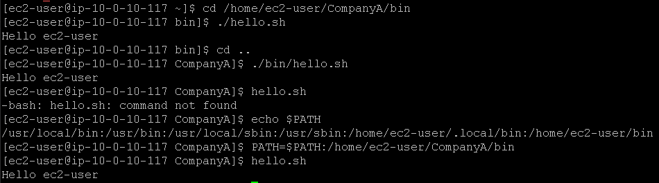

# Laboratório de shell bash no Linux 🐧.

## Task 1: Use SSH to connect to an Amazon Linux EC2 instance

Na task 1, vamos realizar a conexão SSH assim como fizemos no laboratório anterior, veja em [Lab2 - Introdução ao Linux](https://github.com/RodrigoArraes07/Labs-AWS/blob/main/Lab2-IntroducaoLinux/README.md).

## Task 2: Create an alias for a backup operation

Nesta task, iniciamos com o comando <code>alias backup='tar -cvzf '</code>, que cria um alias ("apelido") para um comando, nesse caso o comando é *'tar -cvzf '* e o seu "apelido" é *"backup"*. Este comando armazenado no alias, realiza a criação de um arquivo *tar* de um diretório especificado, e em seguida compacta ele. Em seguida executamos o comando <code>backup backup_companyA.tar.gz CompanyA</code> que executa o alias backup passando o nome do arquivo e a pasta a qual deve ser realizado o backup. Em seguida podemos verificar se o arquivo foi realmente criado usando <code>ls</code>:     

## Task 3: Explore and update the PATH environment variable

Agora, usamos o comando <code>cd /home/ec2-user/CompanyA/bin</code> para mudar de diretório, em seguida executamos o comando <code>./hello.sh</code> que executa o arquivo *hello.sh* do diretório atual. Em seguida subimos um nível no diretório, e executamos o arquivo novamente, informando seu diretório. Podemos notar que se tentarmos executar o arquivo fora de seu diretório (que é */bin*) o sistema nos retorna que não encontrou o comando, pois este arquivo não está localizado na nossa pasta atual. Depois, usamos o comando <code>echo $PATH</code> para exibir a variável de ambiente *$PATH*, que mostra os diretórios em que o sistema busca por executáveis. Agora, vamos adicionar o diretório do arquivo *hello.sh* às variáveis de ambiente, com o comando <code>PATH=$PATH:/home/ec2-user/CompanyA/bin</code>, e poderemos notar que agora conseguimos executar o arquivo mesmo estando em outro diretório:  

