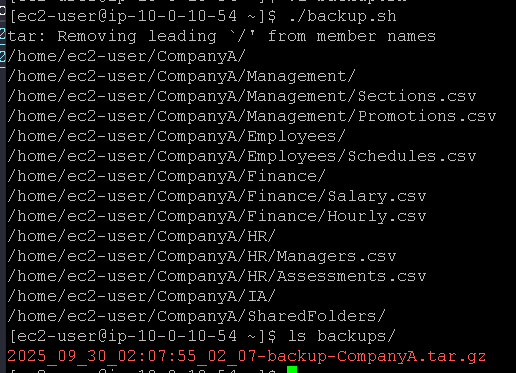

# Laboratório de scripts de shell bash no Linux 🐧.

## Task 1: Use SSH to connect to an Amazon Linux EC2 instance

Na task 1, vamos realizar a conexão SSH assim como fizemos no laboratório anterior, veja em [Lab2 - Introdução ao Linux](https://github.com/RodrigoArraes07/Labs-AWS/blob/main/Lab2-IntroducaoLinux/README.md).

## Task 2: Write a shell script

Nesta task, vamos iniciar utilizando o comando <code>touch backup.sh</code> para criar o arquivo **backup.sh** em seguida usamos o comando <code>sudo chmod 755 backup.sh</code> para definir as permissões do arquivo, sendo *rwx* para o criador e *rx* para o grupo e outros. Após isso, usamos o comando <code>vi backup.sh</code>:
  

Dentro do arquivo, nós vamos inserir as seguintes 
informações:  
  
Onde:  
- *#!/bin/bash*: indica que o script deve ser executado usando o Bash shell;
- *DAY="$(date +%Y_%m_%d_%T_%H_%M)"*: Cria uma variável *"DAY"* com a data e hora atual, no formato especificado;
- *BACKUP="/home/$USER/backups/$DAY-backup-CompanyA.tar.gz"*: Define o caminho completo para o arquivo de backup;
- *tar -csvpzf $BACKUP /home/$USER/CompanyA*: Cria o arquivo de backup compactado pre-definindo permissões, local de armazenamento e outras informações.

Por fim, executamos o arquivo que criamos anteriormente e podemos ver ele criando o backup das informações da pasta *CompanyA*. Em seguida, se listarmos os backups, é possível ver o que acabamos de criar:  
