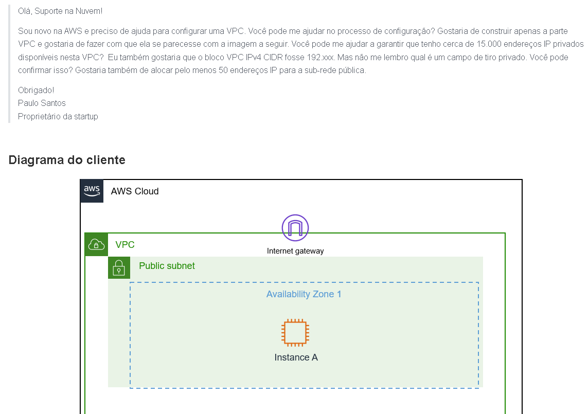
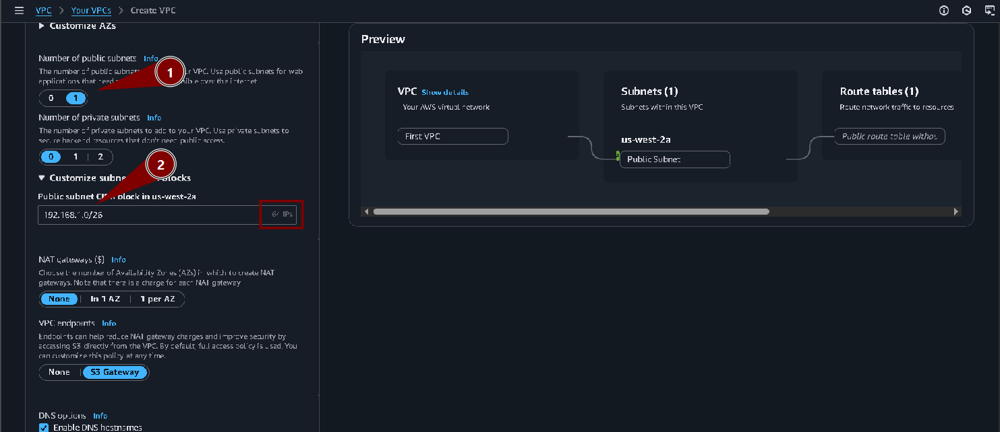
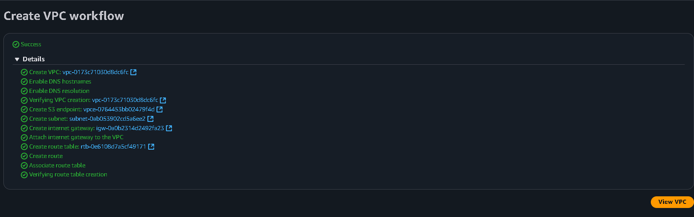

# Laboratório de criação de sub-redes em uma VPC - Redes🌐📡

<h3>Neste laboratório, o cliente nos pede ajuda para configurar uma VPC como podemos ver abaixo</h3>

## Task 1: Investigate the customer's needs

Na task 1, vamos criar uma VPC (É uma rede virtual isolada dentro da AWS onde você pode executar seus recursos com controle total sobre endereçamento IP, sub-redes e segurança) com a configuração solicitada pelo cliente, onde a VPC deve ter 15mil endereços privados e 50 endereços IP públicos:  

Aqui em **IPv4 CIDR block** é onde definimos o intervalo de endereços IP disponíveis pra a VPC, nesse caso usei */18* que disponibiliza mais de 16 mil endereços:  

Já na Sub-rede (É uma subdivisão da VPC que organiza e isola recursos em diferentes faixas de endereços IP dentro da mesma rede) que é onde vamos alocar os 50 endereços IP públicos solicitados pelo cliente, usei o intervalo */26* de disponibiliza 64 endereços IP, e como essa sub-rede é pública, atendemos ao pedido do cliente:  

Aqui podemos ver que a VPC foi criada:  

## Task 2: Send the response to the customer

<blockquote>
Olá, Paulo!  
 
Criei a sua VPC conforme o solicitado, criei uma sub-rede pública para contar os 50 endereços IP público que você solicitou, e a VPC conta com uma capacidade para mais de 16k endereços IPs privados, conforme solicitado
 

Espero ter ajudado, estou à disposição!  
Rodrigo  
Suporte de Nuvem.
</blockquote>