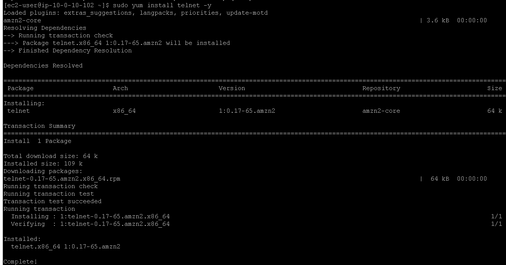
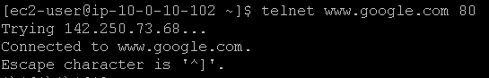

# Laboratório de comandos para solução de problemas relacionados ao protocolo de internet - Redes🌐📡

## Task 1: Use SSH to connect to an Amazon Linux EC2 instance

Na task 1, vamos realizar a conexão SSH assim como fizemos no laboratório anterior, veja em [Lab2 - Introdução ao Linux](https://github.com/RodrigoArraes07/Labs-AWS/blob/main/Lab2-IntroducaoLinux/README.md).

## Task 2: Practice troubleshooting commands

Aqui temos as camadas do modelo OSI (um padrão teórico de sete camadas que define as funções de comunicação de rede para garantir a interoperabilidade entre diferentes sistemas e dispositivos.):  

(Camada 3 e 4 - Network e transport) Iniciamos usando o comando <code>ping 8.8.8.8 -c 5</code> para testar a conexão da máquina realizando um ping e limitando a contagem a 5. Agora usamos <code>traceroute 8.8.8.8</code>, que serve para rastrear o caminho que os dados percorrem até chegar ao destino (8.8.8.8). Em seguida usamos <code>netstat -tp</code> que vai listar todas as conexões de rede ativas, o programa que está utilizando-a, e o endereço e porta:  

(Camada 7 - Application) Agora, iniciamos usando <code>sudo yum install telnet -y</code> para instalar o programa **telnet**:  

Em seguida usamos <code>telnet www.google.com 80</code> para tentar estabelecer uma conexão de texto com o site do Google através da porta 80 e testar se a conexão funciona:  
  
Podemos ver que a conexão foi estabelecida com sucesso ⬆.

Agora vou utilizar o comando <code>curl -vLo /dev/null https://aws.com</code> para baixar a página inicial da AWS, e exibe os detalhes da comunicação, e em seguida descarta o conteúdo baixado, pois queremos observar a comunicação com a página:  

