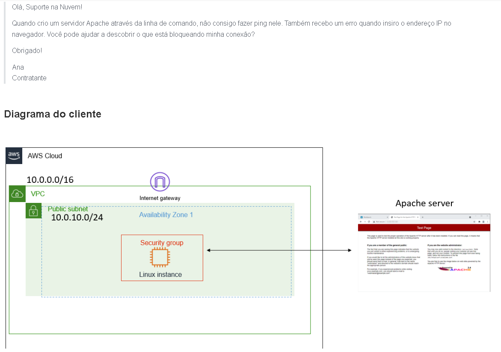
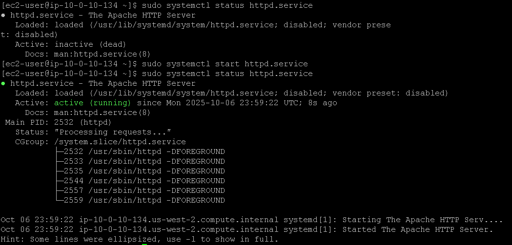
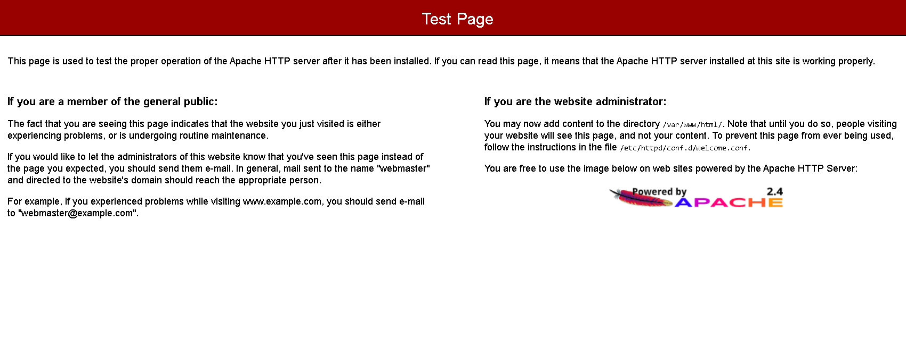

# Laboratório de solução de problemas de redes -  Redes🌐📡

<h3> Aqui abaixo temos um email do cliente informando que não está conseguindo realizar um ping no servidor Apache, e também não está conseguindo acessá-lo no navegador: </h3>  

## Task 1: Use SSH to connect to an Amazon Linux EC2 instance

Na task 1, vamos realizar a conexão SSH assim como fizemos no laboratório anterior, veja em [Lab2 - Introdução ao Linux](https://github.com/RodrigoArraes07/Labs-AWS/blob/main/Lab2-IntroducaoLinux/README.md).

## Task 2: Install httpd

Nesta task, iniciamos verificando o status do servidor, podemos ver que ele está inativo, então em seguida o ativamos e podemos ver que ele é inicializado com sucesso:  

## Task 3: Investigate the customer's VPC configuration

Agora, acessamos o **Console AWS** e vamos verificar as configurações da VPC do cliente, nos seguintes passos:  
1. Acessamos o painel da VPC;  
2. Vamos em **Security Group** para verificar as permissões do grupo de segurança;  
3. Selecionamos o *Security group* da instância;
4. Vamos em **Inbound Rules** para verificar as regras de entrada do grupo de segurança;  
5. Em seguida vamos editar essas regras em **Edit inbound rules**:  

O Security Group estava configurado apenas para permitir conexões via SSH, então precisei adicionar as conexões HTTP e HTTPS para que fosse possível acessar o servidor:  

E aqui podemos ver o servidor Apache sendo acessado via navegador. Logo podemos concluir que encontrei a causa do problema do cliente:  
